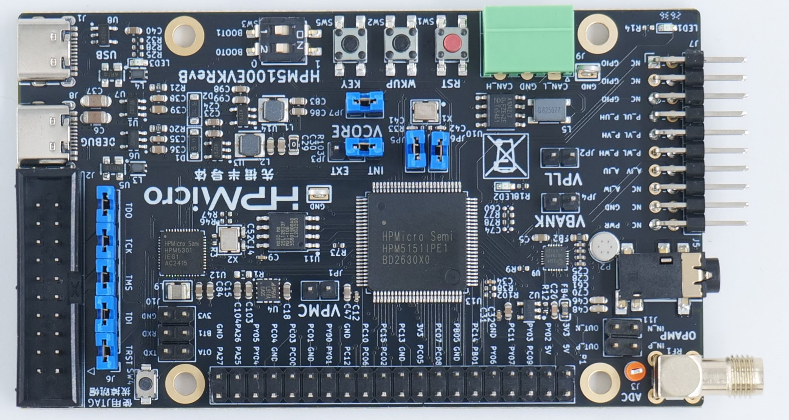

.. _hpm5100evk:

HPM5100EVK
==========

Overview
--------

The HPM5100EVK provides a series of interfaces for the characteristic peripherals of the HPM5100 series microcontrollers, including a motor pin interface for PWM output and ADC sampling, an operational amplifier interface, and an RS485/422 interface. HPM5100EVK also integrates IO expansion interfaces, which connect most of the IOs of the HPM5100 MCU for users to freely evaluate. HPM5100EVK expands NOR Flash storage for MCU and integrates an on-board debugger.

VCORE power supply selection
------------------------------

The VCORE power supply of the HPM5100EVK can be selected with the JP3 jumper. The options are an external DCDC supply (EXT) or the internal LDO supply (INT).

- The maximum CPU operating frequency differs between the external DCDC supply and the internal LDO supply. Please refer to the technical specifications in the datasheet to select the appropriate power supply and configure a suitable CPU operating frequency.
- By default, VCORE uses the DCDC supply: JP3 is shorted on the EXT side and the CPU frequency is configured to 400 MHz.

DIP Switch
----------

- Bit 1 and 2 control the boot mode

  .. list-table::
     :header-rows: 1

     * - bit[2:1]
       - Description
     * - OFF, OFF
       - Boot from Quad SPI NOR flash
     * - OFF, ON
       - Serial boot
     * - ON, OFF
       - ISP

.. _hpm5100evk_buttons:

Button
------

-

  .. list-table::
     :header-rows: 1

     * - Name
       - FUNCTIONS
     * - PY07 (WKUP)
       - WAKE UP Button
     * - PA15 (USER KEY)
       - USER KEY
     * - RESET
       - Reset Button

.. _hpm5100evk_pins:

Pin Description
---------------

- UART0 Pin:

  The UART0 is used for core0 debug console:

  .. list-table::
     :header-rows: 1

     * - Function
       - Pin
     * - UART0.TX
       - PA00
     * - UART0.RX
       - PA01

- UART2 Pin:

  The UART2 is used for some functional testing using UART:

  Attention: The TX pin PY07 of UART2 is multiplexed with the WKUP button. There is a capacitor on the WKUP button side. If the working baud rate of UART2 is relatively high, it is recommended to remove this capacitor.

  .. list-table::
     :header-rows: 1

     * - Function
       - Pin
       - Position
       - Remark
     * - UART2.TX
       - PY07
       - P1[8]
       -
     * - UART2.RX
       - PY06
       - P1[10]
       -
     * - UART2.break
       - PC14
       - P1[11]
       - generate uart break signal

- UART3 Pin:

  The UART3 is used for UART-simulated LIN communication function:

  .. list-table::
     :header-rows: 1

     * - Function
       - Pin
       - Position
     * - UART3.TX
       - PC00
       - P1[32]
     * - UART3.RX
       - PC05
       - P1[18]

- SPI Pin:

  Attention: The MISO pin PC15 of SPI3 is multiplexed with the ADC function. There is a capacitor on the ADC side. If the working frequency of SPI3 is relatively high, it is recommended to remove this capacitor.

  .. list-table::
     :header-rows: 1

     * - Function
       - Pin
       - Position
     * - SPI3.CSN
       - PC06
       - P1[24]
     * - SPI3.SCLK
       - PC10
       - P1[23]
     * - SPI3.MISO
       - PC15
       - P1[21]
     * - SPI3.MOSI
       - PC13
       - P1[19]

- I2C Pin:

  .. list-table::
     :header-rows: 1

     * - Function
       - Pin
       - Position
     * - I2C0.SCL
       - PY01
       - P1[28]
     * - I2C0.SDA
       - PY00
       - P1[27]
     * - I2C1.SCL
       - PY03
       - P1[5]
     * - I2C1.SDA
       - PY02
       - P1[3]

- CAN Pin:

  .. list-table::
     :header-rows: 1

     * - Function
       - Position
     * - CAN_H
       - J9[1]
     * - CAN_L
       - J9[3]

- ACMP Pin:

  .. list-table::
     :header-rows: 1

     * - Function
       - Pin
       - Position
     * - ACMP0.CH0.INN1
       - PC00
       - P1[32]

- GPTMR Pin:

  .. list-table::
     :header-rows: 1

     * - Function
       - Pin
       - Position
       - Remark
     * - GPTMR0.CAPT_0
       - PC10
       - P1[23]
       -
     * - GPTMR0.COMP_0
       - PC15
       - P1[21]
       -
     * - GPTMR0.COMP_1
       - PC13
       - P1[19]
       -
     * - GPTMR0.COMP_3
       - PC11
       - P1[7]
       -

- ADC Pin:

  .. list-table::
     :header-rows: 1

     * - Function
       - Pin
       - Position
     * - ADC16 Input
       - PC05
       - P1[18]

- ADC16 differential input

  For differential sampling such as ``samples/drivers/adc/adc16_differential``. Uses ADC2 (master) and ADC3 (slave) as a pair.

  .. list-table::
     :header-rows: 1

     * - Function
       - Pin
       - Position
     * - ADC16 diff master (ADC2)
       - PB12 (ADC2.IN09)
       - J7[14] (ADC_IV)
     * - ADC16 diff slave (ADC3)
       - PB11 (ADC3.IN11)
       - J7[13] (ADC_IU)

- I2S Pin:

  .. list-table::
     :header-rows: 1

     * - Function
       - Pin
     * - I2S0.BCLK
       - PB09
     * - I2S0.FCLK
       - PB10
     * - I2S0.MCLK
       - PB04
     * - I2S0.RXD_3
       - PB08
     * - I2S0.TXD_0
       - PB00

- PWM Pin:

  .. list-table::
     :header-rows: 1

     * - Function
       - Position
     * - PWM3.P0
       - J7[7]
     * - PWM3.P1
       - J7[8]

- OPAMP Pin (J11):

  .. list-table::
     :header-rows: 1

     * - Function
       - Position
     * - OPA3.INP1 (PB03)
       - J11[1]
     * - OPA3.OUT0 (PC09)
       - J11[2]
     * - OPA3/OPA2/OPA1.INP (PB07)
       - J11[3]
     * - OPA3/OPA2/OPA1.OUT (PC00)
       - J11[4]

- ESP-HOSTED Pin

  .. list-table::
     :header-rows: 1

     * - Function
       - Position
       - Note
     * - PB05
       - P1[13]
       - RESET Pin
     * - PC07
       - P1[15]
       - HANDSHAKE Pin
     * - PC08
       - P1[16]
       - DATA_READY Pin

.. _motor_pin:

- Motor Pin:

  The motor PWM output and ADC sampling pins use the J7 connector. Pin assignments are as follows:

  .. list-table::
     :header-rows: 1

     * - Function
       - J7 Pin
       - MCU Pin
     * - PWM_UH
       - J7[7]
       - PA16 (PWM3.P0)
     * - PWM_UL
       - J7[8]
       - PA17 (PWM3.P1)
     * - PWM_VH
       - J7[9]
       - PA30 (PWM3.P6)
     * - PWM_VL
       - J7[10]
       - PA31 (PWM3.P7)
     * - PWM_WH
       - J7[11]
       - PA28 (PWM3.P4)
     * - PWM_WL
       - J7[12]
       - PA29 (PWM3.P5)
     * - ADC_IU
       - J7[13]
       - PB11 (ADC3.IN11)
     * - ADC_IV
       - J7[14]
       - PB12 (ADC2.IN09)
     * - ADC_IW
       - J7[15]
       - PA24 (ADC1.IN12)
     * - GND
       - J7[17]
       -
     * - +5V
       - J7[19]
       -

- BROWNOUT Interrupt Indicator Pin

  .. list-table::
     :header-rows: 1

     * - Function
       - Position
     * - PA27
       - P1[40]

- CLOCK REF Pin

  .. list-table::
     :header-rows: 1

     * - Function
       - Position
     * - PB01
       - P1[12]
