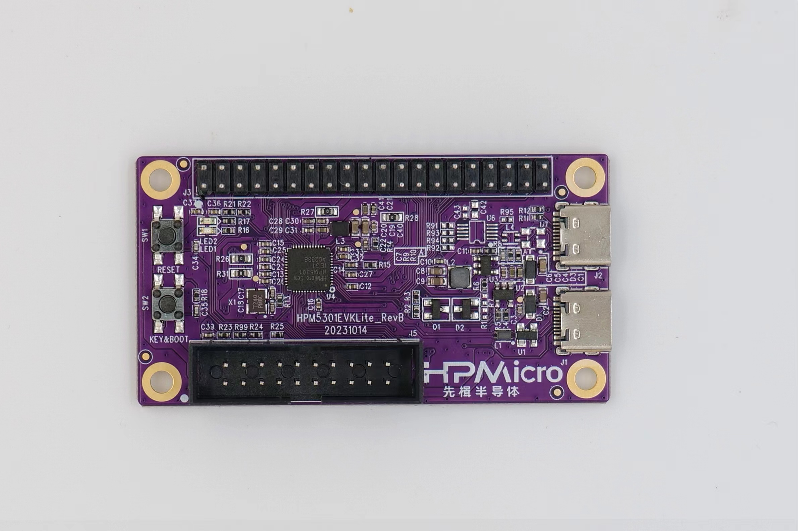

.. _hpm5301evklite:

HPM5301EVKLITE
==============

Overview
--------

HPM5301EVKLite is a development board based on Xianji's entry-level high-performance MCU HPM5301. HPM5301EVKLite provides a USB Type-C interface for high-speed USB-OTG functionality, with onboard buttons and LEDs for convenient user interaction. It also provides an extension interface that is compatible with Raspberry Pi and a standard JTAG debugging interface.

Console information printing
----------------------------

By default, UART0 is used for console printing. Connect UART0.TXD (J3.36) and UART0.RXD (J3.38) externally through the USB to serial port tool.

Boot Switch
-----------

- The KEY&BOOT button controls the boot switch

  - By default, the board boots from flash
  - To enter ISP boot mode, follow these steps:

    1. Press reset
    2. Press key
    3. Release reset
    4. Release key

.. list-table::
   :header-rows: 1

   * - KEY
     - Description
   * - OFF
     - Boot from Quad SPI NOR flash
   * - ON
     - ISP

.. _hpm5301evklite_buttons:

Button
------

.. list-table::
   :header-rows: 1

   * - Name
     - FUNCTIONS
   * - RESET
     - Reset Button
   * - KEY&BOOT
     - User Key & Boot switch

.. _hpm5301evklite_pins:

Pin Description
---------------

- UART Pin: modbus_rtu sample
  - The UART0 used for debugger console or some functional testing using UART
  - The UART3 is used for some functional testing using UART, such as USB_CDC_ACM_UART, MODBUS_RTU etc.

.. list-table::
   :header-rows: 1

   * - Function
     - Position
     - Remark
   * - UART3.TXD
     - J3[8]
     -
   * - UART3.RXD
     - J3[10]
     -
   * - UART0.TXD
     - J3[36]
     -
   * - UART0.RXD
     - J3[38]
     -
   * - UART3.break
     - J3[24]
     - generate uart break signal

- SPI Pin:

.. list-table::
   :header-rows: 1

   * - Function
     - Position
   * - SPI1.CSN
     - J3[24]
   * - SPI1.SCLK
     - J3[23]
   * - SPI1.MISO
     - J3[21]
   * - SPI1.MOSI
     - J3[19]

- I2C Pin:

.. list-table::
   :header-rows: 1

   * - Function
     - Position
   * - I2C3.SCL
     - J3[28]
   * - I2C3.SDA
     - J3[27]

- ACMP Pin:

.. list-table::
   :header-rows: 1

   * - Function
     - Position
   * - ACMP.CMP1.INN4
     - J3[13]
   * - ACMP.COMP_1
     - J3[3]

- ADC16 Pin:

.. list-table::
   :header-rows: 1

   * - Function
     - Position
   * - ADC0.INA2
     - J3[26]
   * - ADC1.INA1
     - J3[3]

- TinyUF2 Pin:

  .. note::

     - PA9 connect GND, and press reset, board enter DFU mode, then PA9 connect 3.3V, drag app to U disk, will download app and enter app directly if successfully;
     - PA9 connect 3.3V, and press reset, board enter bootloader mode, if flash has the valid app, will directly enter app;

.. list-table::
   :header-rows: 1

   * - Function
     - Position
   * - TinyUF2 Button
     - J3[32]

- GPTMR Pin:

.. list-table::
   :header-rows: 1

   * - Function
     - Position
     - Remark
   * - GPTMR0.CAPT_1
     - J3[3]
     - SENT decode input pin (idle low level)
   * - GPTMR0.COMP_1
     - J3[5]
     -
   * - GPTMR0.COMP_3
     - J3[8]
     - BCLK of i2s emulation
   * - GPTMR0.COMP_2
     - J3[26]
     - LRCK of i2s emulation
   * - GPTMR1.COMP_1
     - J3[7]
     - MCLK of i2s emulation
   * - GPTMR0.CAPT_2
     - J3[11]
     - SENT decode input pin (idle high level)

- CS Pin of i2s emulation

.. list-table::
   :header-rows: 1

   * - Function
     - Position
     - Remark
   * - PA31
     - J3[11]
     - the pin that controls the SPI slave CS

- CLOCK REF Pin

.. list-table::
   :header-rows: 1

   * - Function
     - Position
   * - PA09
     - J3[32]

- ESP-HOSTED Pin

.. list-table::
   :header-rows: 1

   * - Function
     - Position
     - Note
   * - PA09
     - J3[32]
     - RESET Pin
   * - PB12
     - J3[27]
     - HANDSHAKE Pin
   * - PB13
     - J3[28]
     - DATA_READY Pin

- BROWNOUT Interrupt Indicator Pin

.. list-table::
   :header-rows: 1

   * - Function
     - Position
   * - PB13
     - J3[28]
