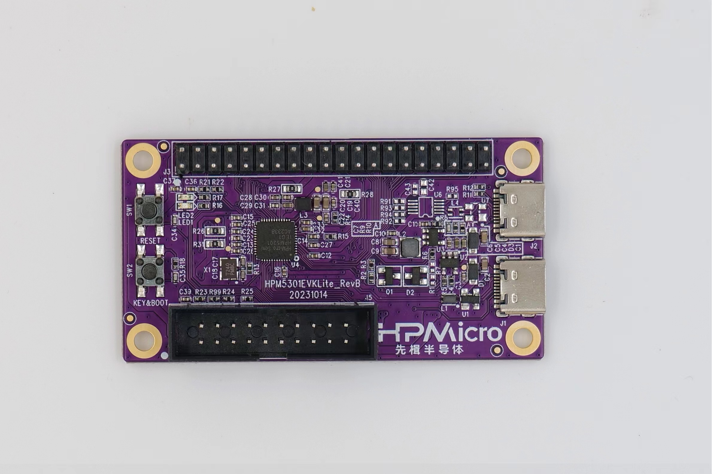

# HPM5301EVKLITE开发板

## 概述

HPM5301EVKLite是基于先楫的入门级高性能MCU HPM5301的开发板。HPM5301EVKLite提供了一个USB Type-C接口实现高速的USB-OTG功能，板载的按键和LED方便用户交互，同时提供了一个适配了树莓派的扩展接口和一个标准的JTAG调试接口。

## console 信息打印

默认使用 UART0 进行console打印，通过USB转串口工具外接UART0.TXD（J3.36）和UART0.RXD（J3.38）。

## BOOT切换

- 按键 KEY&BOOT 控制BOOT切换

  注意：
- 默认工作在 flash 启动；
- 通过以下步骤进入 isp 启动：
  1. 按下 reset
  2. 按下 key
  3. 松开 reset
  4. 松开 key

|    KEY   | 功能描述                |
| -------- | ----------------------- |
|    OFF   | Quad SPI NOR flash 启动 |
|    ON    | 在系统编程               |

## 按键

(lab_hpm5301evklite_board_buttons)=

| 名称     | 功能                         |
| -------- | --------------------------- |
| RESET    | Reset 按键                   |
| KEY&BOOT | 用户按键 & BOOT切换按键      |

## 引脚描述

(lab_hpm5301_evklite_board)=

- UART引脚

| 功能      | 位置   |
| --------- | ------ |
| UART3.TXD | J3[8]  |
| UART3.RXD | J3[10] |
| UART0.TXD | J3[36] |
| UART0.RXD | J3[38] |

- SPI引脚：

| 功能      | 位置    |
| --------- | ------ |
| SPI1.CSN  | J3[24] |
| SPI1.SCLK | J3[23] |
| SPI1.MISO | J3[21] |
| SPI1.MOSI | J3[19] |

- I2C引脚：

| 功能     | 位置   |
| -------- | ------|
| I2C2.SCL | J3[5] |
| I2C2.SDA | J3[3] |

- ACMP引脚

| 功能           | 位置   |
| -------------- | ------ |
| ACMP.CMP1.INN4 | J3[13] |
| ACMP.COMP_1    | J3[3]  |

- ADC16引脚

| 功能       | 位置    |
| ---------- | ------ |
| ADC0.INA11 | J3[5]  |
| ADC1.INA1  | J3[3]  |
| ADC1.INA2  | J3[26] |
| ADC1.INA3  | J3[13] |

- TinyUF2引脚 :

  注意:
  - PA9 连接 GND，同时按下 reset，board 进入 DFU mode, PA9 接 3.3V, 将app拖进枚举的U盘中, 下载app, 成功后自动跳转 app;
  - PA9 连接3.3V，同时按下 reset，board 进入 bootloader 模式， 如果此时 flash 有有效的app，会自动跳转 app；

| 功能           | 位置    |
| -------------- | ------ |
| TinyUF2 Button | J3[32] |

