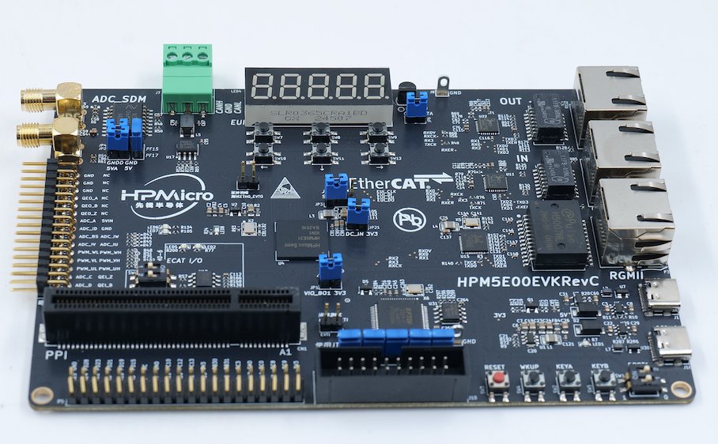

.. _hpm5e00evk:

HPM5E00EVK
==========

Overview
--------

The HPM5E00 is a single-core MCU with high computing power and abundant peripheral resources, 512KB of RAM on the chip and 1MB flash.

The HPM5E00EVK is an evaluation board for the HPM6E00 series MCU, providing a range of interfaces including ADC input with SMA interface, SDM input with SMA interface, motor control interface (QEO/QEI/SEI/PWM/ADC), CAN interface, Ethernet interface, EtherCAT interfaces, USB interface, audio interface, PPI/FREMC interface, and Raspberry Pi interface. It also integrates an onboard debugger FT2232 for easy debugging by users.

Onboard Hardware Resources
--------------------------

- HPM5E31 MCU (1MB Flash)
- Ethernet

  - 1000 Mbits PHY

- EtherCAT

  - 2 ports

- USB

  - USB type C (USB 2.0 OTG) connector x1

- Motor
- AD sensor

  - NSI1306W25

- Others

  - RGB LED
  - CAN

- Attention

  - **When using PPI peripherals, please insert the corresponding expansion board into the PPI interface**

    - The standard expansion board for HPM5E00EVK evaluation purposes is as follows, with a 16 bits SRAM and an EtherCAT interface.

      .. image:: doc/hpm5e00evk_ext.png
          :alt: hpm5e00evk_ext

    - The SRAM of the standard expansion board is reused with the 1Wire interface and QEI interface. When using the PPI SRAM, JP6 needs to be disconnected and the QEI pin should be floating.
    - The PPI interface has high flexibility. If you need to evaluate other parallel port devices, such as FPGA, ASYNC SRAM, etc., you can design your own expansion board or contact us.

DIP Switch SW2
--------------

.. list-table::
   :header-rows: 1

   * - Bit[2:1]
     - Description
   * - OFF, OFF
     - Boot from Quad SPI NOR flash
   * - ON, OFF
     - ISP

.. _hpm5e00evk_buttons:

Button
------

.. list-table::
   :header-rows: 1

   * - Name
     - FUNCTIONS
   * - PB24
     - GPIO ButtonA
   * - PB25
     - GPIO ButtonB
   * - WBUTN
     - WAKE UP Button
   * - RESETN
     - Reset Button

Plug-in
-------

- Debug interface select

.. list-table::
   :header-rows: 1

   * - Function
     - Position
     - Note
   * - Debug interface select
     - J17
     - All connected: use the on-board ft2232, All disconnected: use JTAG interface

- PPI/FEMC interface

.. list-table::
   :header-rows: 1

   * - Function
     - Position
     - Note
   * - PPI interface
     - CN1
     - Connecting to PPI expansion board. The SRAM of the standard expansion board is reused with the 1Wire interface and QEI interface. When using the PPI SRAM, JP6 needs to be disconnected and the QEI pin should be floating

.. _hpm5e00evk_pins:

Pin Description
---------------

- UART0 Pin

The UART0 is used for core0 debugger console:

.. list-table::
   :header-rows: 1

   * - Function
     - Pin
     - Position
   * - UART0.TX
     - PA00
     - DEBUGUART0
   * - UART0.RX
     - PA01
     - DEBUGUART0

- UART4 Pin

The UART4 is used for some functional testing using UART, such as MICROROS_UART, USB_CDC_ACM_UART, MODBUS_RTU, LIN, etc.

.. list-table::
   :header-rows: 1

   * - Function
     - Pin
     - Position
     - Remark
   * - UART4.TX
     - PC16
     - P5[8]
     -
   * - UART4.RX
     - PC17
     - P5[10]
     -
   * - UART4.break
     - PD13
     - P5[18]
     - generate UART break signal

- CAN Pin

.. list-table::
   :header-rows: 1

   * - Function
     - Position
   * - CAN_H
     - J7[0]
   * - CAN_L
     - J7[2]

- ADC Pin

.. list-table::
   :header-rows: 1

   * - Function
     - Pin
     - Position
   * - ADC16 Input
     - PF26
     - J3[6]
   * - SDM ADC Input
     - J4
     - request to connect JP2, JP4, JP5

- ACMP

.. list-table::
   :header-rows: 1

   * - Function
     - Pin
     - Position
   * - CMP0.INN6
     - PF26
     - J3[6]

- Quadrature Encoder Pin

.. note::

   QEO ABZ pins should be connected as documented here
   When a HALL sensor is required, the development board cannot be connected directly to the HALL.U/V/W of the motor board, but needs to be wired separately.

.. list-table::
   :header-rows: 1

   * - Function
     - Position
   * - QEI.A / HALL.U
     - J3[1]
   * - QEI.B / HALL.V
     - J3[3]
   * - QEI.Z / HALL.W
     - J3[5]
   * - QEO.A
     - J3[24]
   * - QEO.B
     - J3[22]
   * - QEO.Z
     - J3[26]

- PWM Output Pin

.. list-table::
   :header-rows: 1

   * - Function
     - Position
   * - PWM.WL
     - J3[12]
   * - PWM.WH
     - J3[11]
   * - PWM.VL / PWM1.P3
     - J3[10]
   * - PWM.VH / PWM1.P2
     - J3[9]
   * - PWM.UL / PWM1.P1
     - J3[8]
   * - PWM.UH / PWM1.P0
     - J3[7]
   * - PWM.FAULT
     - J3[5]

- QEIV2 Sin/Cos Pin

.. list-table::
   :header-rows: 1

   * - Function
     - Pin
     - Note
   * - Example1
     - J3[10]
     - Example Note 1
   * - Example2
     - J3[12]
     - Example Note 2

- PLB Pulse Output Pin

.. list-table::
   :header-rows: 1

   * - Function
     - Position
   * - PLB.PULSE_OUT
     - J3[5]

- PLB LIN Clock Pin

This pin is used for UART LIN Slave baud rate adaptive demo to detect the clock of RX signal

.. list-table::
   :header-rows: 1

   * - Function
     - Position
   * - PLB.TRGM_IN
     - J3[5]

- PLB Filter Output Pin

.. list-table::
   :header-rows: 1

   * - Function
     - Position
   * - PLB.Filter_IN
     - J3[9]
   * - PLB.Filter_OUT
     - J3[11]

- LOBS Trig Pin

.. list-table::
   :header-rows: 1

   * - Function
     - Pin
     - Position
   * - Trig Pin0
     - PC11
     - P5[24]
   * - Trig Pin1
     - PC10
     - P5[23]

- GPTMR Pin

.. list-table::
   :header-rows: 1

   * - Function
     - Pin
     - Position
     - Note
   * - GPTMR0.CAPT_2
     - PC00
     - P5[7]
     -
   * - GPTMR0.CAPT_3
     - PC08
     - P5[5]
     -
   * - GPTMR0.COMP_2
     - PD07
     - P5[26]
     - BLCK of i2s emulation
   * - GPTMR0.COMP_3
     - PD15
     - P5[29]
     - LRCK of i2s emulation
   * - GPTMR1.COMP_3
     - PC03
     - P5[11]
     - MCLK of i2s emulation
   * - GPTMR1.CAPT_2
     - PC00
     - P5[7]
     - QEI phase A
   * - GPTMR1.CAPT_3
     - PC08
     - P5[5]
     - QEI phase B

- CS Pin of i2s emulation

.. list-table::
   :header-rows: 1

   * - Function
     - Position
   * - PD24
     - P5[38]

- SPI Pin

.. list-table::
   :header-rows: 1

   * - Function
     - Pin
     - Position
   * - SPI1.CSN
     - PC11
     - P5[24]
   * - SPI1.SCLK
     - PC10
     - P5[23]
   * - SPI1.MISO
     - PC12
     - P5[21]
   * - SPI1.MOSI
     - PC13
     - P5[19]

- I2C Pin

.. list-table::
   :header-rows: 1

   * - Function
     - Position
   * - I2C0.SCL
     - P5[5]
   * - I2C0.SDA
     - P5[3]

- ECAT

.. list-table::
   :header-rows: 1

   * - Function
     - Pin
     - Position
   * - Port0
     -
     - P1
   * - Port1
     -
     - P2
   * - Port2
     -
     - via Extension board
   * - Input IO(2bit)
     - PD06/PD12
     - SW6
   * - Output IO(2bit)
     - PC23/PC24
     - LED6/LED7

.. list-table::
   :header-rows: 1

   * - Function
     - Pin
     - Note
   * - Example1
     - J3[10]
     - Example Note 1
   * - Example2
     - J3[12]
     - Example Note 2

- CLOCK REF Pin

.. list-table::
   :header-rows: 1

   * - Function
     - Position
   * - PC30
     - P5[22]
