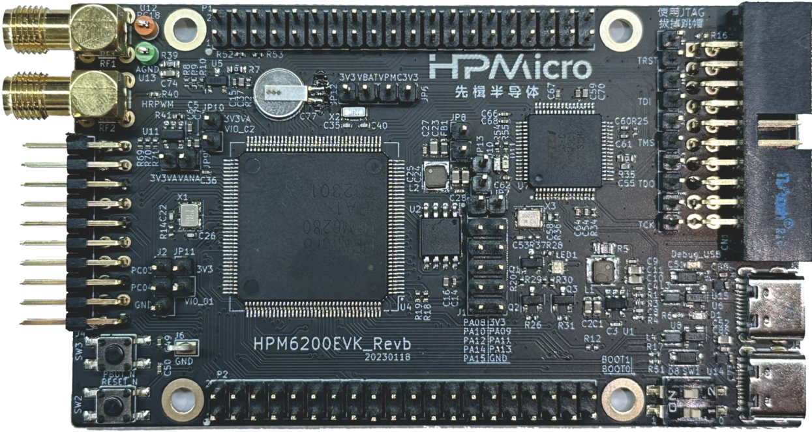

.. _hpm6200evk:

HPM6200EVK开发板
================

概述
----

HPM6200EVK提供了一系列HPM6200系列微控制器特色外设的接口，包括一个ADC输入SMA接口，一个高分辨率PWM输出的SMA接口，和一个先楫标准的电机控制接口。HPM6200EVK同时集成了2个2x20 pin IO扩展接口，连接了HPM6200 MCU的大部分IO，供用户自由评估。HPM6200EVK为MCU外扩了NOR Flash存储，并集成了板载调试器。

拨码开关 SW1
------------

- Bit 1，2控制启动模式

.. list-table::
   :header-rows: 1

   * - Bit[2:1]
     - 功能描述
   * - OFF, OFF
     - Quad SPI NOR flash 启动
   * - OFF, ON
     - 串行启动
   * - ON, OFF
     - 在系统编程

.. _hpm6200evk_buttons:

按键
----

.. list-table::
   :header-rows: 1

   * - 名称
     - 功能
   * - PBUTN (SW3)
     - 电源按键, TinyUF2 Boot按键, GPIO 按键
   * - RESET (SW2)
     - Reset 按键

.. _hpm6200evk_pins:

引脚描述
--------

- UART引脚

  UART2用于CORE1调试串口或一些使用UART的功能测试，例如USB_CDC_ACM_UART, MODBUS_RTU等。

  .. list-table::
     :header-rows: 1

     * - 功能
       - 位置
       - 备注
     * - UART2.TXD
       - P1[8]
       -
     * - UART2.RXD
       - P1[10]
       -
     * - UART2.break
       - P2[29]
       - 产生uart break信号

- LIN引脚

  .. list-table::
     :header-rows: 1

     * - 功能
       - 位置
     * - LIN0.TX
       - J1[3]
     * - LIN0.RX
       - J1[6]

- SDM引脚

  .. list-table::
     :header-rows: 1

     * - 功能
       - 位置
     * - SDM0.CLK_3
       - P2[27]
     * - SDM0.DAT_3
       - P2[28]

- SPI引脚：

  .. list-table::
     :header-rows: 1

     * - 功能
       - 位置
     * - SPI1.CSN
       - P2[29]
     * - SPI1.SCLK
       - P2[32]
     * - SPI1.MISO
       - P2[31]
     * - SPI1.MOSI
       - P2[33]

- I2C引脚：

  .. list-table::
     :header-rows: 1

     * - 功能
       - 位置
     * - I2C0.SCL
       - P2[7]
     * - I2C0.SDA
       - P2[10]

- ACMP引脚

  .. list-table::
     :header-rows: 1

     * - 功能
       - 位置
     * - ACMP.CMP1.INN5
       - J4[6]
     * - ACMP.COMP_1
       - J4[8]

- GPTMR引脚

  .. list-table::
     :header-rows: 1

     * - 功能
       - 位置
       - 备注
     * - GPTMR1.CAPT_0
       - P2[3]
       -
     * - GPTMR1.COMP_0
       - P2[23]
       - SPI模拟I2S的MCLK
     * - GPTMR1.COMP_1
       - P2[24]
       - SPI模拟I2S的LRCK
     * - GPTMR1.COMP_2
       - P2[5]
       - SPI模拟I2S的BLCK

- ADC16引脚

  .. list-table::
     :header-rows: 1

     * - 功能
       - 位置
     * - ADC0.INA8
       - P2[11]

- DAC引脚

  .. list-table::
     :header-rows: 1

     * - 功能
       - 位置
     * - DAC0.OUT
       - J2[1]
     * - DAC1.OUT
       - J2[2]

- PWM引脚

  .. list-table::
     :header-rows: 1

     * - 功能
       - 位置
     * - PWM0.P0
       - J4[14]
     * - PWM0.P1
       - J4[13]

- HRPWM引脚

  .. list-table::
     :header-rows: 1

     * - 功能
       - 位置
     * - HRPWM0.P0
       - RF2
     * - HRPWM0.P2
       - P2[29]

- PLA输出引脚

  .. list-table::
     :header-rows: 1

     * - 功能
       - 位置
     * - PLA.OUT
       - P1[26]

- 电机引脚

  参考 :ref:`drv_lv50a_mp1907` 进行连接
  hpm6200evk的HALL引脚需要单独接线

  - HALL引脚：

    .. list-table::
       :header-rows: 1

       * - 功能
         - evk板位置
         - 电机板位置
       * - HALL.U
         - J4[20]
         - J22[3]
       * - HALL.V
         - J4[18]
         - J22[4]
       * - HALL.W
         - J4[16]
         - J22[5]
       * - GND
         - J4[4]
         - J22[1]

- Tamper 接口

  .. list-table::
     :header-rows: 1

     * - 功能
       - 引脚
       - 位置
       - 模式
     * - TAMP.04
       - PZ04
       - P1[33]
       - 主动模式
     * - TAMP.05
       - PZ05
       - P1[36]
       - 主动模式
     * - TAMP.06
       - PZ06
       - P1[38]
       - 被动模式

- SPI模拟I2S CS引脚

  .. list-table::
     :header-rows: 1

     * - 功能
       - 位置
       - 备注
     * - PB31
       - P1[7]
       - 控制SPI从机CS的引脚

- CLOCK REF引脚

.. list-table::
   :header-rows: 1

   * - 功能
     - 位置
   * - PA14
     - J1[7]

.. _hpm6200evk_known_issues:

开发板已知问题
---------------

- USB VBUS引脚串接电阻问题

  - 影响

    - 该问题会影响到USB作为Device时，Host可能无法对其进行枚举。

  - 解决办法

    - 将USB VBUS 串接的 `1Kohm` 的电阻 R17 更换成 `10ohm` 电阻。

    .. image:: doc/hpm6200evk_known_issue_1.png
       :alt: hpm6200evk_known_issue_1

  - 修正情况

    - `HPM6200EVKRevC` 已修正，`HPM6200EVKRevB` 及之前的版本有这个问题。
