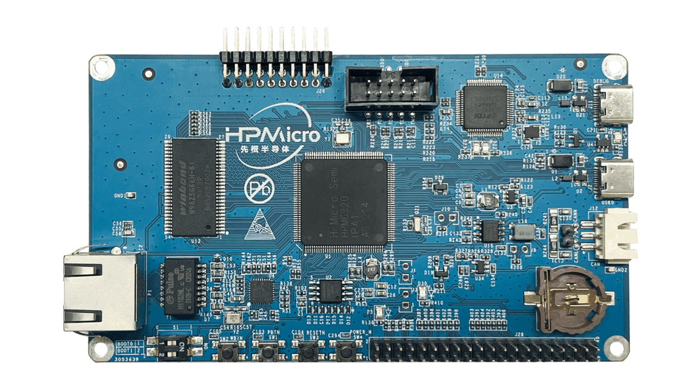

.. _hpm6300evk:

HPM6300EVK
==========

Overview
--------

HPM6300EVK provides interfaces for most of the peripherals of the HPM6300 microcontroller, including 1 SD card slot, 1 USB Type-C interface, a 100M Ethernet port, CAN FD interface, etc., and expands NOR Flash, SDRAM and other external memories, and integrates an on-board debugger.

Hardware
--------

- HPM6360IPA MCU
- Onboard Memory

  - 16bit 256Mb SDRAM
  - 128Mb Quad SPI NOR Flash

- USB

  - USB type C (USB 2.0 OTG) connector x2

- Ethernet

  - 100Mb PHY

- Others

  - TF Slot
  - CAN FD
  - FT2232

- Expansion port

  - Motor control port
  - Raspberry PI extension port

.. note::

   The sdram pins are multiplexed with the 15-20pin of the motor interface J26, so the motor interface and sdram can't be used at the same time.

DIP Switch S1
-------------

.. list-table::
   :header-rows: 1

   * - bit[2:1]
     - Description
   * - OFF, OFF
     - Boot from Quad SPI NOR flash
   * - OFF, ON
     - Serial boot
   * - ON, OFF
     - ISP

.. _hpm6300evk_buttons:

Button
------

.. list-table::
   :header-rows: 1

   * - Function
     - Position
   * - PBUTN (SW1)
     - Power Button, TinyUF2 Boot Button, GPIO Button
   * - WBUTN (SW2)
     - WAKE UP Button
   * - RESETN (SW3)
     - Reset Button

Plug-in
-------

- The ADC/DAC reference voltage is selected as follows:

  .. list-table::
     :header-rows: 1

     * - Connection
       - Description
     * - J108[2, 3]
       - Reference voltage

.. _hpm6300evk_pins:

Pin Description
---------------

- SPI Pin:

  .. list-table::
     :header-rows: 1

     * - Function
       - Position
     * - SPI3.CSN
       - J28[24]
     * - SPI3.SCLK
       - J28[23]
     * - SPI3.MISO
       - J28[21]
     * - SPI3.MOSI
       - J28[19]

- I2C Pin:

  .. list-table::
     :header-rows: 1

     * - Function
       - Position
     * - I2C0.SCL
       - J28[13]
     * - I2C0.SDA
       - J28[15]

- ACMP Pin:

  .. list-table::
     :header-rows: 1

     * - Function
       - Position
     * - CMP.INN5
       - J26[7]
     * - CMP.COMP_1
       - J26[8]

- GPTMR Pin:

  .. list-table::
     :header-rows: 1

     * - Function
       - Position
       - Remark
     * - GPTMR2.CAPT_0
       - J28[40]
       -
     * - GPTMR2.COMP_0
       - J28[35]
       - MCLK of i2s emulation
     * - GPTMR2.COMP_1
       - J28[12]
       - LRCK of i2s emulation
     * - GPTMR2.COMP_2
       - J28[16]
       - BLCK of i2s emulation

- ADC16 Pin:

  .. list-table::
     :header-rows: 1

     * - Function
       - Position
     * - ADC16 Reference Voltage
       - J108[2]
     * - ADC0.INA6
       - J28[38]

- DAC Pin:

  .. list-table::
     :header-rows: 1

     * - Function
       - Position
     * - DAC Reference Voltage
       - J108[2]
     * - DAC0.OUT
       - J26[11]

- PWM Pin:

  .. list-table::
     :header-rows: 1

     * - Function
       - Position
     * - PWM2.P0
       - J26[14]
     * - PWM2.P1
       - J26[13]

- Ethernet PPS Pin:

  .. list-table::
     :header-rows: 1

     * - Function
       - Pin
       - Position
     * - ENET0.EVTO0
       - PC21
       - J28[19]
     * - ENET0.EVTO1
       - PC20
       - J28[23]
     * - ENET0.EVTI0
       - PC27
       - J28[22]
     * - ENET0.EVTI1
       - PC26
       - J28[18]

- UART pin:

  The UART2 is used for some functional testing using UART, such as uart_software_rx_idle, uart_rx_timeout, uart_software_lin, MICROROS_UART, USB_CDC_ACM_UART, MODBUS_RTU etc.

  .. list-table::
     :header-rows: 1

     * - Function
       - Position
       - Remark
     * - UART2.TXD
       - J28[18]
       -
     * - UART2.RXD
       - J28[22]
       -
     * - UART2.break
       - J28[24]
       - generate uart break signal

- TRGMUX pin for uart_software_rx_idle sample:

  .. list-table::
     :header-rows: 1

     * - Function
       - Position
     * - TRGM1_P4(PA24)
       - J28[16]

- Motor Pin:

  Refer to section :ref:`drv_lv50a_mp1907` for configuration

- Tamper Pin:

  .. list-table::
     :header-rows: 1

     * - Function
       - Pin
       - Position
       - Mode
     * - TAMP.06
       - PZ06
       - J28[8]
       - Active Mode
     * - TAMP.07
       - PZ07
       - J28[10]
       - Active Mode

- CS Pin of i2s emulation:

  .. list-table::
     :header-rows: 1

     * - Function
       - Position
       - Remark
     * - PA07
       - J28[11]
       - the pin that controls SPI slave CS

.. _hpm6300evk_known_issues:

Board Know Issue
----------------------

- USB VBUS pin resistance issue

  - Impact

    - This issue may affect the Host's ability to enumerate USB as a device.

  - Solution

    - Replace the 1kohm resistors R135 with 10ohm resistors.

    .. image:: doc/hpm6300evk_known_issue_1.png
       :alt: hpm6300evk_known_issue_1

  - Revised Status

    - `HPM6300EVKRevD` has been revised, `HPM6360-EVK-A3` and previous versions have this issue.

- USB ID pin pull down resistance issue

  - Impact

    - When using USB OTG, this issue may affect the role recognition of USB connected device or connected host.

  - Solution

    - Remove the pull-down resistors R127, R128 from the CC port of the USB interface.

    .. image:: doc/hpm6300evk_known_issue_2.png
       :alt: hpm6300evk_known_issue_2

  - Revised Status

    - `HPM6300EVKRevD` has been revised, `HPM6360-EVK-A3` and previous versions have this issue.