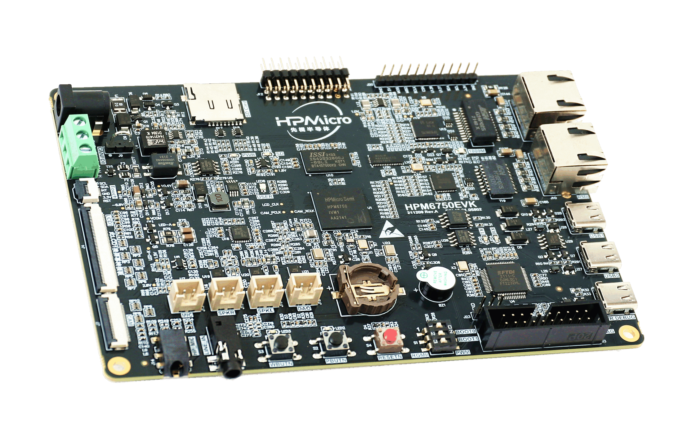
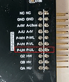

# HPM6750EVK

## Overview

The HPM6750 is a dual-core flashless MCU running 816Mhz. It has a 2MB continuous on-chip ram. Also, it provides various memory interfaces, including SDRAM, Quad SPI NOR Flash, SD/eMMC. It integrates rich audio and video interfaces, including LCD, pixel DMA, camera， and I2S audio interfaces.

 

## Hardware

- HPM6750IVM MCU (816Mhz, 2MB OCRAM)
- Onboard Memory
  - 256Mb SDRAM
  - 128Mb Quad SPI NOR Flash
- Display & Camera
  - LCD connector
  - Camera (DVP)
- Ethernet
  - 1000 Mbits PHY
  - 100 Mbits PHY
- USB
  - USB type C (USB 2.0 OTG) connector x3
- Audio
  - Line in
  - Mic
  - Speaker
  - DAO
- Others
  - TF Slot
  - FT2232
  - Beeper
  - RGB LED
  - CAN
- Expansion port
  - Motor control

## DIP Switch S1

- Bit 2 and 3 controls boot mode

| bit[2:3] | Description                  |
| -------- | ---------------------------- |
| OFF, OFF | Boot from Quad SPI NOR flash |
| OFF, ON  | Serial boot                  |
| ON, OFF  | ISP                          |

- Change the position of bit 1 to select between PWM and Gigabit Ethernet

| Bit1 | Description       |
| ---- | ----------------- |
| OFF  | Gigabit Ethernet |
| ON   | PWM               |

(lab_hpm6750_evk_board)=

## Button

(lab_hpm6750_evk_board_buttons)=

| Name        | FUNCTIONS                                      |
| ----------- | ---------------------------------------------- |
| PBUTN (S2)  | Power Button, TinyUF2 Boot Button, GPIO Button |
| WBUTN (S3)  | WAKE UP Button                                 |
| RESETN (S4) | Reset Button                                   |

## Pin Description

- PWM Pin:

| Function                                                                                | Position |
| --------------------------------------------------------------------------------------- | -------- |
| PWM2.P0                                                                                 | J12[14]  |
| PWM2.P1                                                                                 | J12[13]  |
|  |          |

- SPI Pin：

| Function  | Position |
| --------- | -------- |
| SPI2.CSN  | J20[7]   |
| SPI2.SCLK | J20[8]   |
| SPI2.MISO | J20[9]   |
| SPI2.MOSI | J20[10]  |

- I2C Pin：

| Function | Position |
| -------- | -------- |
| I2C0.SCL | J20[3]   |
| I2C0.SDA | J20[4]   |

- UART for core1 debug console

| Function   | Position |
| ---------- | -------- |
| UART13.TXD | J20[5]   |
| UART13.RXD | J20[6]   |

- ACMP Pin

| Function   | Position |
| ---------- | -------- |
| CMP.INN6   | J12[8]   |
| CMP.COMP_1 | J12[6]   |

- GPTMR Pin

| Function      | Position | Remark   |
| ------------- | -------- | -------- |
| GPTMR4.CAPT_1 | J12[6]   |
| GPTMR3.COMP_1 | J12[8]   | MCLK of i2s emulation  |
| GPTMR5.COMP_2 | J12[18]  | LRCK of i2s emulation |
| GPTMR5.COMP_3 | J12[16]  | BLCK of i2s emulation  |

- ADC12 Pin

| Function                        | Position |
| ------------------------------- | -------- |
| ADC12 Reference Voltage Setting | N/A      |
| ADC0.VINP11                     | J12[6]   |

- ADC16 Pin

| Function                         | Position |
| :------------------------------- | -------- |
| ADC16 Reference Voltage Setting | N/A      |
| ADC3.INA2                        | J12[5]   |

- headphone interface

| Function        | Position | Standard |
| --------------- | -------- | -------- |
| 3.5mm headphone | J14      | CTIA |

- audio input interface

| Function     | Position |
| ------------ | -------- |
| 3.5mm LIN_IN | J17      |

- DAO interface

| Function | Position |
| -------- | -------- |
| Speaker  | J18      |

- Ethernet PPS Pin

| Function    | Position |
| ----------- | -------- |
| ENET0.EVTO0 | U29[2]   |

- UART13 pin
 The UART13 is used for core1 debug console or some functional testing using UART, such as uart_software_rx_idle, uart_rx_timeout, uart_software_lin, MICROROS_UART, USB_CDC_ACM_UART, MODBUS_RTU etc.

| Function   | Position | Remark   |
| ---------- | -------- | ------   |
| UART13.TXD | J20[5]   |
| UART13.RXD | J20[6]   |
| UART13.break | J20[7]   | generate uart break signal |

- TRGMUX pin for uart_software_rx_idle sample

| Function   | Position |
| ---------- | -------- |
| TRGM2_P9(PD19)  | J12[20]   |

- Motor Pin:

  Refer to section [DRV-LV50A-MP1907 Motor Driver Board ](lab_drv_lv50a_mp1907) for configuration

- Tamper Pin

| Function | Pin    | Position |  Mode  |
|----------|--------|--------|----------|
| TAMP.08  | PZ08   | J20[6] | Active Mode |
| TAMP.09  | PZ09   | J20[5] | Active Mode |
| TAMP.10  | PZ10   | J20[4] | Passive Mode |

- CS Pin of i2s emulation

| Function | Position   |  Remark |
| ----     | -----      | ------ |
| PD25      | J12[16]    | the pin that controls the SPI slave CS |
