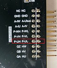

# HPM6750E2VK

## Overview

The HPM6750 is a dual-core flashless MCU running 816Mhz. It has a 2MB continuous on-chip ram. Also, it provides various memory interfaces, including SDRAM, Quad SPI NOR Flash, SD/eMMC. It integrates rich audio and video interfaces, including LCD, pixel DMA, camera， and I2S audio interfaces.

 

## Hardware

- HPM6750IVM MCU (816Mhz, 2MB OCRAM)
- Onboard Memory
  - 256Mb SDRAM
  - 128Mb Quad SPI NOR Flash
- Display & Camera
  - LCD connector
  - Camera (DVP)
- Ethernet
  - 1000 Mbits PHY
  - 100 Mbits PHY
- USB
  - USB type C (USB 2.0 OTG) connector x3
- Audio
  - Line in
  - Mic
  - DAO
- Others
  - TF Slot
  - FT2232
  - RGB LED
  - CAN
- Expansion port
  - Motor control

## DIP Switch S1

- Bit 1 and 2 controls boot mode

| bit[2:1] | Description                  |
| -------- | ---------------------------- |
| OFF, OFF | Boot from Quad SPI NOR flash |
| OFF, ON  | Serial boot                  |
| ON, OFF  | ISP                          |

(lab_hpm6750_evk2_board)=

## Button

(lab_hpm6750_evk2_board_buttons)=

| Name         | FUNCTIONS                                      |
| ------------ | ---------------------------------------------- |
| PBUTN (SW1)  | Power Button, TinyUF2 Boot Button, GPIO Button |
| WBUTN (SW2)  | WAKE UP Button                                 |
| RESETN (SW3) | Reset Button                                   |

## Plug-in

- `J108` ADC reference voltage selection

  | Connection | Description                  |
  | --------   | ---------------------------- |
  | 1, 2       | 3.3v                         |
  | 2, 3       | High precision 3.3v          |

## Resistor Switch

- GigE POP `R177-R182`

  | Status     | Description                  |
  | --------   | ---------------------------- |
  | Welding    | Network                      |
  | Disconnect | Motor                        |

## Pin Description

- PWM Pin:

  
- SPI Pin：

| Function  | Position |
| --------- | -------- |
| SPI2.CSN  | J20[7]   |
| SPI2.SCLK | J20[8]   |
| SPI2.MISO | J20[9]   |
| SPI2.MOSI | J20[10]  |

- I2C Pin：

| Function | Position |
| -------- | -------- |
| I2C0.SCL | J20[3]   |
| I2C0.SDA | J20[4]   |

- UART for core1 debug console

| Function   | Position |
| ---------- | -------- |
| UART13.TXD | J20[5]   |
| UART13.RXD | J20[6]   |

- ACMP Pin

| Function   | Position |
| ---------- | -------- |
| CMP.INN6   | J10[8]   |
| CMP.COMP_1 | J10[6]   |

- GPTMR Pin

| Function      | Position |
| ------------- | -------- |
| GPTMR4.CAPT_1 | J10[6]   |
| GPTMR3.COMP_1 | J10[7]   |

- ADC12 Pin

| Function        | Position |
| --------------- | -------- |
| ADC0/1/2.VINP11 | J10[6]   |
| ADC0/1/2.VINP10 | J10[7]   |
| ADC0/1/2.VINP7  | J10[8]   |

- ADC16 Pin

| Function  | Position |
| :-------- | -------- |
| ADC3.INA2 | J10[5]   |
