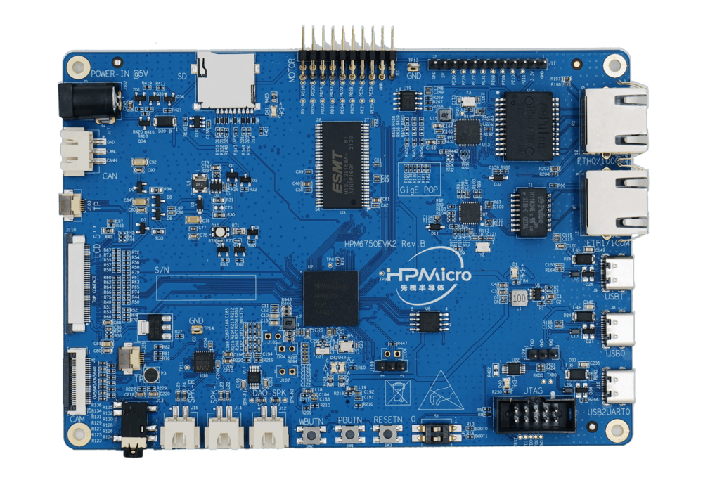

.. _hpm6750evk2:

HPM6750EVK2开发板
=================

概述
----

HPM6750是一款主频达816MHz的双核微控制器。该芯片拥有最大2M字节的连续片上RAM，并集成了丰富的存储接口，如SDRAM，Quad SPI NOR flash， SD/eMMC卡。同时它也提供多种音视频接口包括LCD显示，像素DMA，摄像头以及I2S音频接口。

板上硬件资源
------------

- HPM6750IVM 微控制器 (主频816Mhz, 2MB片上内存)
- 板载存储
  - 256Mb SDRAM
  - 128Mb Quad SPI NOR Flash
- 显示/摄像头
  - LCD接口
  - 摄像头(DVP)接口
- 以太网
  - 1000 Mbits PHY
  - 100 Mbits PHY
- USB
  - USB type C (USB 2.0 OTG) connector x3
- 音频
  - Line in
  - Mic
  - Speaker
  - DAO
- 其他
  - TF卡槽
  - RGB LED
  - CAN
- 扩展口
  - 电机控制

拨码开关 S1
-----------

- Bit 1，2控制启动模式

.. list-table::
   :header-rows: 1

   * - Bit[2:1]
     - 功能描述
   * - OFF, OFF
     - Quad SPI NOR flash 启动
   * - OFF, ON
     - 串行启动
   * - ON, OFF
     - 在系统编程

.. _hpm6750evk2_buttons:

按键
----

.. list-table::
   :header-rows: 1

   * - 名称
     - 功能
   * - PBUTN (SW1)
     - 电源按键, TinyUF2 Boot按键, GPIO 按键
   * - WBUTN (SW2)
     - WAKE UP 按键
   * - RESETN (SW3)
     - Reset 按键

插件
----

- ADC/DAC参考电压连接

.. list-table::
   :header-rows: 1

   * - 连接
     - 描述
   * - J108[2, 3]
     - 参考电压

功能选择电阻
------------

- GigE POP `R177-R182`

.. list-table::
   :header-rows: 1

   * - 状态
     - 描述
   * - 焊接
     - 网络
   * - 断开
     - 电机

.. _hpm6750evk2_pins:

引脚描述
--------

- UART0串口引脚

  UART0的引脚引出至三个位置

.. list-table::
   :header-rows: 1

   * - 功能
     - 引脚
     - 位置1
     - 位置2
     - 位置3
   * - UART0.TX
     - PY06
     - J109[1]
     - JTAG P4[7]
     - USB2UART0
   * - UART0.RX
     - PY07
     - J109[3]
     - JTAG P4[9]
     - USB2UART0

.. note::

   使用UART0时，请确保只有一处连接，避免多处连接造成功能不正常。例如，JTAG口连接了UART0，从USB2UART0接口发送数据给UART0就会异常。

- UART13串口引脚：

  UART13用于CORE1调试串口或一些使用UART的功能测试，例如uart_software_rx_idle，uart_rx_timeout，uart_software_lin，MICROROS_UART，USB_CDC_ACM_UART, MODBUS_RTU等。

.. list-table::
   :header-rows: 1

   * - 功能
     - 引脚
     - 位置
     - 备注
   * - UART13.TXD
     - PZ09
     - J11[5]
     -
   * - UART13.RXD
     - PZ08
     - J11[6]
     -
   * - UART13.break
     - PE31
     - J11[7]
     - 产生uart break信号

- TRGMUX引脚用于uart_software_rx_idle工程

.. list-table::
   :header-rows: 1

   * - 功能
     - 位置
   * - TRGM2_P9(PD19)
     - J10[20]

- SPI引脚：

.. list-table::
   :header-rows: 1

   * - 功能
     - 引脚
     - 位置
   * - SPI2.CSN
     - PE31
     - J11[7]
   * - SPI2.SCLK
     - PE27
     - J11[8]
   * - SPI2.MISO
     - PE28
     - J11[9]
   * - SPI2.MOSI
     - PE30
     - J11[10]

- I2C引脚：

.. list-table::
   :header-rows: 1

   * - 功能
     - 引脚
     - 位置
   * - I2C0.SCL
     - PZ11
     - J11[3]
   * - I2C0.SDA
     - PZ10
     - J11[4]

- PWM引脚:

.. list-table::
   :header-rows: 1

   * - 功能
     - 引脚
     - 位置
   * - PWM2.P[0]
     - PD31
     - J10[14]
   * - PWM2.P[1]
     - PD30
     - J10[13]

- ACMP引脚

.. list-table::
   :header-rows: 1

   * - 功能
     - 引脚
     - 位置
   * - CMP.INN6
     - PE21
     - J10[8]
   * - CMP.COMP_1
     - PE25
     - J10[6]

- GPTMR引脚

.. list-table::
   :header-rows: 1

   * - 功能
     - 引脚
     - 位置
     - 备注
   * - GPTMR4.CAPT_1
     - PE25
     - J10[6]
     -
   * - GPTMR3.COMP_1
     - PE24
     - J12[8]
     - SPI模拟I2S的MCLK
   * - GPTMR5.COMP_2
     - PD24
     - J10[18]
     - SPI模拟I2S的LRCK
   * - GPTMR5.COMP_3
     - PD23
     - J10[16]
     - SPI模拟I2S的BLCK

- ADC12引脚

.. list-table::
   :header-rows: 1

   * - 功能
     - 引脚
     - 位置
   * - ADC12参考电压
     - VREFH
     - J108[2]
   * - ADC0.VINP11
     - PE25
     - J10[6]

- ADC16引脚

.. list-table::
   :header-rows: 1

   * - 功能
     - 引脚
     - 位置
   * - ADC16参考电压
     - VREFH
     - J108[2]
   * - ADC3.INA2
     - PE29
     - J10[5]

- 耳机接口

.. list-table::
   :header-rows: 1

   * - 功能
     - 位置
     - 标准
   * - 3.5mm耳机接口
     - J13
     - OMTP

- 音频输入接口

.. list-table::
   :header-rows: 1

   * - 功能
     - 位置
   * - 麦克风
     - P3

- DAO接口

.. list-table::
   :header-rows: 1

   * - 功能
     - 位置
   * - 喇叭接口
     - J12

- 以太网PPS信号引脚

.. list-table::
   :header-rows: 1

   * - 功能
     - 引脚
     - 位置
   * - ENET0.EVTO0
     - PF05
     - U11[3]
   * - ENET0.EVTI1
     - PE25
     - J10[6]

- 电机引脚

  需要根据功能选择电阻章节，选择GigE POP为电机

  如果使用高频注入的demo，需要去掉PWM接地电阻R436-R441

  参考 :ref:`drv_lv50a_mp1907` 进行连接

- Tamper 接口

.. list-table::
   :header-rows: 1

   * - 功能
     - 引脚
     - 位置
     - 模式
   * - TAMP.08
     - PZ08
     - J11[6]
     - 主动模式
   * - TAMP.09
     - PZ09
     - J11[5]
     - 主动模式
   * - TAMP.10
     - PZ10
     - J11[4]
     - 被动模式

- SPI模拟I2S CS引脚

.. list-table::
   :header-rows: 1

   * - 功能
     - 位置
     - 备注
   * - PD25
     - J10[16]
     - 控制SPI从机CS的引脚

- CLOCK REF引脚

.. list-table::
   :header-rows: 1

   * - 功能
     - 位置
   * - PE24
     - J10[7]

.. _hpm6750evk2_known_issues:

开发板已知问题
---------------

- USB VBUS引脚串接电阻问题

  - 影响

    - 该问题会影响到USB作为Device时，Host可能无法对其进行枚举。

  - 解决办法

    - 将USB VBUS 串接的 `1Kohm` 的电阻 R164 和 R165 更换成 `10ohm` 电阻。

    .. image:: doc/hpm6750evk2_known_issue_1.png
       :alt: hpm6750evk2_known_issue_1

  - 修正情况

    - `HPM6750EVK2RevD` 已修正，`HPM6750EVK2RevC` 及之前的版本有这个问题。

- USB ID引脚下拉电阻问题

  - 影响

    - USB OTG时，该问题可能会影响到USB接入Device设备或接入Host主机的角色识别。

  - 解决办法

    - 将USB接口的CC端口下拉电阻 R155、R156、R157、R158 拿掉。

    .. image:: doc/hpm6750evk2_known_issue_2.png
       :alt: hpm6750evk2_known_issue_2

  - 修正情况

    - `HPM6750EVK2RevD` 已修正，`HPM6750EVK2RevC` 及之前的版本有这个问题。
