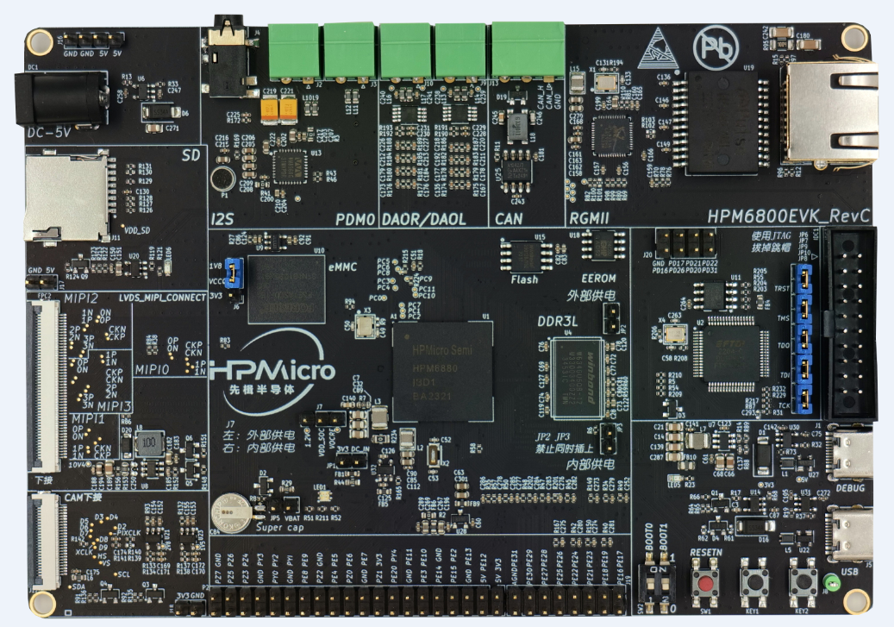

# HPM6800EVK开发板

## 概述

HPM6800是一款主频达816MHz的双核微控制器。该芯片拥有最大1M字节的连续片上RAM，并集成了丰富的存储接口，如SDRAM，Quad SPI NOR flash， SD/eMMC卡。同时它也提供多种音视频接口包括LCD显示，像素DMA，摄像头以及I2S音频接口。

 

## 板上硬件资源

- HPM6800 微控制器 (主频600Mhz, 1M片上SRAM)
- 板载存储
  - 256MB SDRAM
  - 16MB Quad SPI NOR Flash
  - 8GB eMMC
- 显示/摄像头
  - LCD接口
  - MIPI-DSI
  - MIPI-CSI
  - 摄像头(DVP)接口
- 以太网
  - 1000 Mbits PHY
- USB
  - USB type C (USB 2.0 OTG) connector x1
- 音频
  - Line in
  - Mic
  - Speaker
  - DAO
- 其他
  - TF卡槽
  - RGB LED
  - CAN

## 拨码开关 SW2

- Bit 1，2控制启动模式

| Bit[2:1] | 功能描述                |
| -------- | ----------------------- |
| OFF, OFF | Quad SPI NOR flash 启动 |
| OFF, ON  | eMMC启动                |
| ON, OFF  | 在系统编程              |

(lab_hpm6800_evk_board)=

## 按键

(**lab_hpm6800_evk_board_buttons**)=

| 名称         | 功能                                  |
| ------------ | ------------------------------------- |
| PBUTN (KEY1) | GPIO 按键                             |
| WBUTN (KEY2) | WAKE UP 按键                          |
| RESETN (SW1) | Reset 按键                            |

## 插件

- ADC/DAC参考电压连接

  | 连接 | 描述        |
  | ---- | ----------- |
  | J18 | 参考电压 |

- eMMC电压选择

  | 连接 | 描述        |
  | ---- | ----------- |
  | J6 | eMMC电压3.3V和1.8V选择 |
注：在测eMMC示例时需要将跳帽短接VCCQ 和1.8V

## 引脚描述

- UART0串口引脚：

 UART0的引脚引出至两个位置：

| 功能     | 引脚 |   位置     |
| -------- | ---- |  --------- |
| UART0.TX | PA00 | DEBUGUART0 |
| UART0.RX | PA01 | DEBUGUART0 |

- SPI引脚：

| 功能      | 引脚 | 位置    |
| --------- | ---- | ------- |
| SPI3.CSN  | PE04 | P2[24]  |
| SPI3.SCLK | PE05 | P2[23]  |
| SPI3.MISO | PE06 | P2[21]  |
| SPI3.MOSI | PE07 | P2[19]  |

- I2C引脚：

| 功能     | 引脚 | 位置   |
| -------- | ---- | ------ |
| I2C1.SCL | PE13 | P2[5] |
| I2C1.SDA | PE12 | P2[3] |

- ADC16引脚

| 功能          | 引脚  | 位置    |
| ------------- | ----- | ------- |
| ADC0.INA8     | PE16  | J19[15]  |

- GPTMR 引脚

| 功能          | 引脚  | 位置    |
| ------------- | ----- | ------- |
| GPTMR2.CAPT_0 | PE22  | J19[9]  |
| GPTMR2.COMP_0 | PE23  | J19[12] |
| GPTMR2.COMP_1 | PE24  | J19[10] |

- 耳机接口

| 功能          | 位置 | 标准 |
| ------------- | ---- | ---- |
| 3.5mm耳机接口 | J4  | OMTP |

- 音频输入接口

| 功能   | 位置 |
| ------ | ---- |
| 麦克风 | P1   |

- DAO接口

| 功能     | 位置 |
| -------- | ---- |
| 喇叭接口(左) | J9  |
| 喇叭接口(右) | J10  |

- 以太网PPS信号引脚

| 功能        | 位置   |
| ----------- | ------ |
| ENET0.EVTO0 | J20[7]   |

- CAN 通信接口

| 功能       | 引脚    | 位置   |  输出        |
| -----------| ------ | -----  | -----------  |
| MCAN3.TXD  | PD15   | U25[1] | CAN.H J13[3] |
| MCAN3.RXD  | PD14   | U25[4] | CAN.L J13[2] |
| MCAN3.STBY | PD13   | U25[8] |              |
