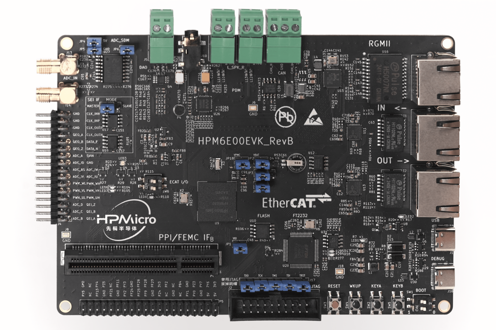
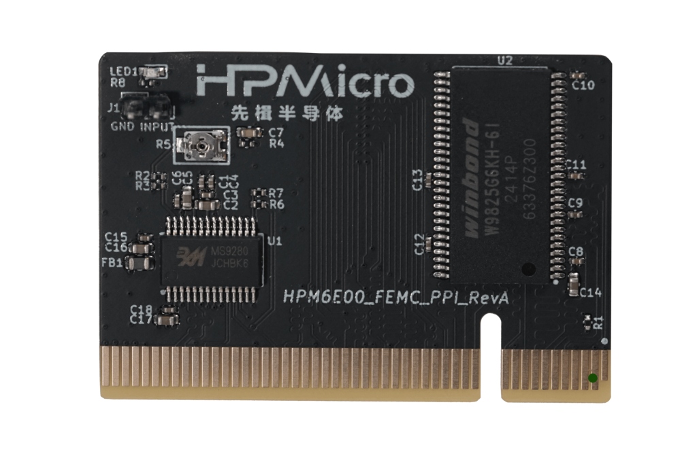

# HPM6E00EVK

## Overview

The HPM6E00 is a dual-core MCU running 600MHz, with high computing power and abundant peripheral resources, and 2MB of RAM on the chip.

The HPM6E00EVK is an evaluation board for the HPM6E00 series MCU, providing a range of interfaces including ADC input with SMA interface, SDM input with SMA interface, motor control interface (QEO/QEI/SEI/PWM/ADC), CAN interface, Ethernet interface, EtherCAT interfaces, USB interface, audio interface, PPI/FREMC interface, and Raspberry Pi interface. It also integrates an onboard debugger FT2232 for easy debugging by users.

 

## Hardware

- HPM6E00 MCU (600MHz dual-core, 2MB onchip RAM)
- Onboard Memory
  - 16MB Quad SPI NOR Flash
- Ethernet
  - 1000 Mbits PHY
- Ethercat
  - 2 port
- USB
  - USB type C (USB 2.0 OTG) connector x1
- Audio
  - Line in
  - Mic
  - DAO
- Motor
  - RS422
  - RS485
- AD sensor
  - NSI1306W25
- Others
  - RGB LED
  - CAN
- Attention
  - **When using FEMC(SDRAM) or PPI peripherals, please insert the corresponding expansion board into the PPI/FEMC interface**
    - The standard expansion board for HPM6E00EVK evaluation purposes is as follows, with a 16 bits SDRAM (FEMC access) and a parallel ADC (PPI access).
      
    - The FEMC/PPI interface has high flexibility. If you need to evaluate other parallel port devices, such as FPGA, ASYNC SRAM, etc., you can design your own expansion board or contact us.
  - **When using SDM peripheral and AD sensor(NSI1306W25) on board, please connect JP4、JP5、JP6 and disconnect J3**
  - **The board level SEI interface CLK pin is the same as the SDM sampling chip CLK pin and cannot be used simultaneously. Please disconnect J3 when using the SDM sampling chip; When using the SEI interface, disconnect JP6.**

## DIP Switch SW2

- Bit 1 and 2 controls boot mode

| bit[2:1] | Description                  |
| -------- | ---------------------------- |
| OFF, OFF | Boot from Quad SPI NOR flash |
| ON, OFF  | ISP                          |

(lab_hpm6e00_evk_board)=

## Button

(lab_hpm6e00_evk_board_buttons)=

| Name         | FUNCTIONS                                      |
| ------------ | ---------------------------------------------- |
| PB24 (KEYA) | GPIO ButtonA                             |
| PB25 (KEYB) | GPIO ButtonB                             |
| WBUTN (WKUP) | WAKE UP Button                          |
| RESETN (RESET) | Reset Button                            |

## Plug-in

- SEI CLK Section:

| Function  | Position   | Note |
| --------- | ------ |------|
| SEI.CLK Section  | J3 | Master side, CLKO active. Slave side，CLKI active |

- Debug interface select

| Function  | Position   | Note |
| --------- | ------ |------|
| Debug interface select  | J17 | All connected:use the on-board ft2232, All disconnected: use JTAG interface |

- PPI/FEMC interface

| Function  | Position   | Note |
| --------- | ------ |------|
| PPI/FEMC interface | CN1  | Connecting to PPI or FEMC expansion board |

## Pin Description

- PUART Pin:
 The PUART is used for low power mode testing, such as wakeup, etc.

| Function | Pin |  Position |
| ---- | ----- | ------|
| PUART.TX | PY0  | P5[8] |
| PUART.RX | PY1  | P5[10] |

- UART0 Pin:

The UART0 use for core0 debugger console:

| Function | Pin  | Position |
| -------- | ---- | ----------|
| UART0.TX | PA00 | DEBUGUART0 |
| UART0.RX | PA01 | DEBUGUART0 |

- UART1 Pin:

 The UART1 is used for core1 debugger console or some functional testing using UART, such as MICROROS_UART, USB_CDC_ACM_UART, MODBUS_RTU, lin etc.

| Function | Pin  | Position | Remark   |
| -------- | ---- | ----------| ------   |
| UART1.TX | PY07 | P5[5]  |
| UART1.RX | PY06 | P5[3] |
| UART1.break | PF27 | J4[6] | generate uart break signal |

- CAN Pin

| Function      | Postion   |
| --------- | ------ |
| CAN_H  | J7[0] |
| CAN_L  | J7[2] |

- Audio Pin

| Function      | Postion   |
| --------- | ------ |
| Speaker Left Channel  | J11 |
| Speaker Right Channel  | J12 |
| 3.5mm  | J10 |
| DAO Interface  | J5 |

- ADC Pin

| Function      | Postion   |
| --------- | ------ |
| ADC Input  | J4[2] |
| SDM ADC Input  | J13 |

- ACMP pin

| Function  | Position |
| --------- | -------- |
| CMP0.INN4 | J4[18]   |

- Quadrature Encoder Pin

| Function      | Postion   |
| --------- | ------ |
| QEI.A / HALL.U  | J4[1] |
| QEI.B / HALL.V  | J4[3] |
| QEI.Z / HALL.W  | J4[5] |
| QEO.A  | J4[26] |
| QEO.B  | J4[24] |
| QEO.Z  | J4[22] |

- PWM Output Pin

| Function      | Postion   |
| --------- | ------ |
| PWM.WL  | J4[12] |
| PWM.WH  | J4[11] |
| PWM.VL / PWM1.P3 | J4[10] |
| PWM.VH / PWM1.P2 | J4[9] |
| PWM.UL / PWM1.P1 | J4[8] |
| PWM.UH / PWM1.P0 | J4[7] |

- SEI Pin

| Function      | Postion   | Note |
| --------- | ------ |------|
| SEI.CLK_IN_P  | J4[29] |Clock differential output in host mode P|
| SEI.CLK_IN_N  | J4[31] |Clock differential output in host mode N|
| SEI.CLK_OUT_P  | J4[27] |Clock differential input in slave mode P|
| SEI.CLK_OUT_N  | J4[25] |Clock differential input in slave mode N|
| SEI.DATA_P  | J4[23] |Data differential Signal P|
| SEI.DATA_N  | J4[21] |Data differential Signal N|

- QEIV2 Sin/Cos Pin

| Function      | Postion   | Note |
| ---------- | ------ | ------  |
| ADC2.INA11  | J4[15] | ADC_IW (Cos) |
| ADC0.INA14  | J4[13] | ADC_IU (Sin) |

- RDC pin

| Function      | EVK board Position | RDC board Position |
| --------- | ------ | ------ |
| RDC.PWM   | J4[7]  | J2[7]  |
| RDC.ADC0  | J4[13] | J2[13]  |
| RDC.ADC1  | J4[14] | J2[14]  |
| GND       | J4[32] | J2[17]  |

- PLB Pin
| Function      | Postion   |
| PLB.PULSE_OUT  | J4[5] |

- Tamper Pin

| Function | Pin    | Position |  Mode  |
|----------|--------|--------|----------|
| TAMP.04  | PZ04   | P5[18] | Active Mode |
| TAMP.05  | PZ05   | P5[33] | Active Mode |
| TAMP.03  | PZ03   | P5[7]  | Passive Mode |

- LOBS Pin

| Pin   | Position |
|--------|--------|
| PF26   | P5[23] |

- GPTMR Pin:

| Function      | Position | Remark   |
| ------------- | -----    | ------   |
| GPTMR4.CAPT_0 | J4[3]    |
| GPTMR4.COMP_0 | J4[1]    | BLCK of i2s emulation |
| GPTMR0.COMP_0 | J4[26]   | LRCK of i2s emulation |
| GPTMR5.COMP_2 | J4[5]    | MCLK of i2s emulation |

- CS Pin of i2s emulation

| Function | Position    |  Remark |
| ----     | -----       | ------
| PA11     | P1[4]       | the pin that controls the SPI slave CS

- SPI Pin：

| Function  | Pin  | Position |
| --------- | ---- | -------- |
| SPI7.CSN  | PF27 | J4[6]   |
| SPI7.SCLK | PF26 | P5[23]   |
| SPI7.MISO | PF28 | P5[21]   |
| SPI7.MOSI | PF29 | P5[19]   |

- I2C Pin：

| Function | Position |
| -------- | ------ |
| I2C0.SCL | P5[28] |
| I2C0.SDA | P5[27] |

- Ethernet PPS PPS Pin:

| Function    | Pin  | Position |
| ----------- | ---- | -------- |
| ENET0.EVTO0 | PE06 | J4[24]   |
| ENET0.EVTO1 | PF20 | J4[4]    |
| ENET0.EVTI1 | PE07 | J4[26]   |

- ECAT:

| Function        | Pin | Position   |
| ----------- | ---- | ------ |
| Port0 | - | P1 |
| Port1 | - | P2 |
| RUN LED | PE03 | LED7 |
| ERR LED | PE02 | LED6 |
| Input IO(2bit) | PC31/PD09 | SW6 |
| Output IO(2bit) | PD08/PE14 | LED8/LED3 |
