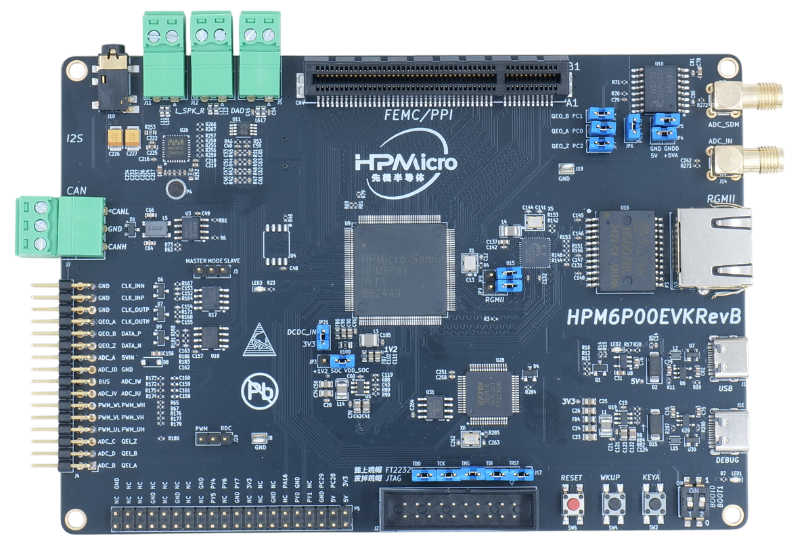

.. _hpm6p00evk:

HPM6P00EVK开发板
================

概述
----

HPM6P00是一款600MHz的双核RISC-V MCU，具有很高的算力和丰富的外设资源。

HPM6P00EVK为HPM6P00系列MCU的评估板，提供了一系列接口，包括ADC输入SMA接口、SDM输入SMA接口，电机控制接口(QEO/QEI/SEI/PWM/ADC)、CAN接口、Ethernet接口、USB接口、音频接口、PPI/FEMC接口和树莓派接口，并集成板载调试器FT2232，方便用户进行调试。

板上硬件资源
------------

- HPM6P81 微控制器 (主频600Mhz双核，片上1MB Flash，800KB SRAM)
- 板载存储
  - 16MB Quad SPI NOR Flash
- 以太网
  - 1000 Mbits PHY
- USB
  - USB type C (USB 2.0 OTG) connector x1
- 音频
  - Line in
  - Mic
  - Speaker
  - DAO
- 电机
  - RS422
  - RS485
- 模拟采样
  - NSI1306W25
- 其他
  - LED
  - CAN

.. note::

  - **当需要使用FEMC(SDRAM)或PPI外设时，请在PPI/FEMC接口插入相应的扩展板**

    - HPM6P00EVK标配的扩展板如下，有1个16bits的SDRAM（FEMC访问）、1个16bits SRAM（FEMC或PPI访问）和1个并口ADC（PPI访问），供评估使用。

      .. image:: doc/hpm6p00evk_ext.png
         :alt: hpm6p00evk_ext

    - FEMC/PPI接口具有很高的灵活性，若需要评估其他并口设备，例如FPGA、ASYNC SRAM等，可自行设计扩展板或联系我们。

拨码开关
--------

- Bit 1，2控制启动模式

.. list-table::
   :header-rows: 1

   * - Bit[2:1]
     - 功能描述
   * - OFF, OFF
     - Quad SPI NOR flash 启动
   * - OFF, ON
     - eMMC启动
   * - ON, OFF
     - 在系统编程

.. note::
  - **在HPM6P00EVKRevB上，当选择ISP模式时且使用Segger或Ozone进行在线调试时，由于USB0_P和ENet RXCK信号复用，再加上USB控制器输出的差分，会导致网络初始化失败。**

.. _hpm6p00evk_buttons:

按键
----

.. list-table::
   :header-rows: 1

   * - 名称
     - 功能
   * - PC23 (KEYA)
     - GPIO 按键
   * - WBUTN (WKUP)
     - WAKE UP 按键
   * - RESETN (RESET)
     - Reset 按键

插件
----

- SEI CLK 选择

.. list-table::
   :header-rows: 1

   * - 功能
     - 位置
     - 说明
   * - SEI.CLK选择
     - J3
     - Master侧，选择CLKO；Slave侧，选择CLKI

- PWM/RDC 功能选择

.. list-table::
   :header-rows: 1

   * - 功能
     - 位置
     - 说明
   * - PWM/RDC 功能选择
     - J20
     - 跳帽在PWM侧，则J4.PWM_UH引脚为PWM_UH功能；跳帽在RDC侧，则J4.PWM_UH引脚为RDC0功能

- USB/RGMII 功能选择

.. list-table::
   :header-rows: 1

   * - 功能
     - 位置
     - 说明
   * - USB/RGMII 功能选择
     - JP8、JP9
     - 跳帽断开，可使用USB功能；跳帽连接，可使用RGMII功能

- SDM/QEO 功能选择

.. list-table::
   :header-rows: 1

   * - 功能
     - 位置
     - 说明
   * - SDM 功能
     - JP1、JP2、JP7、JP4、JP5、JP6
     - 需要断开JP1、JP2、JP7跳帽，连接JP4、JP5、JP6，在HPM6P00EVKRevB上，需要焊接电阻R71(0Ω)。
   * - QEO 功能
     - JP1、JP2、JP7、JP6
     - 需要连接JP1、JP2、JP7跳帽，断开JP6，在HPM6P00EVKRevB上，需要去掉电阻R71(0Ω)。

- 调试器接口选择

.. list-table::
   :header-rows: 1

   * - 功能
     - 位置
     - 说明
   * - 调试器选择
     - J17
     - 全部连接：使用板载ft2232，全部断开：使用标准JTAG接口

- PPI/FEMC接口

.. list-table::
   :header-rows: 1

   * - 功能
     - 位置
     - 说明
   * - PPI/FEMC接口
     - CN4
     - 接PPI或FEMC扩展板

- PPI/FEMC扩展板功能选择

.. list-table::
   :header-rows: 1

   * - 功能
     - 位置
     - 说明
   * - FEMC 接口： SDRAM和SRAM可同时工作
     - J2、J3、J4、JP1、JP2
     - 将J2、J3、J4跨在FEMC侧，断开JP1和JP2跳帽
   * - PPI 接口： ADC和SRAM可同时工作
     - J2、J3、J4、JP1、JP2
     - 将J2、J3、J4跨在PPI侧，连接JP1和JP2跳帽
   * - 其他说明： ADC电压输入
     - J5
     - ADC电压可以来源于DAC或板载可调电阻器分压，通过J5跨针选择

.. _hpm6p00evk_pins:

引脚描述
--------

- PUART串口引脚
  PUART用于低功耗测试，例如唤醒等。

.. list-table::
   :header-rows: 1

   * - 功能
     - 引脚
     - 位置
   * - PUART.TX
     - PY00
     - P5[8]
   * - PUART.RX
     - PY01
     - P5[10]

- UART0串口引脚：

  UART0用于Core0的调试控制台串口。

.. list-table::
   :header-rows: 1

   * - 功能
     - 引脚
     - 位置
   * - UART0.TX
     - PA00
     - DEBUGUART0
   * - UART0.RX
     - PA01
     - DEBUGUART0

- UART4串口引脚

  UART4用于Core1的调试控制台串口或一些使用UART的功能测试，例如MICROROS_UART，USB_CDC_ACM_UART, MODBUS_RTU, lin等。

.. list-table::
   :header-rows: 1

   * - 功能
     - 引脚
     - 位置
     - 说明
   * - UART4.TX
     - PY00
     - P5[10]
     -
   * - UART4.RX
     - PY01
     - P5[8]
     -
   * - UART4.break
     - PY05
     - P5[24]
     - 产生uart break信号

- CAN 接口

.. list-table::
   :header-rows: 1

   * - 功能
     - 位置
   * - CAN_H
     - J7[0]
   * - CAN_L
     - J7[2]

- 音频接口

.. list-table::
   :header-rows: 1

   * - 功能
     - 位置
   * - 扬声器左声道
     - J11
   * - 扬声器右声道
     - J12
   * - 3.5毫米接口
     - J10
   * - DAO接口
     - J5

- ADC 接口

.. list-table::
   :header-rows: 1

   * - 功能
     - 位置
   * - ADC输入
     - J4[2]

- ACMP 接口

.. list-table::
   :header-rows: 1

   * - 功能
     - 位置
   * - CMP4.INN6
     - J4[2]

- 正交旋转编码器接口

.. list-table::
   :header-rows: 1

   * - 功能
     - 位置
   * - QEI.A / HALL.U
     - J4[1]
   * - QEI.B / HALL.V
     - J4[3]
   * - QEI.Z / HALL.W
     - J4[5]
   * - QEO.A
     - J4[26]
   * - QEO.B
     - J4[24]
   * - QEO.Z
     - J4[22]

- HALL引脚

hpm6p00evk的HALL引脚需要单独接线

.. list-table::
    :header-rows: 1

    * - 功能
      - evk板位置
      - 电机板位置
    * - HALL.U
      - J4[1]
      - J22[3]
    * - HALL.V
      - J4[3]
      - J22[4]
    * - HALL.W
      - J4[5]
      - J22[5]
    * - GND
      - J4[32]
      - J22[1]

- PWM 输出接口

.. list-table::
   :header-rows: 1

   * - 功能
     - 位置
   * - PWM.WL / PWM1.P5
     - J4[12]
   * - PWM.WH / PWM1.P4
     - J4[11]
   * - PWM.VL / PWM1.P3
     - J4[10]
   * - PWM.VH / PWM1.P2
     - J4[9]
   * - PWM.UL / PWM1.P1
     - J4[8]
   * - PWM.UH / PWM1.P0
     - J4[7]
   * - PWM.FAULT
     - J4[22]

- SEI 接口

.. list-table::
   :header-rows: 1

   * - 功能
     - 位置
     - 说明
   * - SEI.CLK_IN_P
     - J4[29]
     - 主机模式下时钟差分输出P
   * - SEI.CLK_IN_N
     - J4[31]
     - 主机模式下时钟差分输出N
   * - SEI.CLK_OUT_P
     - J4[27]
     - 从机模式下时钟差分输入P
   * - SEI.CLK_OUT_N
     - J4[25]
     - 从机模式下时钟差分输入N
   * - SEI.DATA_P
     - J4[23]
     - 数据差分信号线P
   * - SEI.DATA_N
     - J4[21]
     - 数据差分信号线N

- QEIV2 Sin/Cos引脚

.. list-table::
   :header-rows: 1

   * - 功能
     - 位置
     - 备注
   * - ADC2.INA09
     - J4[15]
     - ADC_IW (Cos)
   * - ADC0.INA14
     - J4[13]
     - ADC_IU (Sin)

- RDC引脚

.. list-table::
   :header-rows: 1

   * - 功能
     - evk板位置
     - RDC板位置
   * - RDC.PWM
     - J4[7]
     - J2[7]
   * - RDC.ADC0
     - J4[13]
     - J2[13]
   * - RDC.ADC1
     - J4[14]
     - J2[14]
   * - GND
     - J4[32]
     - J2[17]

- PLB Pulse输出引脚

.. list-table::
   :header-rows: 1

   * - 功能
     - 位置
   * - PLB.PULSE_OUT
     - J4[9]

- PLB LIN Clock引脚

  用于UART LIN Slave波特率自适应例程检测RX信号的时钟

.. list-table::
   :header-rows: 1

   * - 功能
     - 位置
   * - PLB.TRGM_IN
     - J20[3]

- PLB Filter输出引脚

.. list-table::
   :header-rows: 1

   * - 功能
     - 位置
   * - PLB.Filter_IN
     - J4[9]
   * - PLB.Filter_OUT
     - J4[11]

- LOBS 触发信号

.. list-table::
   :header-rows: 1

   * - 功能
     - 引脚
     - 位置
   * - Trig Pin0
     - PC28
     - P5[3]
   * - Trig Pin1
     - PC29
     - P5[5]

- GPTMR引脚

.. list-table::
   :header-rows: 1

   * - 功能
     - 位置
     - 备注
   * - GPTMR3.CAPT_0
     - P5[8]
     -
   * - GPTMR3.COMP_0
     - P5[10]
     - SPI模拟I2S的BLCK
   * - GPTMR3.COMP_2
     - J4[5]
     - SPI模拟I2S的LRCK
   * - GPTMR0.COMP_2
     - J4[9]
     - SPI模拟I2S的MCLK

- SPI模拟I2S CS引脚

.. list-table::
   :header-rows: 1

   * - 功能
     - 位置
     - 备注
   * - PA16
     - P5[11]
     - 控制SPI从机CS的引脚

- SPI引脚

.. list-table::
   :header-rows: 1

   * - 功能
     - 引脚
     - 位置
   * - SPI2.CSN
     - PY05
     - P5[24]
   * - SPI2.SCLK
     - PY04
     - P5[23]
   * - SPI2.MISO
     - PY06
     - P5[21]
   * - SPI2.MOSI
     - PY07
     - P5[19]

- I2C引脚

.. list-table::
   :header-rows: 1

   * - 功能
     - 位置
   * - I2C1.SCL
     - P5[5]
   * - I2C1.SDA
     - P5[3]

- 以太网PPS引脚  ##todo

.. list-table::
   :header-rows: 1

   * - 功能
     - 引脚
     - 位置
   * - ENET0.EVTO0
     - PE06
     - J4[24]
   * - ENET0.EVTO1
     - PF20
     - J4[4]
   * - ENET0.EVTI1
     - PE07
     - J4[26]
