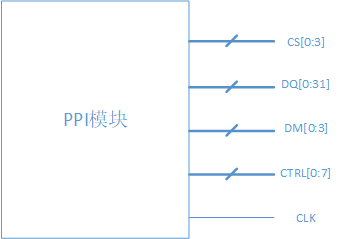
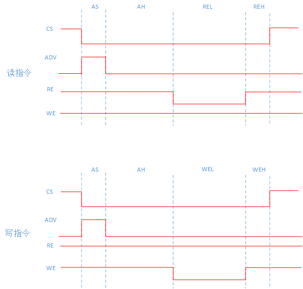

.. _ppi_component:

PPI Component
=============

PPI 资源特性介绍
----------------

- 支持4个CS端口，每个CS端口可以单独配置：地址区间（基地址需1MB对齐）、端口位宽 （支持 8/16/32 位） 和命令序列 （命令的起始/结束索引）
- 有32位数据/地址总线，支持：32位数据 + 32位地址（复用模式）、16位数据 + 32位地址（复用模式）、 8位数据 + 32位数据（复用模式）、16位数据 + 16位地址（非复用模式）、8位数据 + 24位地址（非复用模式）
- 有4个有效字节选择端口（DM信号，用于SRAM的UB/LB等信号）
- 有8个控制线（可配置为SRAM的WE/OE/ADV等信号）
- 有1个时钟线输出（支持时钟始终输出和跟随指令序列输出）

PPI 配置介绍
------------

- CS配置
  CS配置结构体如下：

  .. code-block:: c

    typedef struct {
        ppi_port_size_t port_size;
        uint16_t addr_start_high_12bits;    /* address space: 0xF8000000 ~ 0xFFFFFFFF */
        uint16_t addr_end_high_12bits;      /* address space: 0xF8000000 ~ 0xFFFFFFFF */
        uint16_t addr_mask;
        bool sync_clk_en;
        uint8_t sync_clk_sel;
        uint8_t interval_cycle;
        uint8_t rcmd_start0;
        uint8_t rcmd_end0;
        uint8_t rcmd_start1;
        uint8_t rcmd_end1;
        uint8_t wcmd_start0;
        uint8_t wcmd_end0;
        uint8_t wcmd_start1;
        uint8_t wcmd_end1;
    #if defined(HPM_IP_FEATURE_PPI_DM_POLARITY_EACH_CS) && HPM_IP_FEATURE_PPI_DM_POLARITY_EACH_CS
        ppi_dm_valid_polarity_t dm_polarity;
    #endif
    } ppi_cs_pin_config_t;    /**< ppi_cs_pin_config_t */

  - PPI 的地址空间为0xF8000000 ~ 0xFFFFFFFF，默认为Noncacheable属性，可通过配置PMP为Cacheable属性。需要注意的是，PPI内存地址空间的Cacheable属性仅支持： MEM_TYPE_MEM_WB_READ_WRITE_ALLOC - Memory, Write-back, Write-Allocate, Read-Allocate。
  - `port_size` 为端口位宽， `addr_start_high_12bits` 和 `addr_end_high_12bits` 分别为起始地址的高12位和结束地址的高12位， `addr_mask` 为高16位地址掩码。
  - `sync_clk_en` 为是否同步时钟使能， `sync_clk_sel` 为CS输出有效电平的时刻选择（范围为 0 ~ clkpin_cfg.cycle）， `interval_cycle` 为命令间隔时间（单位为系统时钟周期）。
  - `rcmd_start0` 和 `rcmd_end0` 为首条读命令的起始/结束索引， `wcmd_start0` 和 `wcmd_end0` 为首条写命令的起始/结束索引； `rcmd_start1` 和 `rcmd_end1` 为第二条及后续读命令的起始/结束索引， `wcmd_start1` 和 `wcmd_end1` 为第二条及后续写命令的起始/结束索引。例如，有些支持 burst 传输的设备，首次访问和后续访问时序会不同，所以每个设备可以配置不同的首次访问和后续访问的命令序列。起始/结束索引对应为64个命令字的索引，范围为0 ~ 63。

- CMD命令字配置
  - 一共有64个命令字，4个CS共用。
  - 每次数据传输，可以切成若干片段，每个片段由一个命令字描述。例如，在如下的《PPI组件介绍》章节中，读/写指令均分为4个片段。
  - 针对每个片段，可配置该片段的持续时间（`cmd_cycle`）、CS引脚的输出电平（`cs_pin_value`）、DQ引脚功能（`ad_func_sel`，数据/地址，1个字节为一组）、DQ引脚方向（`ad_pin_dir`，输入/输出，1个字节为一组）、输出字节的来源（`byte_sel`）、8根控制线的电平（`ctrl_pin_value`）、时钟输出使能（`clk_output`，时钟引脚在cmd控制输出模式有效），CMD命令字结构体如下：

  .. code-block:: c

    typedef struct {
      bool cs_pin_value;
      bool clk_output;
      uint8_t cmd_cycle;
      ppi_ad_func_t ad_func_sel[4];
      ppi_ad_pin_dir_t ad_pin_dir[4];
      ppi_byte_sel_t byte_sel[4];
      bool ctrl_pin_value[8];
    } ppi_cmd_config_t;    /**< ppi_cmd_config_t */

- 控制引脚配置
  - 一共有8个控制信号引脚。
  - 可以独立配置每个控制引脚的方向和极性，配置的API如下：

  .. code-block:: c

    static inline void ppi_config_ctrl_pin_polarity(PPI_Type *ppi, uint8_t index, ppi_ctrl_polarity_t pol);
    static inline void ppi_set_ctrl_pin_dir(PPI_Type *ppi, uint8_t index, ppi_ctrl_pin_dir_t dir);

- 时钟引脚配置
  - 一共有1 个时钟信号输出。
  - 时钟有2种工作模式：（1）始终输出；（2）由CMD控制输出，即ppi_cmd_config.clk_output控制时钟输出。
  - 时钟引脚配置的结构体如下

  .. code-block:: c

    typedef struct {
      uint8_t cycle_num;
      uint8_t high_num;
      uint8_t low_num;
      ppi_clk_output_mode_t mode;
      bool revert;
    } ppi_clk_pin_config_t;    /**< ppi_clk_pin_config_t */

  其中， `cycle_num` 、 `high_num` 、 `low_num` 三个参数控制输出时钟的周期， `mode` 配置工作模式， `revert` 控制时钟输出是否取反。

PPI 组件介绍
------------

目前PPI组件实现了异步SRAM的读写时序，支持地址/数据复用模式和非复用模式，各模式的引脚对应如下：

.. list-table::
   :header-rows: 1

   * - AD复用模式
     - 数据线
     - 地址线
     - 地址锁存器
   * - 32位数据 + 32位地址
     - D0 - D31 : DQ0 - DQ31
     - A0 - A31 : DQ0 - DQ31
     - DQ0 - DQ31 需要地址锁存器
   * - 16位数据 + 32位地址
     - D0 - D15 : DQ0 - DQ15
     - A0 - A31 : DQ0 - DQ31
     - DQ0 - DQ15 需要地址锁存器，DQ16 - DQ31 无需地址锁存器
   * - 8位数据 + 32位地址
     - D0 - D7 : DQ0 - DQ7
     - A0 - A31 : DQ0 - DQ31
     - DQ0 - DQ7 需要地址锁存器，DQ8 - DQ31 无需地址锁存器

.. list-table::
   :header-rows: 1

   * - AD非复用模式
     - 数据线
     - 地址线
   * - 16位数据 + 16位地址
     - D0 - D15 : DQ0 - DQ15
     - A0 - A15 : DQ16 - DQ31
   * - 8位数据 + 24位地址
     - D0 - D7 : DQ0 - DQ7
     - A0 - A23 : DQ8 - DQ31

- 备注：支持DQ引脚信号选择，例如DQ0-7信号选择使用PPI的DQ8-15引脚。

异步SRAM配置的结构体如下：

.. code-block:: c

  typedef struct {
      uint32_t base_address;              /**< external SRAM base address, should be 1MB aligned */
      uint32_t size_in_byte;              /**< external SRAM size in byte */
      ppi_port_size_t port_size;          /**< port size */
      bool ad_mux_mode;                   /**< addr and data mux mode */
      bool cs_valid_polarity;             /**< cs valid polarity */
      bool dm_valid_polarity;             /**< dm valid polarity */
      bool addr_valid_polarity;           /**< addr valid polarity */
      uint8_t adv_ctrl_pin;               /**< adv ctrl pin number, 0 - 7 */
      uint8_t rel_ctrl_pin;               /**< rel ctrl pin number, 0 - 7 */
      uint8_t wel_ctrl_pin;               /**< wel ctrl pin number, 0 - 7 */
      uint16_t as_in_ns;                  /**< address setup time */
      uint16_t ah_in_ns;                  /**< address hold time */
      uint16_t rel_in_ns;                 /**< RE low time */
      uint16_t reh_in_ns;                 /**< RE high time */
      uint16_t wel_in_ns;                 /**< WE low time */
      uint16_t weh_in_ns;                 /**< WE high time */
      ppi_dq_pins_t dq_sig_sel[4];        /**< dq signal selection.
                                           *   dq_sig_sel[0] is signal dq0-7 select ppi dq pins,
                                           *   dq_sig_sel[1] is signal dq8-15 select ppi dq pins,
                                           *   dq_sig_sel[2] is signal dq16-23 select ppi dq pins,
                                           *   dq_sig_sel[3] is signal dq24-31 select ppi dq pins.
                                           */
  } ppi_async_sram_config_t;

对应的读写时序图为：

其中，CS为片选信号，ADV、RE、WE为控制信号（在8个控制线中进行选择）。cs、adv、dm的有效极性可以进行配置。

PPI组件配置异步SRAM的API如下，每个CS配置会占用8个CMD命令字，故cmd_start_index需要设置为8的倍数，例如0、8、16、24等。

.. code-block:: c

  /**
   * @brief config async sram
   *
   * @param[in] ppi PPI base address
   * @param[in] cs_index cs index, value: 0 - 3
   * @param[in] cmd_index cmd start index, should be a multiple of 8, such as 0, 8, 16, 24 ...
   * @param[in] config async sram config structure pointer, @ref ppi_async_sram_config_t
   */
  void ppi_config_async_sram(PPI_Type *ppi, uint8_t cs_index, uint8_t cmd_start_index, ppi_async_sram_config_t *config);
