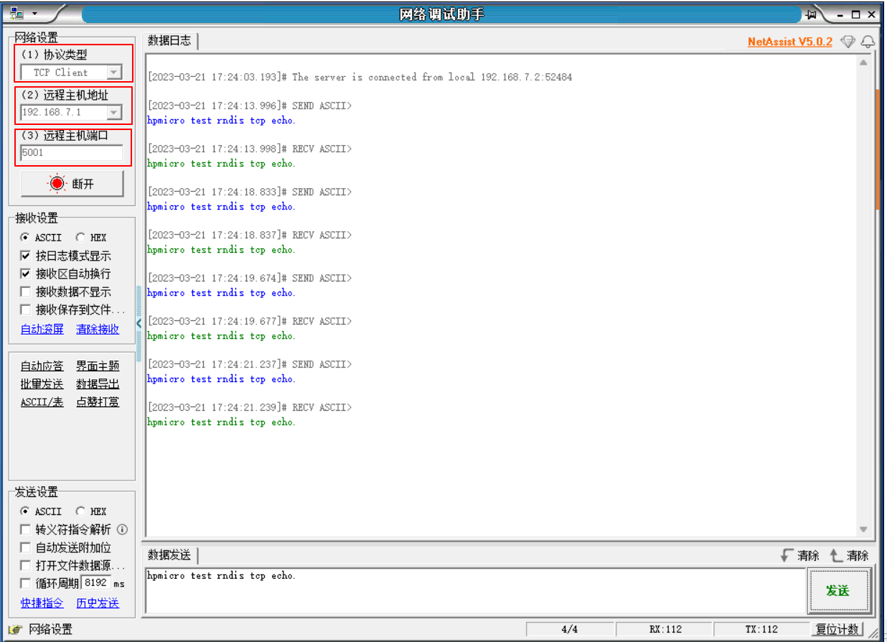

# USB RNDIS DEVICE - TCP SERVER

## Overview

This example project shows USB RNDIS device implement TCP SERVER

- PC sees a network interface via Device Manager, the MAC address is 20:89:84:6A:96:AA.
- Application program using lwip stack create a virtual network interface, the MAC address is 20:89:84:6A:96:00. DHCP, DNS and TCP servers are implemented. The PC enumerated network interface can communicate with virtual network interface through TCP protocol.

## Board Setting

- Connect a USB port on PC to the PWR DEBUG port on the development board with a USB Type-C cable
- Connect a USB port on PC to one of USB port on the development board with a USB Type-C cable

## Running the example

- Download the program and run. The computer will enumerate a network interface device with the following attributes:

- Open the network debugging assistant and set it as follows (the IP address of the remote host is 192.168.7.1, and the port is 5001). Enter the string and click Send. The remote host will return the received string.

