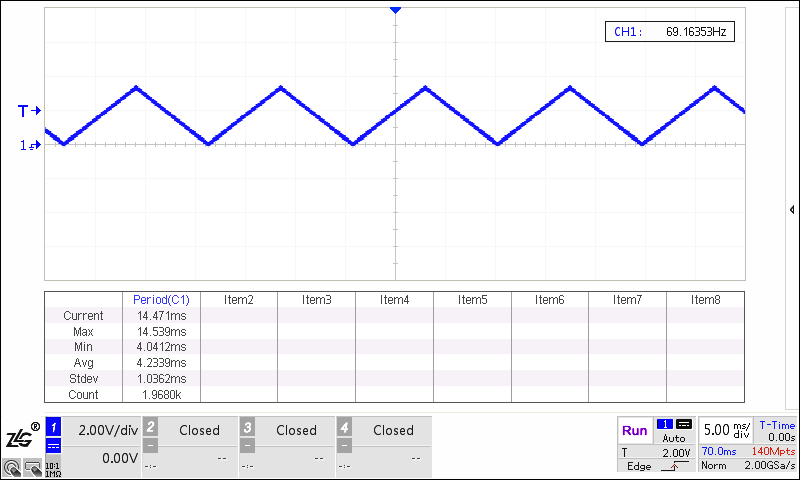

# DAC

## Overview

This example shows DAC conversions and waveform display in three working modes.

## Board Setting

- Output voltage at the specified pin. （Please refer to  [Pin Description](lab_board_resource)）

- If necessary, connect a jumper for VREF pin according to the HW design. （Please refer to  [Pin Description](lab_board_resource)）

## Running the example

- Running log is shown in the serial terminal as follows

```console
This is a DAC demo:
1. Direct mode
2. Step   mode
3. Buffer mode
Please enter the DAC mode code:
```

- Select one of DAC working modes to start DAC conversion,  and then observe the waveform through an oscilloscope

  - Direct mode

  ```console
  Please enter the DAC mode code: 1
  Set DAC to output data in direct mode
  DAC is outputting a triangle waveform in direct mode
  ```
  

  - Step mode

  ```console
  Please enter the DAC mode code: 2
  Set DAC to output data in step mode
  DAC is outputting a saw tooth waveform in step mode
  ```
  

  - Buffer mode

  ```console
  Please enter the DAC mode code: 3
  Set DAC to output data in buffer mode
  DAC is outputting a sine waveform in buffer mode
  ```
  
