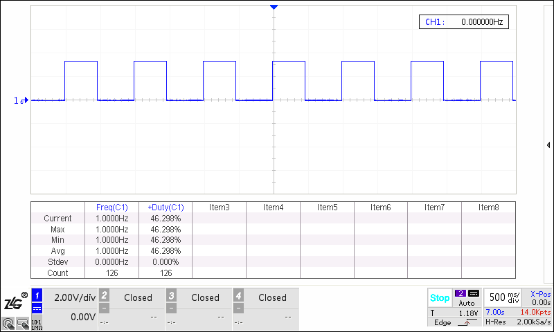

# PPS Output

## Overview

This example shows an Ethernet PPS signal output.

## Board Setting

Output an Ethernet PPS signal at the specified pin. (Please refer to  [Pin Description](lab_board_resource))

## Running the example

- Observe the waveform through an oscilloscope

  (1) Flexible mode:

  

  (2)  Control mode:

  
