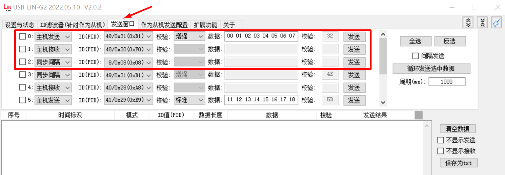

# lin_slave
## Overview

The lin_slave sample project shows that LIN sends/receives data at slave mode.

## Board Setting

Requires a LIN transceiver and USB_LIN debugger
Please refer to [Pin Description](lab_board_resource) for specific board.
connect LIN transceiver mcu signal to LIN's TX and RX on board, connect LIN transceiver LIN signal to USB_LIN debugger.

## Running the example

configure usb_lin debugger:
- configure com and baudrate, then click `Set to Debugger` option
  
- Configure sent data, including master sent, master receive and sync break, the sync break could wake up slave from sleep mode：
  
- Running the example, check the result in debugger window
  

When the example runs successfully, the log would be seen on the terminal like:
```console
LIN slave example
LIN bus timeout, will enter sleep mode
LIN wakeup
ID: 31, receive 8 bytes
0 1 2 3 4 5 6 7
ID: 30, sent 8 bytes
7 6 5 4 3 2 1 0
```
