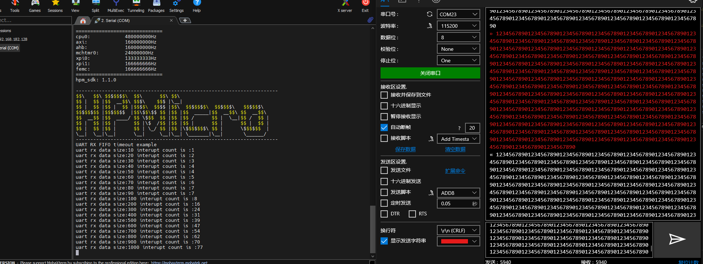

# UART rx timeout 
## Overview

In this example project, UART can use the principle of rx fifo timeout to receives variable length data (data size less than defined BUFF_SIZE in program).

Compared with uart_irq sample,this method can reduce the number of interrupt times triggered by reception.For example,to receive 1000 bytes,1000 interrupts are required for single-byte reception,but this method only needs 77 times.Moreover,the FIFO timeout can be used to judge whether the uart bus is idle,so as to receive data of variable lenth.
If the hardware supports receiving idle detection, uart can use uart_hardware_rx_idle sample.

if you want use software to support idle detection,you can use uart_software_rx_idle sample

## Port Settings

- Serial port baud rate is set to ``115200bps``, with ``one stop bit`` and ``no parity bit``

## Board Setting

- Use the usb2ttl module for testing,connect the tx pin of the module to rx pin of the board to be tested, connect the rx pin of the module to tx pin of the board to be tested,and connect th gnd pin of the module to gnd pin of the board to be tested
- Please refer to [Pin Description](lab_board_resource) for specific board

## Running the example

When the sample is running correctly, input some data through the serial port, and the serial port will send the corresponding data. The serial port terminal will output information in the following form:

```console
UART RX FIFO timeout example
uart rx data size:10 interupt count is :1
uart rx data size:20 interupt count is :2
uart rx data size:30 interupt count is :3
uart rx data size:40 interupt count is :4
uart rx data size:50 interupt count is :4
uart rx data size:60 interupt count is :5
uart rx data size:70 interupt count is :6
uart rx data size:80 interupt count is :7
uart rx data size:90 interupt count is :7
uart rx data size:100 interupt count is :8
uart rx data size:200 interupt count is :16
uart rx data size:300 interupt count is :24
uart rx data size:400 interupt count is :31
uart rx data size:500 interupt count is :39
uart rx data size:600 interupt count is :47
uart rx data size:700 interupt count is :54
uart rx data size:800 interupt count is :62
uart rx data size:900 interupt count is :70
uart rx data size:1000 interupt count is :77

```
-  Phenomenon of serial tools

 