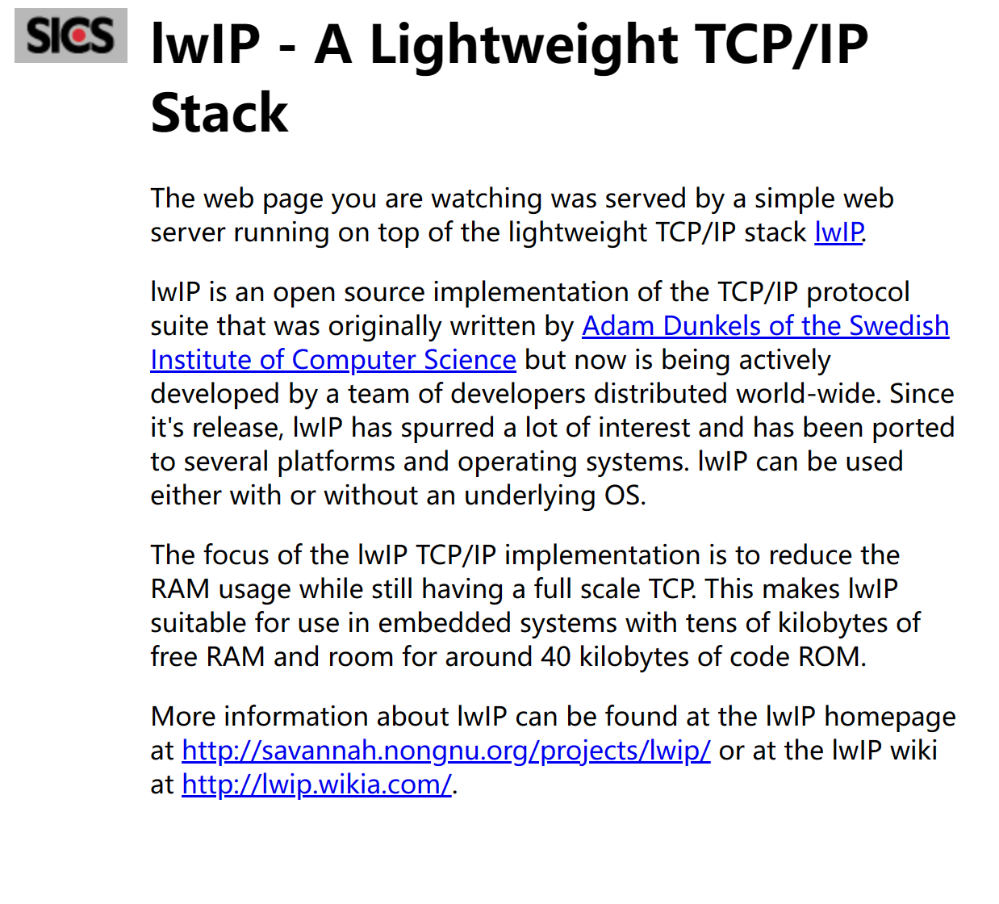

# https服务器测试

## 概述

本示例演示使用lwip和mbedtls实现https网页服务器的功能：

## 硬件设置

* 使用USB Type-C线缆连接PC USB端口和PWR DEBUG端口
* 使用以太网线缆连接PC以太网端口和开发板RGMII或RMII端口

## 工程配置

- 在文件`CMakeLists.txt`中,  根据开发板原理图，设置匹配的以太网PHY类型，例如："set(CONFIG_ENET_PHY_DP83848 1)"

## 运行示例

* 编译下载程序
* 串口终端显示如下信息：
```console
This is an ethernet demo: https server (Polling Usage)
LwIP Version: 2.1.2
Reference Clock: Internal Clock
Enet phy init passes !
Static IP: 10.10.10.10
NETMASK  : 255.255.255.0
Gateway  : 10.10.10.1

************************************************
 mbedTLS HTTPS Server example
************************************************
Link Status: Down
Link Status: Down
Link Status: Up
Link Speed:  100Mbps
Link Duplex: Full duplex
```

使用浏览器客户端，输入https://10.10.10.10，回车后显示如下的页面：

 
