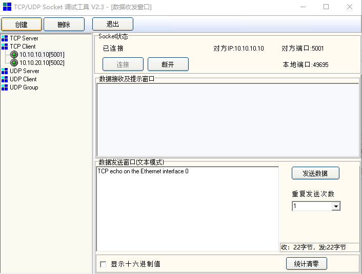
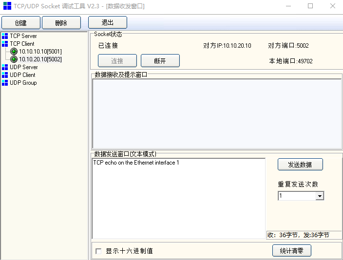
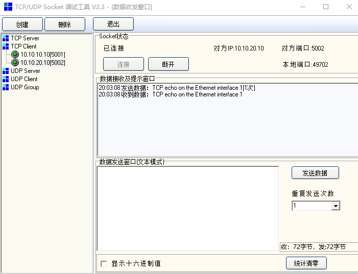

# 多端口TCP回送

## 概述

本示例展示多端口TCP回送通讯

- PC 通过以太网发送TCP数据帧至MCU，MCU将接收的数据帧回发至PC

## 硬件设置

* 使用USB Type-C线缆连接PC USB端口和PWR DEBUG端口
* 使用两根以太网线缆连接PC以太网端口和开发板上RGMII端口和RMII端口

## 工程配置

- 无

## 运行示例

* 编译下载程序
* 串口终端显示如下信息：

  ```console
  This is an ethernet demo: TCP Echo On Multiple Ports (Polling Usage)
  LwIP Version: 2.1.2
  Enet1 Reference Clock: Internal Clock
  Enet0 init passed!
  Enet1 init passed!
  ================ Network Interface 0 ================
  Static IP:  10.10.10.10
  Netmask  : 255.255.255.0
  Gateway  : 10.10.10.1
  ================ Network Interface 1 ================
  Static IP:  10.10.20.10
  Netmask  : 255.255.255.0
  Gateway  : 10.10.10.1
  ================ Network Interface 1 ================
  Link Status: Up
  Link Speed:  100Mbps
  Link Duplex: Full duplex
  ================ Network Interface 0 ================
  Link Status: Up
  Link Speed:  1000Mbps
  Link Duplex: Full duplex
  ```
* 打开以太网调试工具

  - 创建并设置TCP客户端：
    TCP服务端0 IP: 10.10.10.10/端口: 5001
    TCP服务端1 IP: 10.10.20.10/端口: 5002

    **注：实际需要根据PC所在局域网段调整服务端IP**
  - 连接
  - 在数据发送窗口(10.10.10.10)编辑发送字符

  

  - 观察回送数据窗口(10.10.10.10)

  

  - 在数据发送窗口(10.10.20.10)编辑发送字符

  

  - 观察回送数据窗口(10.10.20.10)

  
