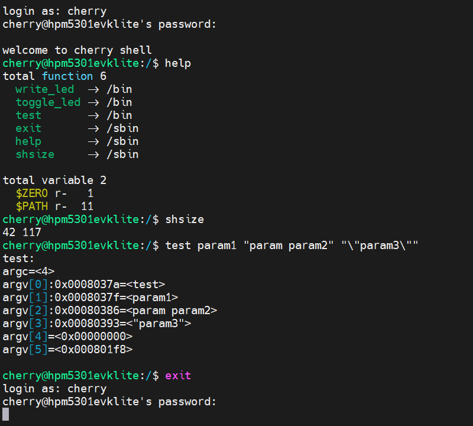
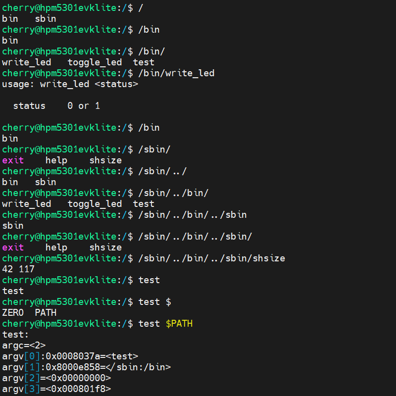

# CherryShell

[English](./README.md)

## 简介

CherryShell是一个专为嵌入式应用程序而设计的微型Shell。

## 功能
- [x] 支持路径补全，tab进行路径补全
- [x] 支持命令补全，tab进行命令补全
- [x] 支持环境变量，需使用 ``$` `作为前缀，例如` `$PATH``
- [x] 支持通过 ``$PATH`` 环境变量，自动在指定目录下搜索命令
- [x] 支持历史记录，通过 ``↑`` ``↓`` 按键
- [x] 兼容 VT100 以及 Xterm 键值
- [x] 支持设定用户名、主机名、路径
- [x] 支持非阻塞模式
- [x] 支持用户登录，需要实现hash函数，默认strcmp
- [ ] 支持``Ctrl + \<key\>`` ``Alt + \<key\>`` ``F1-F12`` 快捷键调用命令
- [ ] 支持``Ctrl + \<key\>`` ``Alt + \<key\>`` ``F1-F12`` 按键功能重映射
- [ ] 支持 exec 函数簇，直接调用命令
- [ ] 支持文件系统，FatFS，FileX，LittleFS，RomFS等
- [ ] 支持环境变量添加、修改、删除、读出
- [ ] 支持信号处理，捕获和处理不同的信号，例如Ctrl+C``SIGINT``和Ctrl+Z``SIGTSTP``
- [ ] 支持 exit 函数实现终止命令执行以及现场返回并调用设定的handler，利用setjmp实现(裸机)
- [ ] 支持输入输出重定向功能
- [ ] 支持多用户命令权限
- [ ] 支持作业控制，可以在前台或后台运行命令，并使用相关的控制命令（如fg、bg、jobs）来管理和操作作业

## 示例





## 移植

以先楫半导体hpm5301evklite为例
``` c
// 包含头文件
#include "csh.h"

// 创建一个shell实例
static chry_shell_t csh;

```

``` c
// 字符输出函数，将字符直接输出到串口
static uint16_t csh_sput_cb(chry_readline_t *rl, const void *data, uint16_t size)
{
    uint16_t i;
    (void)rl;
    for (i = 0; i < size; i++) {
        if (status_success != uart_send_byte(HPM_UART0, ((uint8_t *)data)[i])) {
            break;
        }
    }

    // 返回成功输出的字符数量
    return i;
}

```

``` c
// 字符输入函数，直接从串口读入字符，如果波特率较高可以增加一个FIFO缓冲输入
static uint16_t csh_sget_cb(chry_readline_t *rl, void *data, uint16_t size)
{
    uint16_t i;
    (void)rl;
    for (i = 0; i < size; i++) {
        if (status_success != uart_receive_byte(HPM_UART0, (uint8_t *)data + i)) {
            break;
        }
    }

    // 返回成功读取的字符数量
    return i;
}
```

``` c
// shell 初始化
int shell_init(void)
{
    // 结构体用于配置初始化参数
    chry_shell_init_t csh_init;

    // 设置字符输入输出函数（必须实现）
    csh_init.sput = csh_sput_cb;
    csh_init.sget = csh_sget_cb;

    // linkscript 中定义的符号，用于存放导出的命令和变量
    extern const int __fsymtab_start;
    extern const int __fsymtab_end;
    extern const int __vsymtab_start;
    extern const int __vsymtab_end;

    // 配置函数表和变量表的起始和结束地址（必须实现）
    csh_init.command_table_beg = &__fsymtab_start;
    csh_init.command_table_end = &__fsymtab_end;
    csh_init.variable_table_beg = &__vsymtab_start;
    csh_init.variable_table_end = &__vsymtab_end;

    // 定义一个提示符缓冲区
    static char csh_prompt_buffer[128];
    // 配置提示符缓冲区（可选）
    // 取决于是否使能可编辑提示符功能 CONFIG_CSH_PROMPTEDIT
    csh_init.prompt_buffer = csh_prompt_buffer;
    csh_init.prompt_buffer_size = sizeof(csh_prompt_buffer);

    // 定义一个历史记录缓冲区，缓冲的命令条数取决于缓冲区大小以及命令长度
    static char csh_history_buffer[128];

    // 配置历史记录缓冲区（可选）
    // 取决于是否使能历史记录功能 CONFIG_CSH_LNBUFF_STATIC
    csh_init.history_buffer = csh_history_buffer;
    csh_init.history_buffer_size = sizeof(csh_history_buffer);

    // 定义一个行输入缓冲区，最大输入的单条命令无法超过缓冲区长度
    static char csh_line_buffer[128];

    // 配置行输入缓冲区（可选）
    // 取决于是否使能静态行缓冲区功能 CONFIG_CSH_LNBUFF_STATIC
    // 如果不使能静态行缓冲区功能，行缓冲区将存在于栈上，此时不能使用非阻塞模式
    //   即 CONFIG_CSH_NOBLOCK 必须为0
    csh_init.line_buffer = csh_line_buffer;
    csh_init.line_buffer_size = sizeof(csh_line_buffer);

    // 用户数量默认为1
    csh_init.uid = 0; // 默认用户ID
    csh_init.user[0] = "cherry"; // 用户ID0的用户名
    csh_init.hash[0] = NULL; // 用户ID0的密码哈希值
    csh_init.host = "hpm5301evklite"; // Host的名称

    // 初始化
    int ret = chry_shell_init(&csh, &csh_init);
    if (ret) {
        return -1;
    }

    return 0;
}
```

``` c
// shell 的主函数，需要再while(1)中循环调用
int shell_main(void)
{
    int ret;

restart:
    ret = chry_shell_task_repl(&csh);
    if (ret == -1) {
        // 执行失败或者出现问题
        return -1;
    } else if (ret == 1) {
        // 非阻塞模式执行读取字符时读出字符不足，先返回执行用户其他工作
        return 0;
    } else {
        // 执行成功结束，重新执行
        goto restart;
    }

}

```

``` c
// 用于避免printf和shell竞争同一个串口，printf之前调用
void shell_uart_lock(void)
{
    chry_readline_erase_line(&csh.rl);
}

// 用于避免printf和shell竞争同一个串口，printf之后调用
void shell_uart_unlock(void)
{
    chry_readline_edit_refresh(&csh.rl);
}
```

``` c

int main(void)
{
    board_init();
    board_init_led_pins();

    shell_init();

    uint32_t freq = clock_get_frequency(clock_mchtmr0);
    uint64_t time = mchtmr_get_count(HPM_MCHTMR) / (freq / 1000);

    while (1) {
        shell_main();

        // 每5秒打印一次
        uint64_t now = mchtmr_get_count(HPM_MCHTMR) / (freq / 1000);
        if (now > time + 5000) {
            time = now;
            // 打印时需要调用锁，避免printf影响shell输入
            shell_uart_lock();
            printf("other task interval 5S\r\n");
            shell_uart_unlock();
        }
    }

    return 0;
}
```

``` c
// 实现一个命令的导出
// write_led 1 点亮LED
// write_led 0 熄灭LED
static int write_led(int argc, char **argv)
{
    if (argc < 2) {
        printf("usage: write_led <status>\r\n\r\n");
        printf("  status    0 or 1\r\n\r\n");
        return -1;
    }

    board_led_write(atoi(argv[1]) == 0);
    return 0;
}
CSH_CMD_EXPORT(write_led, );

```
