# Host Power Save (ESP-Hosted MCU)

## Overview

The **Host Power Save** feature allows the host MCU to enter low-power states while the ESP slave maintains network connectivity. This enables efficient power usage in battery-operated devices.

**Host Power Save Modes:**
- **Deep Sleep at Host**: Ultra-low power consumption with GPIO wake-up
- **Light Sleep at Host**: *(Coming Soon)* Faster wake-up with reduced power savings

Key features include:
- Host enters power save mode, network stays online
- Slave intelligently wakes host when needed
- Power state synchronization between host and slave
- Seamless network handover during power save
- Integration with Network Split

---
## Configuration

### Host Configuration

In host example project, run `idf.py menuconfig` and Enable `Allow host to power save`
```
# Host side kconfig
Component config
  └── ESP-Hosted config
       └── [*] Allow host to power save                      <== Enable This
               └── [*] Allow host to enter deep sleep.             ─┐
                       ├── (<gpio_num>) Host in: Host Wakeup GPIO   │
                       └── Host Wakeup GPIO Level                   ├── Default config (No change)
                           └── (X) High                            ─┘
```
> [!NOTE]
> 1. The wakeup GPIO number must be an RTC-capable GPIO.
> 2. Ensure the wake up GPIO is unused

### Slave Configuration

In slave project, run `idf.py menuconfig` and Enable `Allow host to power save`

```
# Slave side kconfig
Example Configuration
└── [*] Allow host to power save                         <== Enable This
        └── [*] Allow host to enter deep sleep.                    ─┐
                ├── (<gpio_num>) Slave out: Host wakeup GPIO        │
                └── Host Wakeup GPIO Level                          ├── Default config (No change)
                    └── (X) High                                   ─┘
```

---
## High Level Overview

The power management system coordinates between the host MCU and ESP slave to ensure smooth transitions between active and power save states.


### Wake-up Mechanisms

The slave initiates a wake-up by toggling a dedicated GPIO line to the host when one of the following triggers occurs:

* Periodic Timer-based Wake-up
* CLI-based Wake-up
* Network-triggered Wake-up

```mermaid
flowchart TD
    A[💤 Host in Power Save Mode] --> B{⏱️ Trigger on Slave?}
    B -->|🕒 Timer Expired| C[🔔 Send Wake-up GPIO]
    B -->|🧑‍💻 CLI Command| C
    B -->|🌐 Network Packet| C
    C --> D[⚡ Host Wakes Up]
    D --> E[▶️ Resume Operations]

    classDef sleep fill:#f5f5f5,stroke:#888,font-size:14px;
    classDef event fill:#e3f2fd,stroke:#2196f3,font-size:14px;
    classDef action fill:#e0f7e9,stroke:#4caf50,font-size:14px;

    class A sleep
    class B,C event
    class D,E action
```



### State transitions

- Active → Preparing: Host prepares (notifies slave, configures GPIO)
- Preparing → PowerSave: Host enters power save mode; slave handles network
- PowerSave → Waking: Slave triggers wakeup on event (timer/packet/CLI)
- Waking → Active: Host re-inits system, syncs with slave

```mermaid
stateDiagram
    [*] --> Active
    Active --> Preparing: 🥱 start_host_power_save()
    Preparing --> PowerSave: 😴 Power Save Entry
    PowerSave --> Waking: 😳 Wake Event
    Waking --> Active: 😊 Slave sync-up complete

```


---
## Deep Dive

### 💤 Host Enters Power Save Mode

When the host application initiates power save mode, the following function sequence occurs to safely coordinate with the slave.


### Host Wake-up and Synchronization Sequence

The slave wakes the host using a GPIO signal. Upon rebooting, the host detects the wake-up reason and synchronizes with the slave through a handshake mechanism, after which normal operation resumes.


---
## APIs

### Sources

#### Host Files

-   `host/api/include/esp_hosted_power_save.h`: enums and APIs
-   `host/drivers/power_save/power_save_drv.c`: power save logic
-   `host/drivers/transport/transport_drv.c`: slave communication
-   `host/drivers/transport/{sdio,spi}/...`: bus specific power save hooks

#### Slave Files

-   `slave/main/host_power_save.h`: slave enums and APIs
-   `slave/main/host_power_save.c`: wake-up management
-   `slave/main/lwip_filter.c`: packet inspection (for wake-up)

### Functions

#### Host APIs

```c
/* Power save driver APIs (host side) */
int esp_hosted_power_save_enabled(void);
int esp_hosted_power_save_init(void);
int esp_hosted_woke_from_power_save(void);
int esp_hosted_power_saving(void);
int esp_hosted_power_save_start(esp_hosted_power_save_type_t power_save_type);
int esp_hosted_power_save_timer_start(uint32_t time_ms, int timer_type);
int esp_hosted_power_save_timer_stop(void);

/* Retain GPIO during power save */
int hold_slave_reset_gpio_pre_power_save(void);
int release_slave_reset_gpio_post_wakeup(void);
```

#### Slave APIs


```c
/* Slave-side power save APIs */
int host_power_save_init(void (*host_wakeup_callback)(void));
int is_host_power_saving(void);
int is_host_wakeup_needed(interface_buffer_handle_t *buf_handle);
int wakeup_host_mandate(uint32_t timeout_ms);
int wakeup_host(uint32_t timeout_ms);
int host_power_save_alert(uint32_t ps_evt);
```

---

##  CLI Demo

### Enter Power Save Mode

1.  **Enable CLI**: Ensure `ESP_HOSTED_CLI_ENABLED` is enabled in the host's `menuconfig`.
2.  **Start the CLI**: The CLI starts automatically when `esp_hosted_init()` is called.
3.  **Enter the command**: At the `host>` prompt, type the `power_save` command.

```sh
host> host-power-save
I (11147) esp_cli: Putting ESP32-P4 into power save mode...
I (11147) H_power_save: Inform slave: Host PS start
I (11148) H_SDIO_DRV: Inform slave, host power save is started
ESP-ROM:esp32p4...
...
```
This command calls `esp_hosted_power_save_start()`, which signals the slave and puts the host into the configured power save mode. If it is deep sleep power save, The host would not be able to execute any further code until it is woken up.

### Wake-up from Slave

The host can be woken up by the slave under several conditions, such as receiving a specific network packet. On the slave, a CLI command `wake-up` is available for demonstration.

1.  **Network Packet Wake-up**: By default, the slave is configured to wake the host upon receiving certain network traffic (e.g., on priority ports like SSH, or MQTT messages containing a "wakeup-host" payload).
2.  **Manual Wake-up (Demo)**: Use the `wake-up` command in the slave's terminal.

**Slave Log:**
```sh
coprocessor> wake-up-host
I (13730) esp_cli: Asking P4 to wake-up...
I (13730) host_ps: WAKE UP Host!!!!!
I (13741) host_ps: Cleared wakeup gpio, IO2
...
I (15543) host_ps: Wakeup semaphore given
I (15543) host_ps: host  woke up
```

**Host Log (After Wake-up):**
```sh
...
I (430) H_power_save: Wakeup from power save
I (432) transport: Waiting for power save to be off
I (1137) H_SDIO_DRV: Host woke up from power save
...
```
When the host wakes up, checks wake-up reason, and re-establishes slave connectivity automatically.

---

## Coding Example

While the CLI provides an easy demo, most applications would trigger power save modes using the power save APIs.

### Host example

The example below shows how to check wake-up reason and enter power save mode programmatically:

```c
#include "esp_hosted.h"
#include "esp_hosted_power_save.h"

static const char* TAG = "HOST_APP";

void app_main(void)
{
    /* First, check the reason of host bootup. is it deep sleep? */
    if (esp_hosted_woke_from_power_save()) {
        ESP_LOGI(TAG, "Host woke up from power save mode.");
    }

    esp_hosted_init();
    esp_hosted_power_save_init();

    /*
     * The call to esp_hosted_init() automatically handles informing the
     * slave that the host has woken up. No explicit call to
     * stop_host_power_save() is needed here.
     */

    ESP_LOGI(TAG, "Application running. Entering power save in 15 seconds.");
    vTaskDelay(pdMS_TO_TICKS(15000));

    ESP_LOGI(TAG, "Initiating power save now.");
    /* This function does not return. The host will enter power save mode
     * and wake up from app_main upon wake-up event. */
    esp_hosted_power_save_start(HOSTED_POWER_SAVE_TYPE_DEEP_SLEEP);
}
```

### Slave Example

The slave wakes the host automatically for host destined network packets.
The example below demonstrates manual wake-up using timer

```c
#include "host_power_save.h"

static const char* TAG = "SLAVE_APP";

void wake_host_task(void *pvParameters)
{
    /* Wait for a while before attempting to wake the host */
    vTaskDelay(pdMS_TO_TICKS(30000));

    ESP_LOGI(TAG, "Checking host power state.");

    /* Check if the host is actually sleeping */
    if (is_host_power_saving()) {
        ESP_LOGI(TAG, "Host is in power save mode. Sending wake-up signal.");

        /*
         * Attempt to wake the host. The timeout (in ms) is for the
         * handshake to complete after the host wakes up.
         */
        int ret = wakeup_host(5000);
        if (ret == 0) {
            ESP_LOGI(TAG, "Host wake-up process initiated successfully.");
        } else {
            ESP_LOGE(TAG, "Failed to wake up host. Error: %d", ret);
        }
    } else {
        ESP_LOGI(TAG, "Host is already awake.");
    }

    vTaskDelete(NULL);
}

void app_main(void)
{
    /*
     * Initialize slave-side components...
     * host_power_save_init() is called internally by the ESP-Hosted component.
     */

    /* Create a task to wake up the host */
    xTaskCreate(wake_host_task, "wake_host_task", 2048, NULL, 5, NULL);
}
```

---

## Troubleshooting

1. **Wake-up Failures**
   - Check GPIO configuration and physical connections.
   - Verify `CONFIG_ESP_HOSTED_HOST_WAKEUP_GPIO` is set correctly on both host and slave.
   - Check that the GPIO level configuration (High/Low) matches on both devices.

2. **Conflicting GPIOs**
   - Ensure you use Host Wakeup GPIO different from the GPIOs used in communication bus underlying

3. **Network Connectivity Loss**
   - Verify the slave maintains its WiFi connection while the host is asleep.
   - Check the Network Split configuration if enabled.

4. **Transport Synchronization Issues**
   - Ensure the correct power state signals are being sent. After wake-up, the host should log that it is informing the slave it has woken up.

