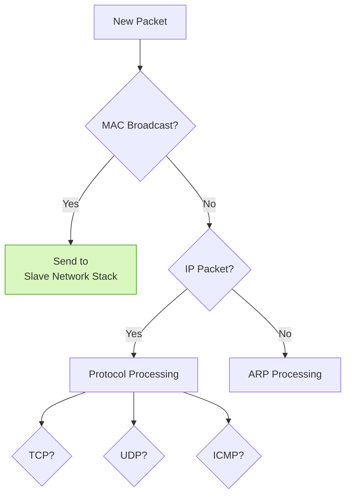
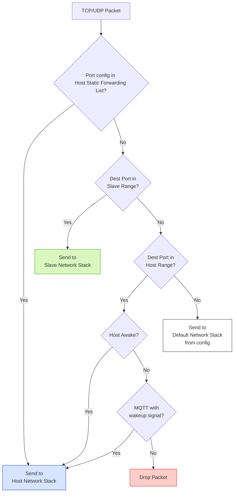

# Network Split Feature for ESP-Hosted MCU


| Supported Slave Targets | ESP32-C5 | ESP32-C6 | ESP32-S2 | ESP32-S3 |
|------------------------|:--------:|:--------:|:--------:|:--------:|


## Overview

**Network Split** allows the **Host MCU** and **ESP32 Slave** to share one IP address and split traffic between them.

It is especially useful when the host sleeps — the ESP continues handling selected network activity (e.g., MQTT, DNS).

**Highlights:**

* Port-based traffic routing
* Shared IP address
* Packet filtering and DPI
* Wake-on-packet support (e.g., MQTT)
* Power management integration
* **Supported Slave Targets:** ESP32-C5/C6/S2/S3 only

---

## Configuration

### On the Slave

1. Run:

   ```bash
   idf.py menuconfig
   ```
2. Enable:

   ```
   Example Configuration
   └── [*] Enable Network Split
   ```
3. (Optional) Customize under `Network Split Configuration`:

   ```
   ├── Host Static Port Forwarding
   │   ├── TCP dst: 22,80,443,8080,8554
   │   └── UDP dst: 53,123
   ├── Port Ranges
   │   ├── Host: 49152–61439
   │   └── Slave: 61440–65535
   └── Default Destination: slave / host / both
   ```

### On the Host

1. Run:

   ```bash
   idf.py menuconfig
   ```
2. Enable:

   ```
   Component config
   └── ESP-Hosted config
       └── [*] Enable Network Split
   ```
3. Match **port ranges** with the slave:

   ```
   └── LWIP port config
       ├── Host LWIP: 49152–61439
       └── Slave LWIP: 61440–65535
   ```
4. Integrate into your app:
   ```c
   #include "esp_hosted.h"

   void app_main(void) {
       esp_hosted_init();
       // Host now shares IP and splits traffic with slave
   }
   ```

> [!TIP]
>
> The port ranges on the host and slave must match perfectly to avoid routing issues.

---

## Packet Routing Decisions

All incoming network packets arriving at the slave device are evaluated by the logic in `lwip_filter.c`. For each packet received from the WiFi router, the slave determines whether it should be processed locally, forwarded to the host, or handled by both network stacks, according to defined routing rules.

| Packet Type                            | Destination Port Condition                 | Routed To                          |
|--------------------------------------- |--------------------------------------------|------------------------------------|
| Broadcast, ARP Request, ICMP Request   | N/A                                        | Slave Network Stack                |
| ARP Response, ICMP Response            | N/A                                        | Both Network Stacks                |
| DHCP                                   | Any                                        | Both Network Stacks                |
| TCP/UDP                                | Listed in Static Port Forwarding           | Host Network Stack                 |
| TCP/UDP                                | Within Host Port Range                     | Host Network Stack                 |
| TCP/UDP                                | Within Slave Port Range                    | Slave Network Stack                |
| TCP/UDP                                | Port 5001 (iperf)                          | Both Network Stacks                |
| MQTT (Port 1883)                       | Payload contains `"wakeup-host"`           | Host Network Stack (Wake-up)       |
| Others                                 | Not matched by any rule                    | Default Destination (as configured)|
| Packet destined for Host Network Stack | Host is in deep sleep                      | Dropped (unless wake-up packet)    |

> [!TIP]
>
> The packet routing logic is fully customizable within the `lwip_filter.c` file, allowing users to adapt the network management behavior to their specific requirements.

The following diagrams illustrate the decision-making process for packet routing in the Network Split feature.



#### TCP/UDP Packet Processing

Specific case of UDP/TCP packet processing is illustrated below



---

## Internals

### Core Routing API

```c
// lwip_filter.c
hosted_l2_bridge filter_and_route_packet(void *frame_data, uint16_t frame_length);

typedef enum {
    SLAVE_LWIP_BRIDGE = 0,
    HOST_LWIP_BRIDGE  = 1,
    BOTH_LWIP_BRIDGE  = 2,
    INVALID_BRIDGE    = 3
} hosted_l2_bridge;
```

### Wake-Up on MQTT

```c
static bool host_mqtt_wakeup_triggered(const void *payload, uint16_t length) {
    return memcmp(payload, "wakeup-host", strlen("wakeup-host")) == 0;
}
```

---

## Extras

### Use Same Port on Both Sides?

Yes — port 5001 (iperf) is a working example. Others can be added similarly in `lwip_filter.c`.

---

## Files of Interest

| Purpose          | File                                   |
| ---------------- | -------------------------------------- |
| Routing logic    | `slave/main/lwip_filter.c`             |
| Host-side config | `host/api/include/esp_hosted_config.h` |
| Slave control    | `slave/main/interface.h`               |
| API entry point  | `esp_hosted_init()`                    |


## Debugging & Tips

### Checklist

- Port ranges must not overlap
- Logs from `lwip_filter.c` help debug routing
- Static forwarding can override port ranges
- Only supported on ESP32-C5/C6/S2/S3

### Debug Logging

Enable verbose logs in `lwip_filter.c`:

```c
esp_log_level_set("lwip_filter", ESP_LOG_VERBOSE);
```

Wi-Fi sniffer to inspect raw traffic (if really needed)

---
