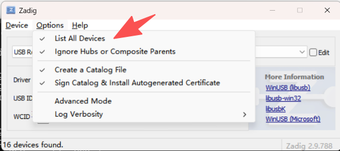
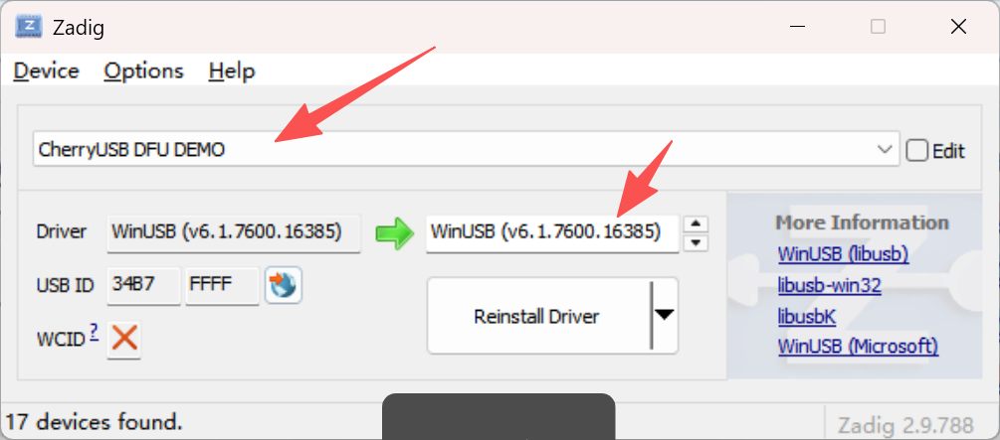

.. _dfu_bootloader:

DFU Bootloader
======================

概述
------

dfu_bootloader示例工程演示了使用CherryUSB实现的USB DFU（设备固件升级）bootloader功能。该bootloader可以通过USB接口进行固件升级。它首先尝试跳转到flash中的有效应用程序，如果未找到有效应用程序，则进入DFU模式接收固件升级。构建使用dfu/bootloader启动的应用程序，生成工程时，需要将HPM_BUILD_TYPE配置为flash_dfu或者flash_sdram_dfu。

硬件设置
------------

- 将USB设备端口连接到PC

驱动安装
-----------
在windows上使用自定义的DFU设备，需要使用zadig软件安装winUSB驱动后才能正常使用

列出所有设备后，找到cherryUSB DFU Demo设备，并安装winUSB驱动

运行现象
------------

当工程正确运行时：

1. 如果flash中存在有效的应用程序，bootloader将跳转到该应用程序并运行
2. 如果未找到有效应用程序，设备将在PC上枚举为USB DFU设备
3. 用户可以使用dfu-util或类似工具通过USB上传新固件
   - 使用dfu-util -l获取DFU设备的alt编号
   - 然后使用dfu-util -D ${bin_file_path} -s ${bin文件起始地址}:leave -a ${alt编号}

.. code-block:: console

   Found DFU: [0483:df11] ver=0200, devnum=39, cfg=1, intf=0, path="1-3.2", alt=1, name="@Option bytes /0x00000000/01*512 g", serial="2022123456"
   Found DFU: [0483:df11] ver=0200, devnum=39, cfg=1, intf=0, path="1-3.2", alt=0, name="@Internal Flash /0x80020000/1016*16Kg", serial="2022123456"

.. code-block:: console

   Warning: Invalid DFU suffix signature
   A valid DFU suffix will be required in a future dfu-util release
   Opening DFU capable USB device...
   Device ID 0483:df11
   Device DFU version 011a
   Claiming USB DFU Interface...
   Setting Alternate Interface #0 ...
   Determining device status...
   DFU state(2) = dfuIDLE, status(0) = No error condition is present
   DFU mode device DFU version 011a
   Device returned transfer size 512
   DfuSe interface name: "Internal Flash "
   Downloading element to address = 0x80020400, size = 56664
   Erase           [=========================] 100%        56664 bytes
   Erase    done.
   Download        [=========================] 100%        56664 bytes
   Download done.

.. code-block:: console

   HPMicro Cherryusb DFU Demo
   @Internal Flash /0x80020000/1016*16Kg
   @Option bytes /0x00000000/01*512 g

设备进入DFU模式后将显示为USB DFU设备。
