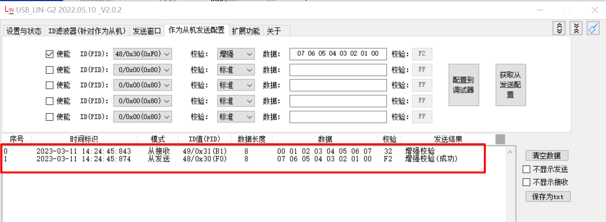

.. _lin_master:

lin_master
====================

概述
------
本示例展示了 HPM LIN 外设在主机模式下的基本功能，包括：

- 支持 LIN 2.2A 协议规范
- 支持主机模式下的数据收发
- 支持增强型校验和模式
- 支持发送唤醒信号
- 支持帧间隔控制
- 支持最大 8 字节数据传输

工作流程
--------
1. 初始化配置

   - 初始化 LIN 引脚配置
   - 配置 LIN 时钟为 20MHz
   - 配置中断优先级
   - 初始化发送数据缓冲区

2. 主循环处理

   - 发送唤醒信号
   - 执行数据传输操作：

     * ID 0x31：发送 8 字节数据
     * ID 0x30：接收 8 字节数据

   - 处理各类事件：

     * 传输完成事件
     * 唤醒信号发送完成
     * 错误事件

3. 中断处理

   - 处理传输错误
   - 处理唤醒信号发送完成
   - 处理传输完成

硬件设置
------------
本示例需要以下硬件：

- 一个 LIN 收发器
- 一个 USB_LIN 调试器（作为从机）
- 连接线缆

请参考具体开发板 :ref:`引脚描述 <board_resource>` 部分的描述。
将开发板上的 LIN TX 和 RX 引脚与 LIN 收发器的 MCU 信号相连，将 USB_LIN 调试器与 LIN 收发器的 LIN 信号相连。

运行现象
------------
运行此程序，需要配置 USB_LIN 调试器：

1. 配置调试器基本参数

   - 选择正确的串口和波特率
   - 点击"设置到调试器"按钮

   .. image:: ../doc/lin_debugger_configuration.png
      :alt: lin_debugger_configuration

2. 配置从机发送选项

   - 设置 ID 和数据以及校验方式
   - 勾选使能选项
   - 点击"配置到调试器"按钮

   .. image:: doc/lin_debugger_slave_sent_config.png
      :alt: lin_debugger_slave_sent

当程序正确运行后，串口终端会输出如下信息：

.. code-block:: console

   LIN master example
   LIN master sent wakeup signal
   ID: 31, sent 8 bytes:
   0 1 2 3 4 5 6 7
   ID: 30, receive 8 bytes
   7 6 5 4 3 2 1 0

调试器窗口可以看到如下结果：

调试建议
--------
1. 硬件连接检查

   - 确保 LIN 收发器与开发板连接正确
   - 检查电源和地连接是否可靠

2. 波特率设置

   - 确保主从设备波特率配置一致
   - 默认波特率为 19200bps

3. 数据帧格式问题

   - ID 不匹配：确认配置的 ID 与主机发送的 ID 一致
   - 检查校验和模式配置是否匹配

4. 常见错误分析

   - 观察中断是否正常触发，检查状态寄存器以定位具体错误
   - 使用示波器观察 LIN 总线信号波形

