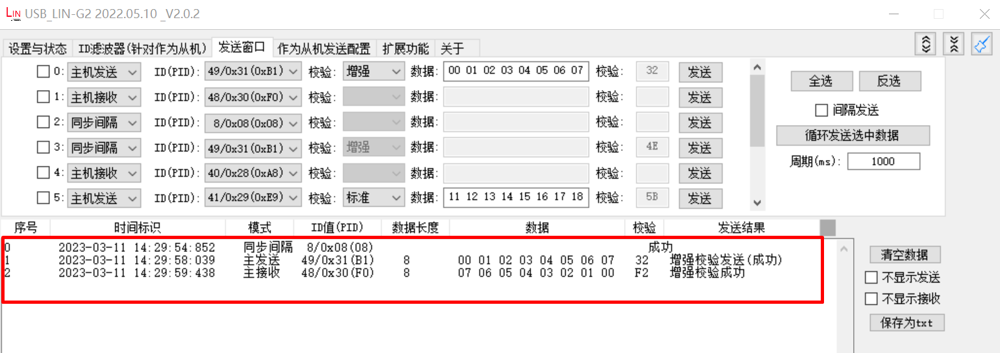

.. _lin_slave:

lin_slave
====================

Overview
--------
This example demonstrates the basic functionality of HPM LIN peripheral in slave mode, including:

- Support for LIN 2.2A protocol specification
- Data transmission and reception in slave mode
- Enhanced checksum mode support
- Sleep and wakeup functionality
- Bus idle timeout detection
- Maximum 8-byte data transfer support

Operation Flow
--------------
1. Initialization Configuration

   - Initialize LIN pin configuration
   - Configure LIN clock to 20MHz
   - Configure interrupt priority
   - Initialize transmit data buffer

2. Main Loop Processing

   - Wait for master request
   - Execute operations based on received frame ID:

     * ID 0x31: Receive 8 bytes of data
     * ID 0x30: Transmit 8 bytes of data

   - Handle various events:

     * Transfer completion event
     * Wakeup event
     * Error event
     * Bus idle timeout event

3. Interrupt Handling

   - Process master data request
   - Handle transfer errors
   - Process bus idle timeout
   - Handle wakeup signal
   - Process transfer completion

Board Setting
-------------
This example requires the following hardware:

- A LIN transceiver
- A USB_LIN debugger (as master)
- Connection cables

Please refer to :ref:`Pin Description <board_resource>` for specific board.
Connect LIN transceiver MCU signal to LIN's TX and RX on board, connect LIN transceiver LIN signal to USB_LIN debugger.

Running the Example
-------------------
To run this program, USB_LIN debugger configuration is required:

1. Configure Basic Parameters

   - Select correct COM port and baud rate
   - Click "Set to Debugger" button

   .. image:: ../doc/lin_debugger_configuration.png
      :alt: lin_debugger_configuration

2. Configure Master Communication Parameters

   - Configure transmission window parameters
   - Set master transmission and reception configuration
   - Set synchronization interval (for waking up slave from sleep mode)
   - Click "Configure to Debugger" button

   .. image:: doc/lin_debugger_master_sent_config.png
      :alt: lin_debugger_master_sent

When the example runs successfully, the log would be seen on the terminal like:

.. code-block:: console

   LIN slave example
   LIN bus timeout, will enter sleep mode
   LIN wakeup
   ID: 31, receive 8 bytes
   0 1 2 3 4 5 6 7
   ID: 30, sent 8 bytes
   7 6 5 4 3 2 1 0

The debugger window will show the following result:

Debugging Tips
--------------
1. Hardware Connection Check

   - Ensure proper connection between LIN transceiver and development board
   - Check power and ground connections

2. Baud Rate Configuration

   - Ensure baud rate matches between master and slave devices
   - Default baud rate is 19200bps

3. Frame Format Issues

   - ID mismatch: Verify configured ID matches master's transmitted ID
   - Verify checksum mode configuration matches

4. Common Error Analysis

   - Check if interrupts are triggered normally, examine status register to locate specific errors
   - Use oscilloscope to observe LIN bus signal waveform

