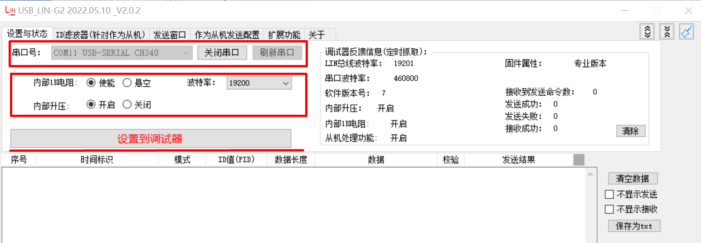

# linv2_master
## Overview

The linv2_master sample project shows that LINV2 sends/receives data at master mode.

## Board Setting

Requires a USB_LIN debugger
Please refer to [Pin Description](lab_board_resource) for specific board.
connect LIN signal on board to USB_LIN debugger.

## Running the example

Configure usb_lin debugger:
- Configure com and baudrate, then click `Set to Debugger` option
  
- Set ID, data and checksum mode, tick `enable option`， then click `Configure to Debugger` option：
  
- Running the example, check the result in debugger window
  

When the example runs successfully, the log would be seen on the terminal like:
```console
LIN master example
LIN master sent wakeup signal
ID: 31, sent 8 bytes:
0 1 2 3 4 5 6 7
ID: 30, receive 8 bytes
7 6 5 4 3 2 1 0
```
