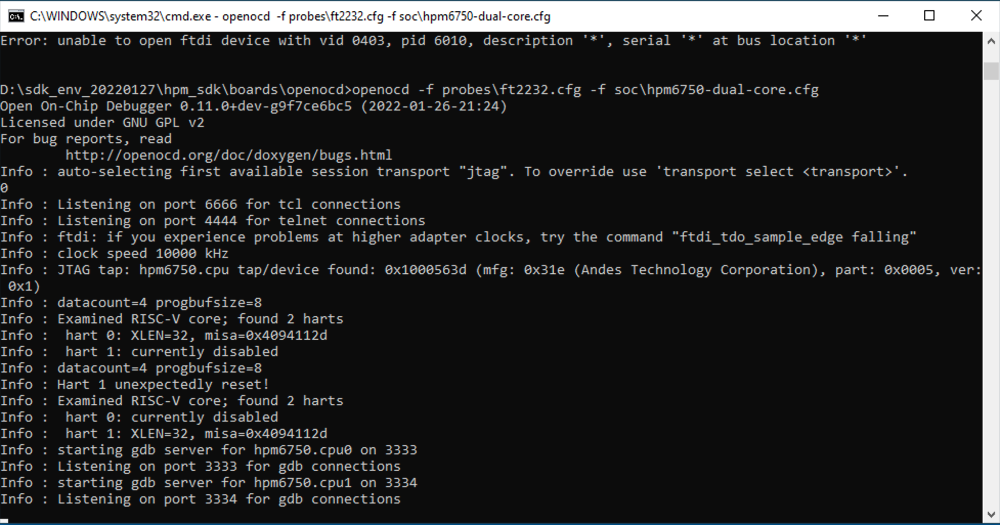
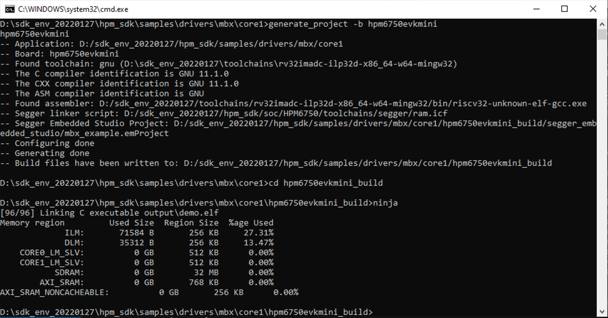
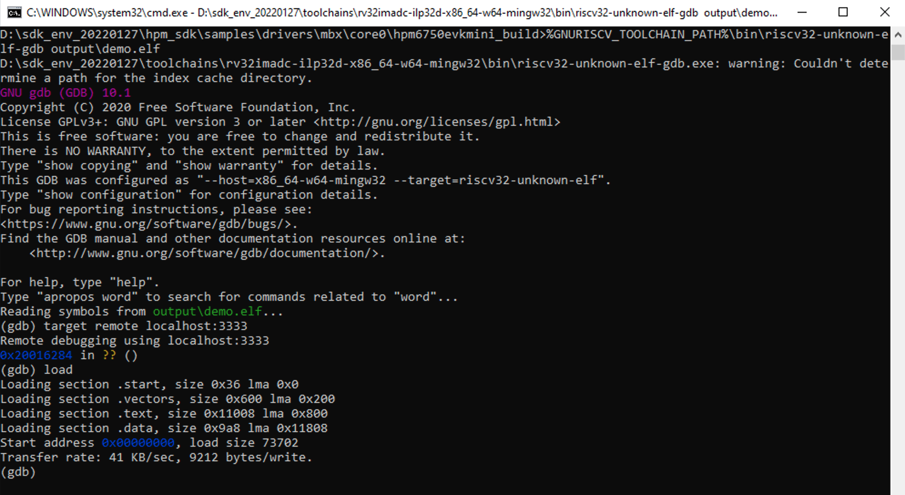
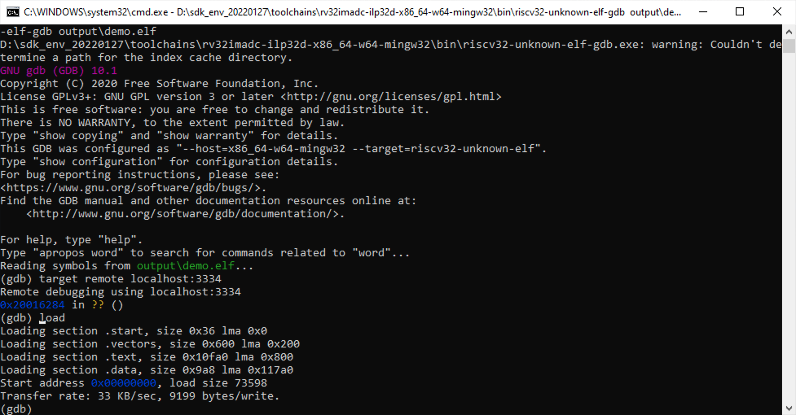
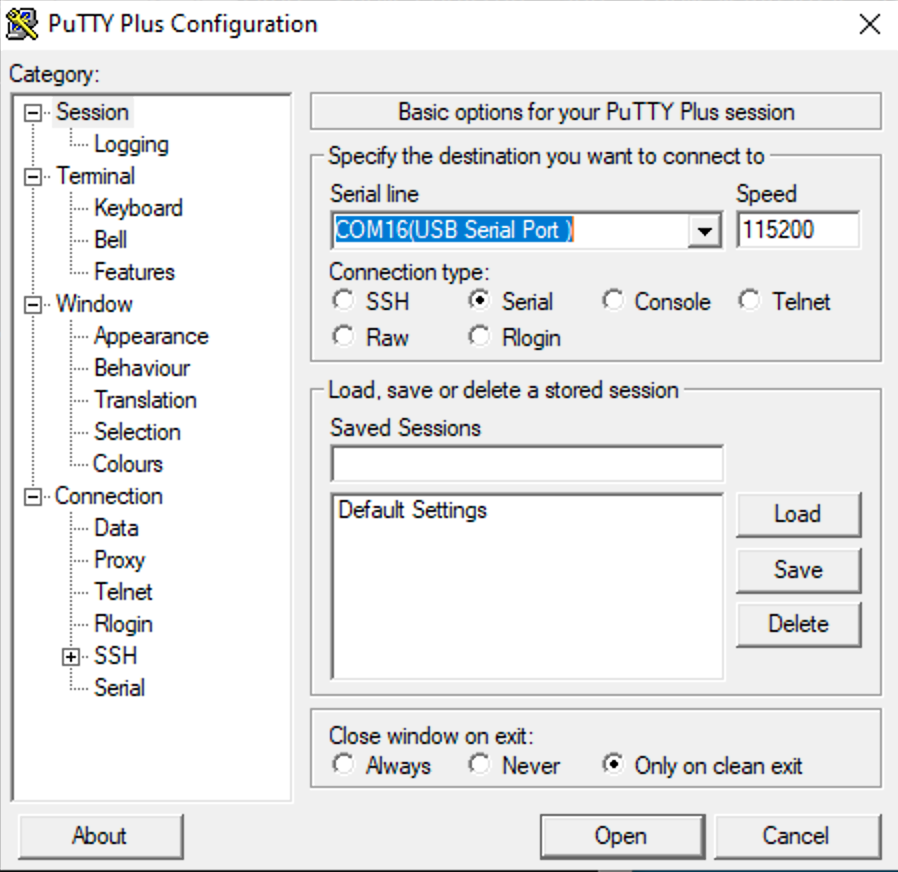
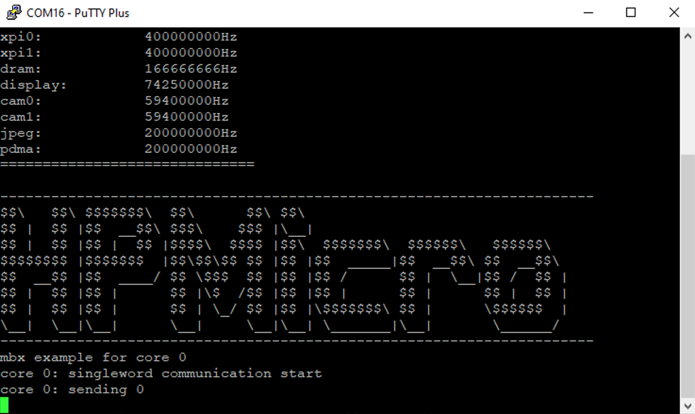
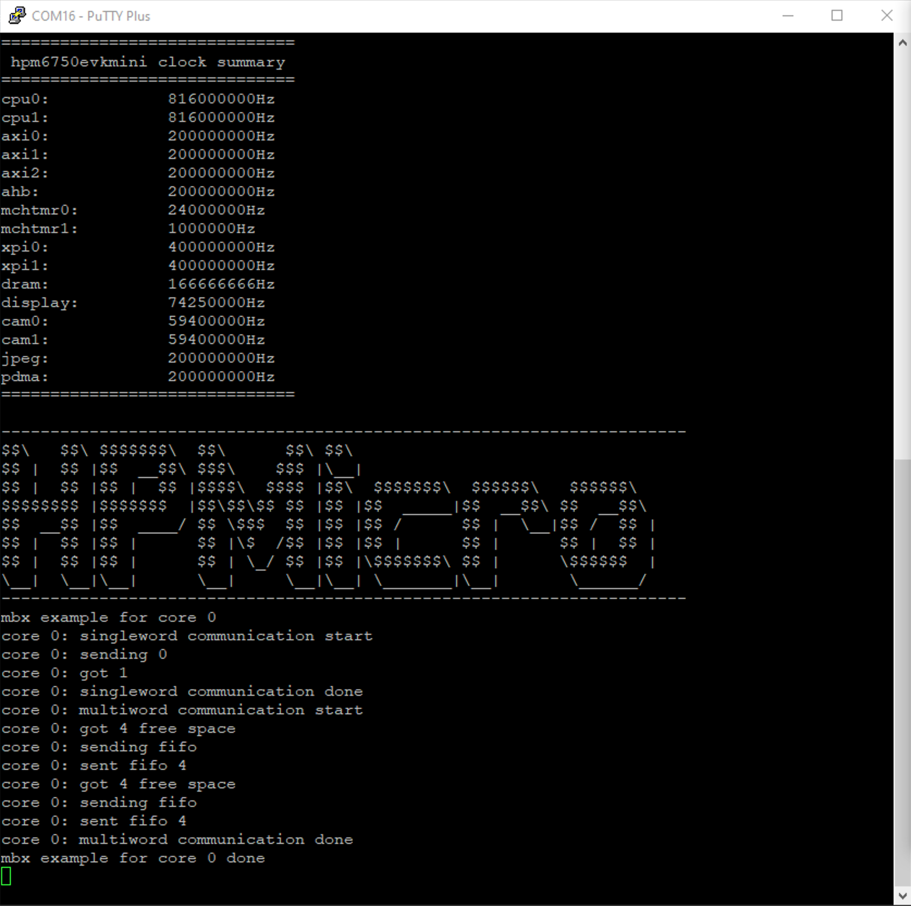

# MBX dualcore
## 概述
***
该示例程序演示了MBX如何工作。Core 0会发送信息给Core 1，Core 1收到之后并将之返回。

## Board Setting
***
使用USB转串口模块，连接评估板上Core 1调试串口终端(请确认具体开发板 {ref}`引脚描述 <lab_board_resource>` 部分描述)

## Running the Example
***
运行此程序，需要使用双核调试脚本，并需要两个gdb客户端分别对Core 0和Core 1进行调试

- 使用双核调试脚本启动openocd，此时可以看到gdb server将会为两个核分别开启一个端口

- 为每个核生成工程，使用ninja编译工程
  - Core 0：
  
  - Core 1:
  
- 启动两个gdb client连接gdb server
  - 为Core 0将gdb client连接到端口3333
  
  - 为Core 1将gdb client连接到端口3334
  
- 启动串口工具，分别连接到Core 0和Core 1两个调试串口
  
- 在gdb中启动示例程序
  - Core 0:
  
  - Core 1:
  
  - 一旦Core1程序启动之后, Core 1将会将从Core 0接收到的信息返回给Core 0，测试将在Core 0的调试串口将可以看到:
  
