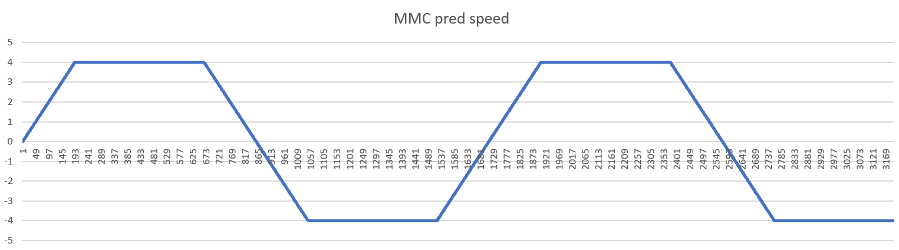

.. _mmc_pred_open_loop:

MMC_PRED_OPEN_LOOP
====================================

概述
------

MMC开环预测工程演示了MMC根据设定的条件调整运动参数和运动系统的时间戳，预测生成运动轨迹的功能。
MMC将预测轨迹的位置信息提供给QEO，QEO可以生成ABZ和PWM等信号，可用于驱动电机。
该示例程序演示了如下的运动轨迹：
- 初始速度为0，加速度为1r/s, 正向匀加速运动

- 速度到达4r/s, 将加速度调整为0， 正向匀速运动

- 位置到达48圈，将加速度调整为-1r/s, 反向匀加速运动

- 速度到达-4r/s，将加速度调整为0， 反向匀速运动

- 位置到达8圈，将加速度调整为1r/s, 正向匀加速运动

硬件设置
------------

请参考 :ref:`引脚描述 <board_resource>` 部分
- 观察QEO的ABZ引脚或PWM的引脚的输出波形。

- 将PWM输出引脚与先楫步进驱动板相连，可驱动步进电机。

运行现象
------------

当工程正确运行后，串口终端会输出如下信息：

.. code-block:: console

   MMC example
   MMC openloop pred postion to QEO
   MMC pred speed value:
   0.00198174
   0.02289963
   0.04381561
   0.06473351
   0.08565141
   0.10656739
   0.12748528
   0.14840126
   0.16931724
   0.19023324
   0.21115112
   0.23206710
   0.25298310
   0.27389908
   0.29481698
   0.31573296
   0.33664896
   0.35756684
   0.37848280
   0.39939880
   0.42031668
   0.44123268
   0.46214868
   0.48306656
   0.50398256
   0.52489852
   0.54581644
   0.56673240
   0.58764840
   0.60856628
   0.62948228
   0.65040016
   0.67131616
   0.69223216
   0.71314808
   0.73406408
   0.75498200
   0.77589800
   0.79681400
   0.81773184
   0.83864784
   0.85956384
   0.88048168
   0.90139768
   0.92231560
   0.94323160
   0.96414760
   0.98506352
   1.00598144
   1.02689743
   1.04781341
   1.06873131
   1.08964729
   1.11056328
   1.13147926
   1.15239716
   1.17331314
   1.19422912
   1.21514512
   1.23606300
   1.25697898
   1.27789498
   1.29881286
   1.31972886
   1.34064676
   1.36156272
   1.38248064
   1.40339660
   1.42431260
   1.44522856
   1.46614648
   1.48706244
   1.50798036
   1.52889632
   1.54981424
   1.57073020
   1.59164620
   1.61256216
   1.63348008
   1.65439604
   1.67531208
   1.69622992
   1.71714592
   1.73806384
   1.75897976
   1.77989768
   1.80081368
   1.82172968
   1.84264752
   1.86356352
   1.88448144
   1.90539744
   1.92631344
   1.94723128
   1.96814728
   1.98906520
   2.00998115
   2.03089714
   2.05181503
   2.07273102
   2.09364700
   2.11456299
   2.13547897
   2.15639687
   2.17731476
   2.19823074
   2.21914672
   2.24006462
   2.26098060
   2.28189660
   2.30281448
   2.32373046
   2.34464644
   2.36556436
   2.38648032
   2.40739632
   2.42831420
   2.44923020
   2.47014616
   2.49106216
   2.51198004
   2.53289604
   2.55381392
   2.57472992
   2.59564592
   2.61656380
   2.63747980
   2.65839768
   2.67931368
   2.70023152
   2.72114752
   2.74206352
   2.76298144
   2.78389736
   2.80481528
   2.82573128
   2.84664920
   2.86756512
   2.88848112
   2.90939904
   2.93031504
   2.95123288
   2.97214888
   2.99306680
   3.01398277
   3.03489875
   3.05581665
   3.07673263
   3.09765053
   3.11856651
   3.13948250
   3.16039848
   3.18131638
   3.20223236
   3.22314834
   3.24406624
   3.26498222
   3.28589820
   3.30681610
   3.32773208
   3.34864808
   3.36956596
   3.39048196
   3.41139984
   3.43231584
   3.45323372
   3.47414972
   3.49506568
   3.51598360
   3.53689956
   3.55781744
   3.57873344
   3.59965132
   3.62056732
   3.64148332
   3.66240120
   3.68331720
   3.70423320
   3.72514912
   3.74606704
   3.76698304
   3.78790096
   3.80881688
   3.82973480
   3.85065080
   3.87156864
   3.89248464
   3.91340256
   3.93431856
   3.95523640
   3.97615240
   3.99706840
   4.00000000
   4.00000000
   4.00000000
   4.00000000
   4.00000000
   4.00000000
   4.00000000
   4.00000000
   4.00000000
   4.00000000
   4.00000000
   4.00000000
   4.00000000
   4.00000000
   4.00000000
   4.00000000
   4.00000000
   4.00000000
   4.00000000
   4.00000000
   4.00000000
   4.00000000
   4.00000000
   4.00000000
   4.00000000
   4.00000000
   4.00000000
   4.00000000
   4.00000000
   4.00000000
   4.00000000
   4.00000000
   4.00000000
   4.00000000
   4.00000000
   4.00000000
   4.00000000
   4.00000000
   4.00000000
   4.00000000
   4.00000000
   4.00000000
   4.00000000
   4.00000000
   4.00000000
   4.00000000
   4.00000000
   4.00000000
   4.00000000
   4.00000000
   4.00000000
   4.00000000
   4.00000000
   4.00000000
   4.00000000
   4.00000000
   4.00000000
   4.00000000
   4.00000000
   4.00000000
   4.00000000
   4.00000000
   4.00000000
   4.00000000
   4.00000000
   4.00000000
   4.00000000
   4.00000000
   4.00000000
   4.00000000
   4.00000000
   4.00000000
   4.00000000
   4.00000000
   4.00000000
   4.00000000
   4.00000000
   4.00000000
   4.00000000
   4.00000000
   4.00000000
   4.00000000
   4.00000000
   4.00000000
   4.00000000
   4.00000000
   4.00000000
   4.00000000
   4.00000000
   4.00000000
   4.00000000
   4.00000000
   4.00000000
   4.00000000
   4.00000000
   4.00000000
   4.00000000
   4.00000000
   4.00000000
   4.00000000
   4.00000000
   4.00000000
   4.00000000
   4.00000000
   4.00000000
   4.00000000
   4.00000000
   4.00000000
   4.00000000
   4.00000000
   4.00000000
   4.00000000
   4.00000000
   4.00000000
   4.00000000
   4.00000000
   4.00000000
   4.00000000
   4.00000000
   4.00000000
   4.00000000
   4.00000000
   4.00000000
   4.00000000
   4.00000000
   4.00000000
   4.00000000
   4.00000000
   4.00000000
   4.00000000
   4.00000000
   4.00000000
   4.00000000
   4.00000000
   4.00000000
   4.00000000
   4.00000000
   4.00000000
   4.00000000
   4.00000000
   4.00000000
   4.00000000
   4.00000000
   4.00000000
   4.00000000
   4.00000000
   4.00000000
   4.00000000
   4.00000000
   4.00000000
   4.00000000
   4.00000000
   4.00000000
   4.00000000
   4.00000000
   4.00000000
   4.00000000
   4.00000000
   4.00000000
   4.00000000
   4.00000000
   4.00000000
   4.00000000
   4.00000000
   4.00000000
   4.00000000
   4.00000000
   4.00000000
   4.00000000
   4.00000000
   4.00000000
   4.00000000
   4.00000000
   4.00000000
   4.00000000
   4.00000000
   4.00000000
   4.00000000
   4.00000000
   4.00000000
   4.00000000
   4.00000000
   4.00000000
   4.00000000
   4.00000000
   4.00000000
   4.00000000
   4.00000000
   4.00000000
   4.00000000
   4.00000000
   4.00000000
   4.00000000
   4.00000000
   4.00000000
   4.00000000
   4.00000000
   4.00000000
   4.00000000
   4.00000000
   4.00000000
   4.00000000
   4.00000000
   4.00000000
   4.00000000
   4.00000000
   4.00000000
   4.00000000
   4.00000000
   4.00000000
   4.00000000
   4.00000000
   4.00000000
   4.00000000
   4.00000000
   4.00000000
   4.00000000
   4.00000000
   4.00000000
   4.00000000
   4.00000000
   4.00000000
   4.00000000
   4.00000000
   4.00000000
   4.00000000
   4.00000000
   4.00000000
   4.00000000
   4.00000000
   4.00000000
   4.00000000
   4.00000000
   4.00000000
   4.00000000
   4.00000000
   4.00000000
   4.00000000
   4.00000000
   4.00000000
   4.00000000
   4.00000000
   4.00000000
   4.00000000
   4.00000000
   4.00000000
   4.00000000
   4.00000000
   4.00000000
   4.00000000
   4.00000000
   4.00000000
   4.00000000
   4.00000000
   4.00000000
   4.00000000
   4.00000000
   4.00000000
   4.00000000
   4.00000000
   4.00000000
   4.00000000
   4.00000000
   4.00000000
   4.00000000
   4.00000000
   4.00000000
   4.00000000
   4.00000000
   4.00000000
   4.00000000
   4.00000000
   4.00000000
   4.00000000
   4.00000000
   4.00000000
   4.00000000
   4.00000000
   4.00000000
   4.00000000
   4.00000000
   4.00000000
   4.00000000
   4.00000000
   4.00000000
   4.00000000
   4.00000000
   4.00000000
   4.00000000
   4.00000000
   4.00000000
   4.00000000
   4.00000000
   4.00000000
   4.00000000
   4.00000000
   4.00000000
   4.00000000
   4.00000000
   4.00000000
   4.00000000
   4.00000000
   4.00000000
   4.00000000
   4.00000000
   4.00000000
   4.00000000
   4.00000000
   4.00000000
   4.00000000
   4.00000000
   4.00000000
   4.00000000
   4.00000000
   4.00000000
   4.00000000
   4.00000000
   4.00000000
   4.00000000
   4.00000000
   4.00000000
   4.00000000
   4.00000000
   4.00000000
   4.00000000
   4.00000000
   4.00000000
   4.00000000
   4.00000000
   4.00000000
   4.00000000
   4.00000000
   4.00000000
   4.00000000
   4.00000000
   4.00000000
   4.00000000
   4.00000000
   4.00000000
   4.00000000
   4.00000000
   4.00000000
   4.00000000
   4.00000000
   4.00000000
   4.00000000
   4.00000000
   4.00000000
   4.00000000
   4.00000000
   4.00000000
   4.00000000
   4.00000000
   4.00000000
   4.00000000
   4.00000000
   4.00000000
   4.00000000
   4.00000000
   4.00000000
   4.00000000
   4.00000000
   4.00000000
   4.00000000
   4.00000000
   4.00000000
   4.00000000
   4.00000000
   4.00000000
   4.00000000
   4.00000000
   4.00000000
   4.00000000
   4.00000000
   4.00000000
   4.00000000
   4.00000000
   4.00000000
   4.00000000
   4.00000000
   4.00000000
   4.00000000
   4.00000000
   4.00000000
   4.00000000
   4.00000000
   4.00000000
   4.00000000
   4.00000000
   4.00000000
   4.00000000
   4.00000000
   4.00000000
   4.00000000
   4.00000000
   4.00000000
   4.00000000
   4.00000000
   4.00000000
   4.00000000
   4.00000000
   4.00000000
   4.00000000
   4.00000000
   4.00000000
   4.00000000
   4.00000000
   4.00000000
   4.00000000
   4.00000000
   4.00000000
   4.00000000
   4.00000000
   4.00000000
   4.00000000
   4.00000000
   4.00000000
   4.00000000
   4.00000000
   4.00000000
   4.00000000
   4.00000000
   4.00000000
   4.00000000
   4.00000000
   4.00000000
   4.00000000
   4.00000000
   4.00000000
   4.00000000
   4.00000000
   4.00000000
   4.00000000
   4.00000000
   4.00000000
   4.00000000
   4.00000000
   4.00000000
   4.00000000
   4.00000000
   4.00000000
   4.00000000
   4.00000000
   4.00000000
   4.00000000
   4.00000000
   4.00000000
   4.00000000
   4.00000000
   4.00000000
   4.00000000
   4.00000000
   4.00000000
   4.00000000
   4.00000000
   4.00000000
   4.00000000
   4.00000000
   4.00000000
   4.00000000
   4.00000000
   4.00000000
   4.00000000
   4.00000000
   4.00000000
   4.00000000
   4.00000000
   4.00000000
   4.00000000
   4.00000000
   4.00000000
   4.00000000
   4.00000000
   4.00000000
   3.98914720
   3.96822928
   3.94731328
   3.92639544
   3.90547944
   3.88456152
   3.86364552
   3.84272768
   3.82181168
   3.80089568
   3.77997776
   3.75905992
   3.73814392
   3.71722600
   3.69631008
   3.67539408
   3.65447616
   3.63356020
   3.61264420
   3.59172632
   3.57081032
   3.54989244
   3.52897644
   3.50805856
   3.48714256
   3.46622656
   3.44530868
   3.42439272
   3.40347480
   3.38255884
   3.36164092
   3.34072496
   3.31980706
   3.29889106
   3.27797318
   3.25705718
   3.23613930
   3.21522332
   3.19430732
   3.17339134
   3.15247345
   3.13155746
   3.11063957
   3.08972359
   3.06880760
   3.04788971
   3.02697372
   3.00605583
   2.98513984
   2.96422192
   2.94330600
   2.92239000
   2.90147400
   2.88055608

