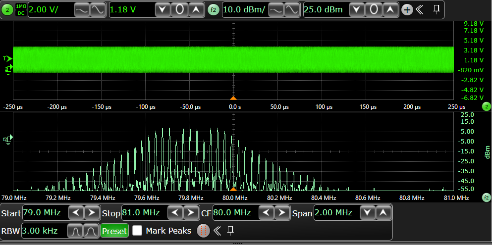
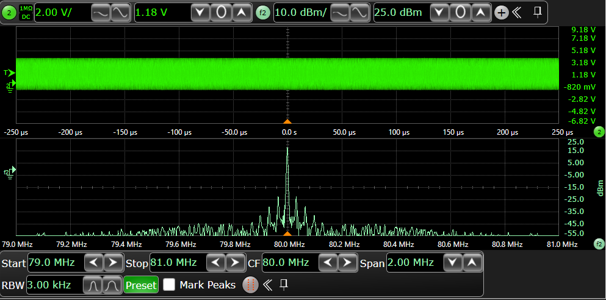

.. _pllctl_spreadspectrum:

PLLCTL频谱扩展
================

概述
------

本示例展示了如何配置锁相环（PLL）扩频。

**频谱扩展功能**

实现频谱扩展调制以降低电磁干扰（EMI），具有以下可配置参数：

- **扩频范围**
    - 默认值：**0.5%**
    - 通过 **SS_RANGE** 宏配置
    - 可调范围：**0.1% 至 3.1%**

- **调制频率**
    - 默认值：**30 kHz**
    - 通过 **MODULATION_FREQ** 宏自定义

- **频谱扩展类型**
    - 默认：下扩展调制
    - 通过 **PLLCTL_SS_TYPE** 宏配置

当频谱扩展功能启用时，在示波器上观察到的FFT结果如下图所示：

对比没有开启扩频时，在示波器上观察到的FFT的结果如下图所示：

硬件设置
------------

- 配置的PLL频率可以通过示波器观察到clk_ref*引脚，请参考 :ref:`Pin Description <board_resource>` 获取具体板子的引脚信息。

运行现象
------------

当工程正确运行后，串口终端会输出如下信息：

.. code-block:: console

   PLLCTL spread spectrum example

   PLL0CLK0 @ 80000000Mhz ss has been enabled (downspread) with range 0.5% @ 30000Hz, which can be observed on "P2[16]" pin by the oscilloscope

   PLLCTL example finished

