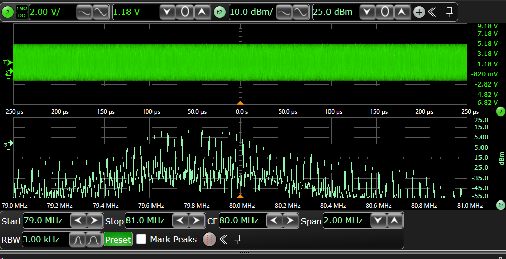
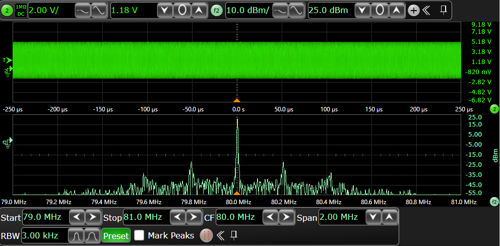

.. _pllctlv2_spreadspectrum:

PLLCTLV2 SPREAD SPECTRUM
================================

Overview
--------

This example demonstrates the configuration of PLL spread spectrum.

**Spread Spectrum Capabilities**

Demonstrates how to configure spread spectrum modulation for EMI (Electromagnetic Interference) reduction.

- **Spread Range**
    - Default: **0.5%**
    - Configurable through **SS_RANGE** macro

- **Modulation Frequency**
    - Default: **30 kHz**
    - Customizable via **MODULATION_FREQ** macro

When the spread spectrum is enabled, on oscilloscope, similar FFT result is expected to be observed as following:

For comparison, the FFT result observed on the oscilloscope without spread spectrum enabled is shown below:

Board Setting
-------------

- The configured PLL frequency can be observed via clk_ref pin by the oscilloscope, please refer to :ref:`Pin Description <board_resource>` for pin information of specific board.

Running the example
-------------------

When the project runs correctly, the serial port terminal will output the following information:

.. code-block:: console

   PLLCTLV2 spread spectrum example
   PLL2CLK0 @ 80000000Mhz spread spectrum has been enabled with range 0.5% @ 30000Hz, which can be observed on "J20[7]" pin by the oscilloscope

   PLLCTLV2 spread spectrum example finished
