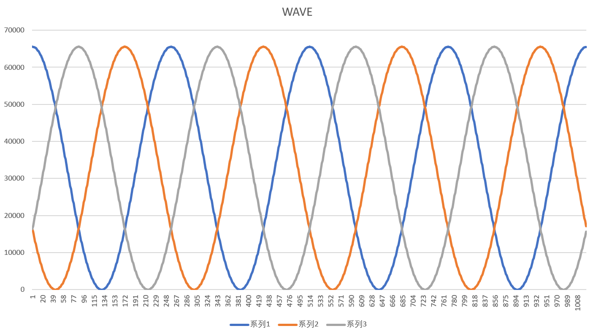
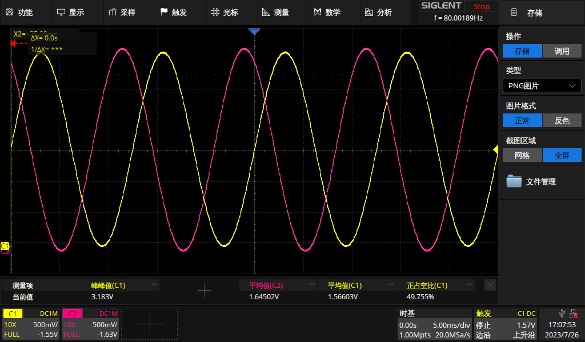

.. _qeo_dac_out:

QEO_DAC_OUT
======================

概述
---------

QEO_DAC_OUT示例工程展示了QEO (Quadrature Encoder Output) 外设根据位置信息生成波形信号的功能。QEO可以接收软件注入或硬件（如MMC）提供的位置信息，结合预设的波形类型和分辨率设置，生成相应的波形（如正弦波、余弦波等），并通过DAC输出模拟信号。

工作流程
-----------

本示例提供了两种工作模式演示：

1. 软件位置注入模式
   配置步骤：

   - 初始化QEO模块，配置波形输出模式
   - 配置波形生成参数：

     * 设置波形类型（如余弦波）
     * 设置分辨率线数，决定波形周期
     * 配置三相波形的相位差（120°和240°）

   - 软件位置注入流程：

     * 计算位置增量值
     * 使能软件位置注入
     * 循环注入位置值生成波形采样点
     * 等待波形计算完成
     * 获取并存储波形输出值
     * 关闭软件位置注入

2. 硬件位置输入模式

   本例中使用MMC (Motor Motion Control) 外设提供位置信息给QEO，QEO根据接收到的位置信息实时生成波形输出。

   配置步骤：

   - 初始化QEO模块，配置与软件模式相同的波形参数
   - 配置硬件位置输入：

     * 通过TRGM连接MMC位置输出到QEO
     * 配置MMC开环预测模式

   - 使能电机时间戳功能，用于同步

硬件设置
-----------

观察指定DAC引脚的输出电压波形，(请参考 :ref:`引脚描述 <board_resource>` 部分)。

注意事项
-----------

1. QEO支持输出3路波形信号，但实际可观察的波形数量受限于开发板上可用的DAC通道数
2. 波形输出值范围为0-65535，对应DAC的满量程输出
3. 在软件注入模式下，位置值范围为0-0x100000000，按分辨率线数均匀划分

运行现象
-----------

当工程正确运行后，可以观察到以下现象：

1. 串口终端输出信息：

.. code-block:: console

   QEO DAC wave example
   QEO generate wave with software inject position
   qeo wave0 output:
   65535
   65526
   65496
   // ... 更多数据点 ...
   QEO generate wave base on hardware(MMC) provide position

2. 波形输出：

- 使用Excel等工具可将串口输出的数据绘制成波形图，显示三相波形的相位关系：

- 使用示波器观察DAC引脚的实际输出波形：

