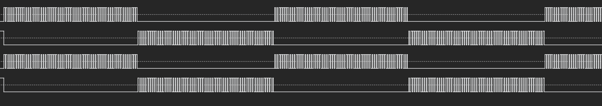

.. _qeo_pwm_out:

QEO_PWM_OUT
======================

概述
---------

QEO_PWM_OUT示例工程展示了QEO (Quadrature Encoder Output) 外设根据位置信息控制PWM输出的功能。QEO可以接收软件注入或硬件（如MMC）提供的位置信息，结合预设的PWM换向表和分辨率设置，生成相应的PWM波形，常用于步进电机的控制。

工作流程
-----------

本示例提供了两种工作模式演示：

1. 软件位置注入模式
   配置步骤：

   - 初始化QEO模块，配置PWM输出
   - 配置4相PWM输出表：

     * 设置每个相位的PWM强制输出状态
     * 配置4步换相序列实现电机换相控制

   - 设置分辨率线数
   - 软件位置注入流程：

     * 计算每步位置增量
     * 使能软件位置注入
     * 循环注入位置值实现PWM输出切换
     * 等待位置计算完成
     * 关闭软件位置注入

2. 硬件位置输入模式

   本例中使用MMC (Motor Motion Control) 外设提供位置信息给QEO，QEO根据接收到的位置信息输出对应的PWM波形。

   配置步骤：

   - 初始化QEO模块，配置PWM输出
   - 配置4相PWM输出表：

     * 设置PWM通道为非强制输出状态(PWM占空比可调)

   - 配置安全模式输出表
   - 配置硬件触发和安全模式：

     * 设置TRGM触发QEO进入安全模式
     * 新位置到来时自动退出安全模式

   - 配置PWM为中心对齐模式
   - 配置MMC位置输出：

     * 通过TRGM连接MMC位置输出到QEO
     * 配置MMC开环预测模式

   - 使能电机时间戳功能

硬件设置
-----------

观察指定PWM引脚的输出波形，(请参考 :ref:`引脚描述 <board_resource>` 部分)。

运行现象
-----------

当工程正确运行后，可以观察到以下现象：

1. 串口终端输出信息：

.. code-block:: console

   QEO PWM example
   QEO generate PWM signal with software inject postion
   QEO generate PWM signal with hardware(MMC) provide postion

2. PWM输出波形：

使用逻辑分析仪可以观察到两种不同的PWM波形：

- 软件位置注入模式下的强制输出波形：

- 硬件位置输入模式下的PWM调制波形：

