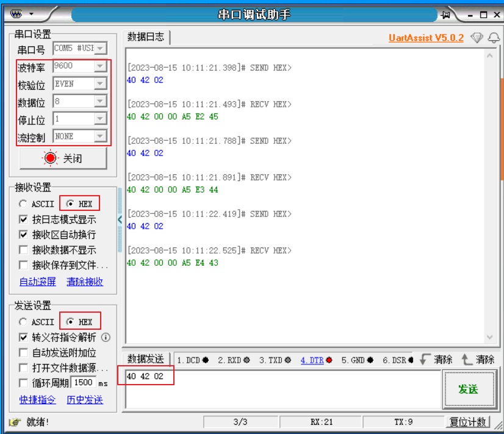

.. _sei_slave_simulate_hiperface_encoder:

SEI Slave: Simulate HIPERFACE Encoder
==========================================================================

Overview
----------

- This demo shows SEI interface simulate Hiperface encoder and generate position data, then print related information by uart console.

- The simulated Hiperface encoder is SKM36-HFA0-K02。

Configuration
---------------

- Prepare a USB to 485 module

- Connect SEI pins DATA_P/DATA_N to 485 module pins A/B

Running the example
-------------------

- Download and run the program in the development board.

- Use PC serial debugging assistant to communicate with the development board, obtain simulated encoder data.

- Set PC serial debugging assistant: baudrate-9600, startbits-1, databits-8, stopbits-1, paritybits-even. Then send data: 0x40 0x42 0x02, the development board will response.

- Meanwhile, the console shows the following log. POS's value increasing by 1 each sample.

.. code-block:: console

   ----------------------------------------------------------------------
   $$\   $$\ $$$$$$$\  $$\      $$\ $$\
   $$ |  $$ |$$  __$$\ $$$\    $$$ |\__|
   $$ |  $$ |$$ |  $$ |$$$$\  $$$$ |$$\  $$$$$$$\  $$$$$$\   $$$$$$\
   $$$$$$$$ |$$$$$$$  |$$\$$\$$ $$ |$$ |$$  _____|$$  __$$\ $$  __$$\
   $$  __$$ |$$  ____/ $$ \$$$  $$ |$$ |$$ /      $$ |  \__|$$ /  $$ |
   $$ |  $$ |$$ |      $$ |\$  /$$ |$$ |$$ |      $$ |      $$ |  $$ |
   $$ |  $$ |$$ |      $$ | \_/ $$ |$$ |\$$$$$$$\ $$ |      \$$$$$$  |
   \__|  \__|\__|      \__|     \__|\__| \_______|\__|       \______/
   ----------------------------------------------------------------------
   SEI slave hiperface sample
   Started sei engine!
   ADDR:0x40, CMD:0x42, POS:0xa5a5, CRC:0x40, sample_tm1:301346678, sample_tm2:0, sample_interval:1883416 us
   ADDR:0x40, CMD:0x42, POS:0xa5a6, CRC:0x80, sample_tm1:333346343, sample_tm2:301346678, sample_interval:199997 us
   ADDR:0x40, CMD:0x42, POS:0xa5a7, CRC:0x0, sample_tm1:365346007, sample_tm2:333346343, sample_interval:199997 us
   ADDR:0x40, CMD:0x42, POS:0xa5a8, CRC:0xf0, sample_tm1:397345672, sample_tm2:365346007, sample_interval:199997 us
   ADDR:0x40, CMD:0x42, POS:0xa5a9, CRC:0x70, sample_tm1:429345337, sample_tm2:397345672, sample_interval:199997 us
   ADDR:0x40, CMD:0x42, POS:0xa5aa, CRC:0xb0, sample_tm1:461345002, sample_tm2:429345337, sample_interval:199997 us
   ADDR:0x40, CMD:0x42, POS:0xa5ab, CRC:0x30, sample_tm1:493344667, sample_tm2:461345002, sample_interval:199997 us
   ADDR:0x40, CMD:0x42, POS:0xa5ac, CRC:0xd0, sample_tm1:525344332, sample_tm2:493344667, sample_interval:199997 us

