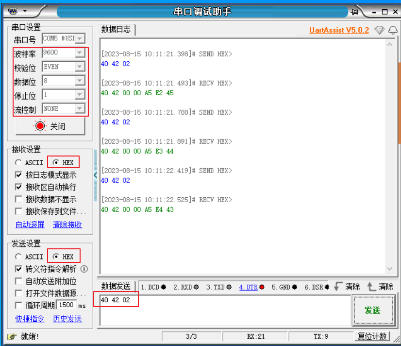

.. _sei_slave_simulate_hiperface_encoder:

SEI Slave: Simulate HIPERFACE Encoder
==========================================================================

Overview
----------

- This demo shows SEI interface simulate Hiperface encoder and generate position data, then print related information by uart console.

- The simulated Hiperface encoder is SKM36-HFA0-K02。

Configuration
---------------

- Prepare a USB to 485 module

- Connect SEI pins DATA_P/DATA_N to 485 module pins A/B

Running the example
-------------------

- Download and run the program in the development board.

- Use PC serial debugging assistant to communicate with the development board, obtain simulated encoder data.

- Set PC serial debugging assistant: baudrate-9600, startbits-1, databits-8, stopbits-1, paritybits-even. Then send data: 0x40 0x42 0x02, the development board will response.

- Meanwhile, the console shows the following log. POS's value increasing by 1 each sample.

.. code-block:: console

   ----------------------------------------------------------------------
   $$\   $$\ $$$$$$$\  $$\      $$\ $$\
   $$ |  $$ |$$  __$$\ $$$\    $$$ |\__|
   $$ |  $$ |$$ |  $$ |$$$$\  $$$$ |$$\  $$$$$$$\  $$$$$$\   $$$$$$\
   $$$$$$$$ |$$$$$$$  |$$\$$\$$ $$ |$$ |$$  _____|$$  __$$\ $$  __$$\
   $$  __$$ |$$  ____/ $$ \$$$  $$ |$$ |$$ /      $$ |  \__|$$ /  $$ |
   $$ |  $$ |$$ |      $$ |\$  /$$ |$$ |$$ |      $$ |      $$ |  $$ |
   $$ |  $$ |$$ |      $$ | \_/ $$ |$$ |\$$$$$$$\ $$ |      \$$$$$$  |
   \__|  \__|\__|      \__|     \__|\__| \_______|\__|       \______/
   ----------------------------------------------------------------------
   SEI slave hiperface sample
   Started sei engine!
   ADDR:0x40, CMD:0x42, POS:0xa5a5, CRC:0x2, sample_interval:1514121 us
   ADDR:0x40, CMD:0x42, POS:0xa5a6, CRC:0x1, sample_interval:199996 us
   ADDR:0x40, CMD:0x42, POS:0xa5a7, CRC:0x0, sample_interval:199996 us
   ADDR:0x40, CMD:0x42, POS:0xa5a8, CRC:0xf, sample_interval:199996 us
   ADDR:0x40, CMD:0x42, POS:0xa5a9, CRC:0xe, sample_interval:199996 us
   ADDR:0x40, CMD:0x42, POS:0xa5aa, CRC:0xd, sample_interval:199996 us
   ADDR:0x40, CMD:0x42, POS:0xa5ab, CRC:0xc, sample_interval:199996 us
   ADDR:0x40, CMD:0x42, POS:0xa5ac, CRC:0xb, sample_interval:199996 us
   ADDR:0x40, CMD:0x42, POS:0xa5ad, CRC:0xa, sample_interval:199996 us
   ADDR:0x40, CMD:0x42, POS:0xa5ae, CRC:0x9, sample_interval:199996 us
   ADDR:0x40, CMD:0x42, POS:0xa5af, CRC:0x8, sample_interval:199996 us
   ADDR:0x40, CMD:0x42, POS:0xa5b0, CRC:0x17, sample_interval:199996 us
   ADDR:0x40, CMD:0x42, POS:0xa5b1, CRC:0x16, sample_interval:199996 us
   ADDR:0x40, CMD:0x42, POS:0xa5b2, CRC:0x15, sample_interval:199996 us
   ADDR:0x40, CMD:0x42, POS:0xa5b3, CRC:0x14, sample_interval:199996 us
   ADDR:0x40, CMD:0x42, POS:0xa5b4, CRC:0x13, sample_interval:199996 us
   ADDR:0x40, CMD:0x42, POS:0xa5b5, CRC:0x12, sample_interval:199996 us
   ADDR:0x40, CMD:0x42, POS:0xa5b6, CRC:0x11, sample_interval:199996 us
   ADDR:0x40, CMD:0x42, POS:0xa5b7, CRC:0x10, sample_interval:199996 us
   ADDR:0x40, CMD:0x42, POS:0xa5b8, CRC:0x1f, sample_interval:199996 us
   ADDR:0x40, CMD:0x42, POS:0xa5b9, CRC:0x1e, sample_interval:199996 us
   ADDR:0x40, CMD:0x42, POS:0xa5ba, CRC:0x1d, sample_interval:199996 us
   ADDR:0x40, CMD:0x42, POS:0xa5bb, CRC:0x1c, sample_interval:199996 us
   ADDR:0x40, CMD:0x42, POS:0xa5bc, CRC:0x1b, sample_interval:199996 us
