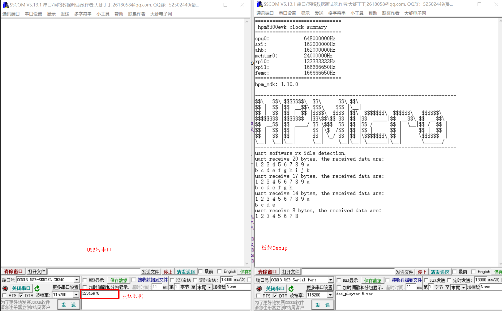

.. _uart_software_rx_idle_detection:

UART软件接收空闲检测
========================

概述
------

该示例工程，UART使用软件接受空闲检测通过DMA接收不定长的数据（数据量小于程序定义的BUFF_SIZE）。
该方法用于UART硬件不支持接收空闲检测的情况，通过TRGMUX和GPTMR软件检测RX信号的方式实现接收空闲检测。
如果硬件支持接收空闲检测，则可使用uart_hardware_rx_idle的例程。

端口设置
------------

-  串口波特率设置为 ``115200bps`` ，``1个停止位`` ，``无奇偶校验位``

硬件设置
------------

该例程需要使用USB转串口工具。

- 将USB转串口工具的TX与开发板的UART RX相连，将USB转串口的GND与开发板相连。

- 将开发板的UART RX引脚与板上TRGMUX的输入IO引脚相连。

- 请参考:ref:`引脚描述 <board_resource>`。

运行现象
------------

打开串口调试助手1，配置USB转串口工具所使用的端口号、波特率等参数后，发送数据。
打开串口调试助手2，配置开发板debug接口所使用的端口号、波特率等参数后，可以看到调试信息。
当程序正确运行后，通过USB转串口工具的串口助手发送数据，例如"1234567890123", 开发板debug接口的串口助手会以如下形式输出信息：

.. code-block:: console

   uart software rx idle detection.
   uart receive 13 bytes, the received data are:
   1 2 3 4 5 6 7 8 9 0
   1 2 3

