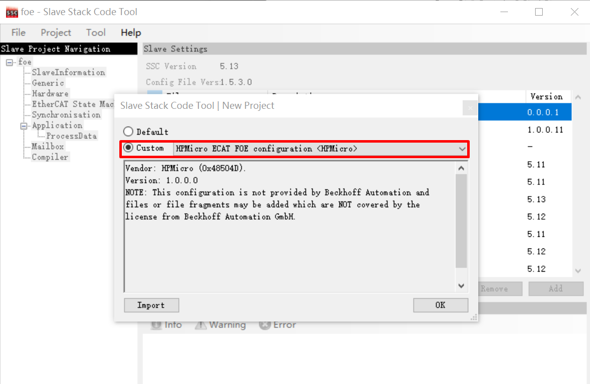
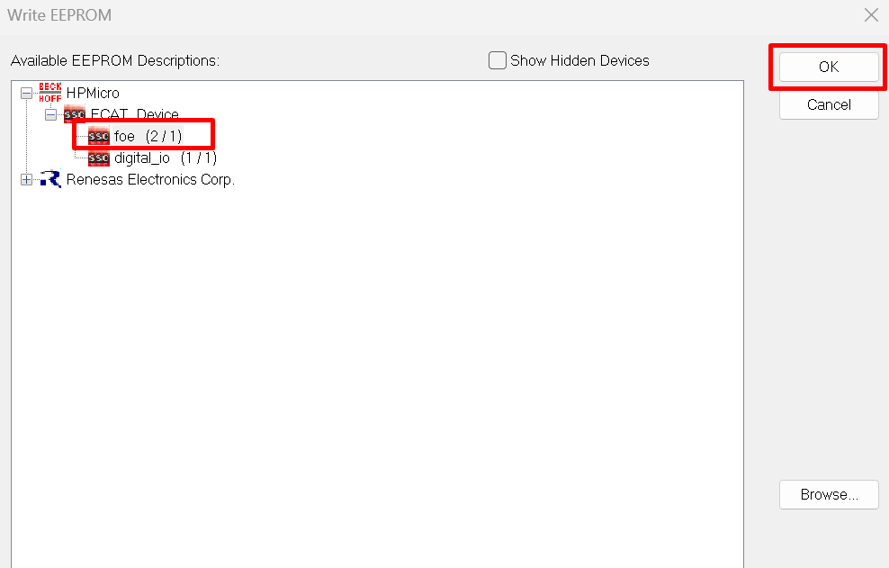
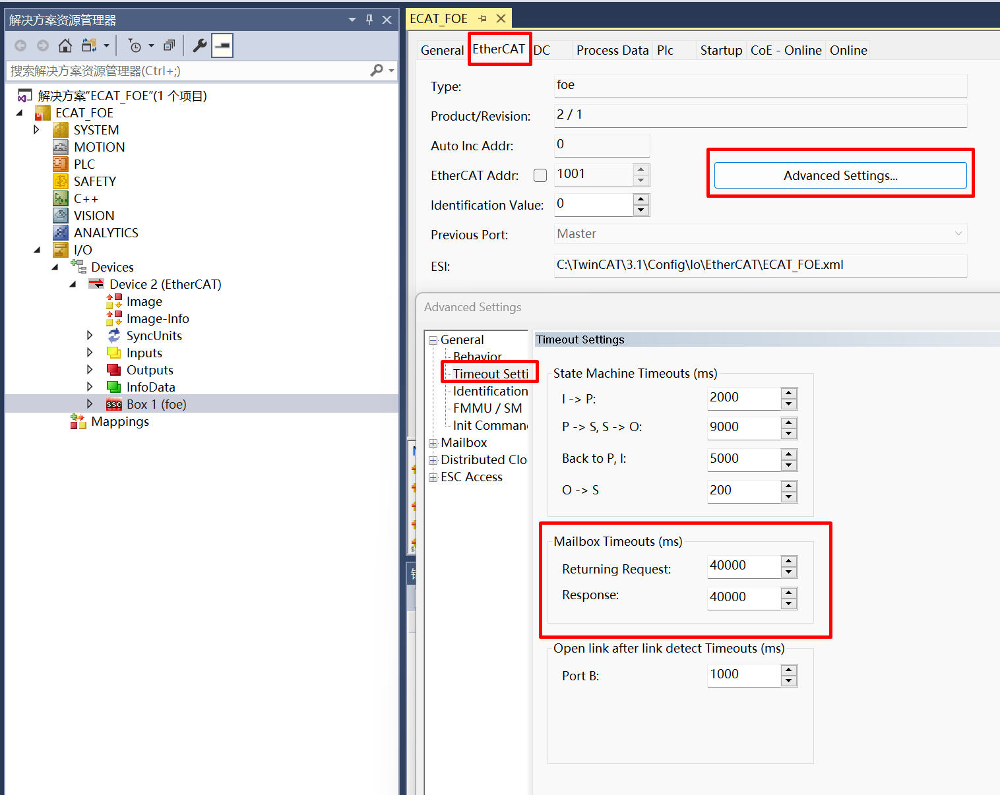
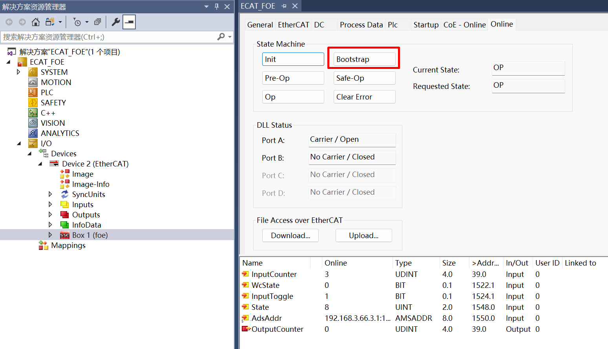
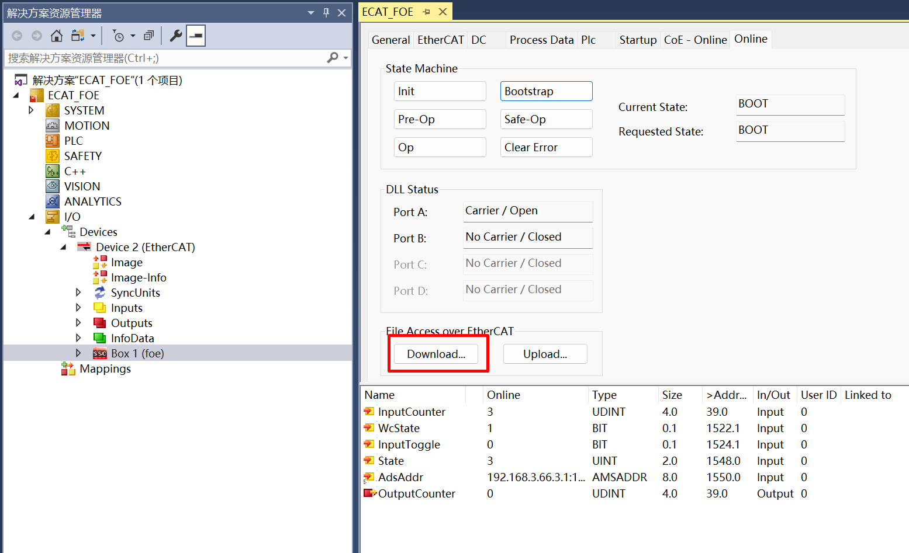
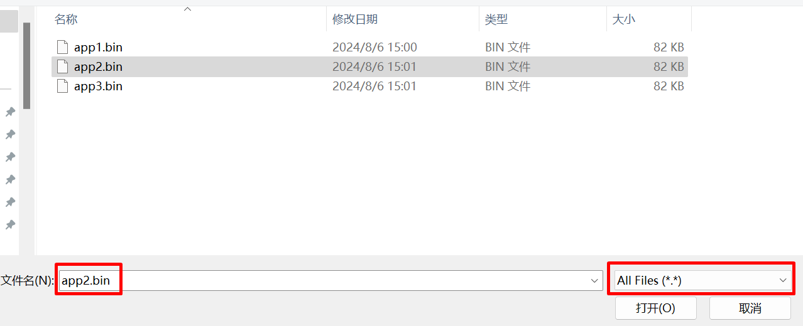
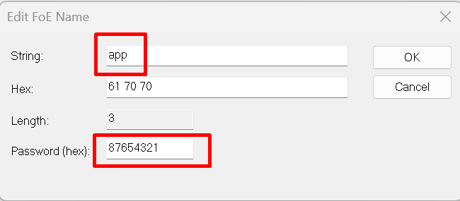
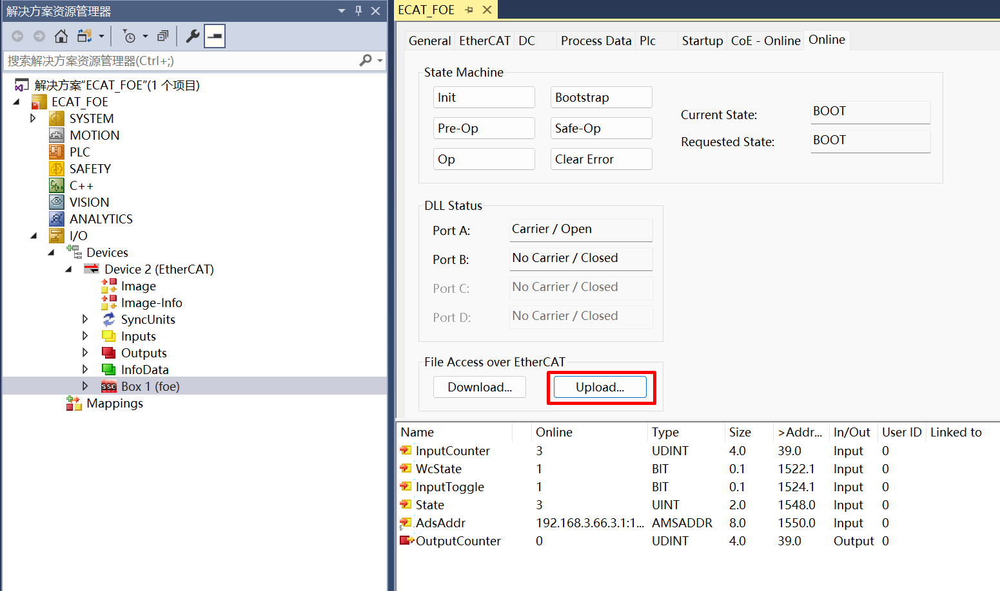
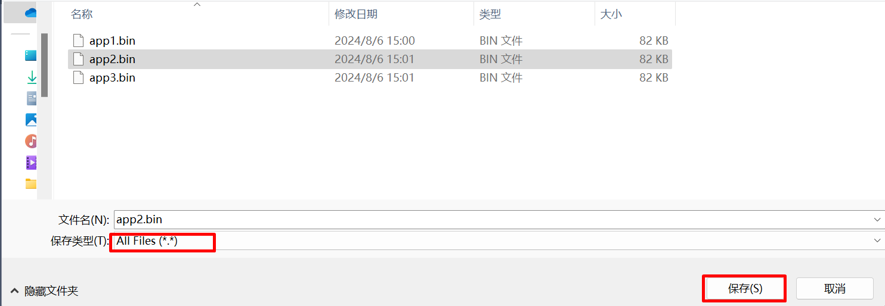

# ECAT_FOE

## 1. 概述

ECAT_FOE示例演示使用ECAT外设和从站协议栈代码(SSC)实现ECAT FOE读写从站文件的功能。

关于使用ECAT FOE更新firmware的功能演示， 请参考hpm_apps中OTA相关例程。

hpm_apps仓库：
  github: https://github.com/hpmicro/hpm_apps
  gitee: https://gitee.com/hpmicro/hpm_apps

## 2. 准备

  请参照ECAT_IO的README
  软件版本：SSC Tool(SSC Version: 5.13.1; Config File Vers: 1.5.3.0)

## 3. 工程设置

  请参照ECAT_IO的README

  **注意**: 使用FLASH模拟EEPROM功能时，需要为FLASH_EEPROM内容分配合适的flash空间， 避免与其他的flash内容产生冲突。

## 4. 生成从站协议栈代码

由于许可问题, HPM_SDK不提供EtherCAT从站协议栈代码(SSC), 用户须从倍福官网下载SSC Tool并生成从站协议栈代码

### 4.1. 下载SSC Tool

  请参照ECAT_IO的README

### 4.2 SSC Tool中导入配置文件
  配置文件路径为: <hpm_sdk>/samples/ethercat/ecat_foe/SSC/Config/HPM_ECAT_FOE_Config.xml

### 4.3 SSC Tool生成协议栈代码
  1. 创建新工程，选择指定的配置文件
    
  2. 导入应用xlsx：<hpm_sdk>/samples/ethercat/ecat_foe/SSC/foe.xlsx
  3. 指定输出目录，生成从站协议栈代码

## 5. TwinCAT工程设置
  请参照ECAT_IO的README

### 5.1. 添加ESI文件
  将SSC工具生成的ESI文件复制到TwinCAT的安装目录下(如: **C:\TwinCAT\3.1\Config\Io\EtherCAT**)

### 5.2 创建工程
  请参照ECAT_IO的README

### 5.3 软件配置
  请参照ECAT_IO的README

### 5.4 扫描设备
  请参照ECAT_IO的README

### 5.5 更新EEPROM
  请选择**foe**设备描述文件
  


### 5.6 FOE操作
  1. 设置MailBox timeout时间(当文件比较大时， 需要调整timeout时间)
  
  2. 选择从站， 进入Bootstrap模式
  
  3. 进入Bootstrap模式后， 下载文件到从站
    点击Download
    
    选择要下载的文件，源文件名和文件格式并不限定，但需要在编辑FOE名页面将文件名称改为指定名称
    
    编辑文件名称和密码， 文件名称是：**app**; 密码是：**87654321**.
    
    等待写进度条完成
  4. 进入Bootstrap模式后，从从站读取文件
    点击Uplaod
    
    选择文件保存文件和名称, 需要保存的文件名和文件格式并不限定，但需要在编辑FOE文件名页面将文件名称修改为指定名称
    
    编辑文件名称和密码，文件名称是：**app**; 密码是：**87654321**.
    
    等待读进度条完成
  4. 退出Bootstrap模式

## 6. 运行现象

当工程正确运行后, 串口终端会输出如下信息：
当EEPROM未被初始化时，输出如下信息提示需要初始化EEPROM内容。
```console
EtherCAT FOE sample
Write or Read file from flash by FOE
EEPROM loading with checksum error.
EtherCAT communication is possible even if the EEPROM is blank(checksum error),
but PDI not operational, please update eeprom  context.
```
当EEPROM被正确初始化后， 输出如下信息， 在Twincat中可以进行文件写读操作，对比写下去与读回来的文件保持一致。
```console
EtherCAT IO sample
Write or Read file from flash by FOE
EEPROM loading successful, no checksum error.
Write file start
Write file finish
Read file start
Read file finish
```


