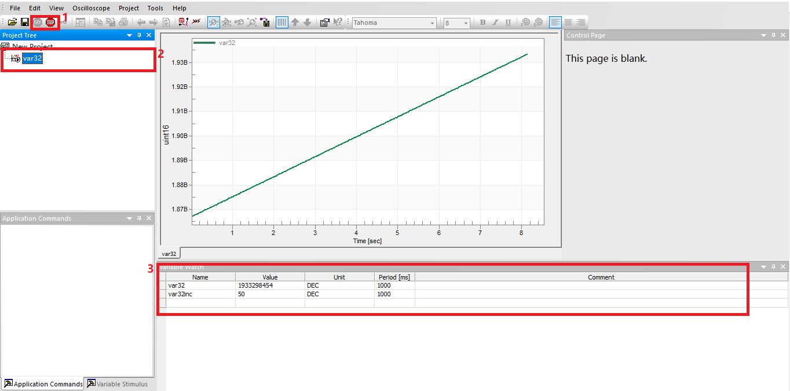

# Freemaster

## Overview

**freemaster** project mainly shows how to debug the project uses **freemaster**. the main details are as follows:

- Initialize **freemaster** MCU communication driver, like uart
- Accumulate a global variable that can be observed and modified with **freemaster**

(lab_samples_freemaster_configure)=
## Configure items

- Make sure **freemaster** has been properly installed on PC
- Connect USB cable to debug port and power on the target board
- Make sure PC detect the COM port and debug interface, then take a note of the current COM port, for example, COM4
## Running the example

- Compile the project using gcc or "SEGGER Embedded Studio for RISC-V"
- Open the `./freemaster.pmpx` in **freemaster**
- Add the generated elf file to **freemaster**

  - if compiled with gcc, configure it as follows:

    - By clicking Project->Options, the following dialog window should be shown. Follow the order and content shown in the image to configure:

      

  - if compiled with "SEGGER Embedded Studio for RISC-V". Use the following configuration:

    **Note: Set `Default symbol` to the generated map file**
    - Open the drop-down list to configure `File format`, as follows image:

      

    - Write `HPM_SEGGER_MAP` to area 1 and `([0-9a-fA-F]+)-[0-9a-fA-F]+\s+(\w+)\s+([0-9])` to area 2, as following
  	    

- Make sure **freemaster** has been selected the right COM, and then click `Project->Options->Comm` and configure according to the following image:

    

- Observe variable changes in **freemaster**

  1. Click the GO icon to enable the **freemaster** to set up communication with the target board
  2. Click `var32` to show the waveform
  3. Modify `var32inc` to change waveform slope, then the change should be reflected on the shown waveform

    

- Additional variables can be added by double-clicking on the blank lines in area 3 of the above image
