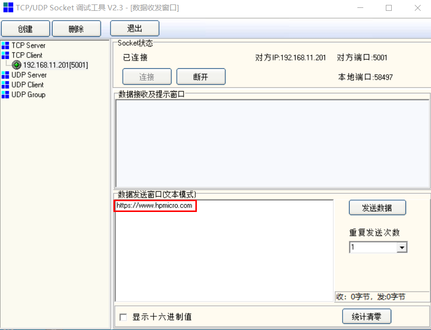

# TCP Echo 

## Overview

This  example shows TCP echo communication.

- PC sends TCP data frames to MCU,  and then MCU sends the data frames back to PC

## Board Setting

- Connect a USB port on PC to the PWR DEBUG port on the development board with a USB Type-C cable
- Connect an Ethernet port on PC to a RGMII port or a RMII port on the development board with an Ethernet cable

## Project Configuration

- In the file [cmakelists.txt](./CmakeLists.txt) ,  set a matched Ethernet PHY type according to the development board schematic，

  e.g. "set(COFNIG_ENET_PHY_DP83848 1)"

## Run Example

- Compiling and Downloading
- Running log is shown in the serial terminal as follows:

  ```
     This is an ethernet demo: TCP Echo
     LwIP Version: 2.1.2
     Local IP: 192.168.11.201
     Speed Rate:100Mbps
     Reference Clock: Internal Clock
     Enet phy init passes !
     Static IP: 192.168.11.201
     NETMASK  : 255.255.255.0
     Gateway  : 192.168.11.1
  ```
  
- Run an Ethernet debugging tool

  - create and set a TCP client:  TCP Server IP: 192.168.11.201/Port: 5001

    **Note: There is a necessary adjustment for Server IP according to the segment of  LAN where PC resides**

  - Connect

  - Enter and send any characters in the edit window

    

  - Watch the characters echoed from MCU

    