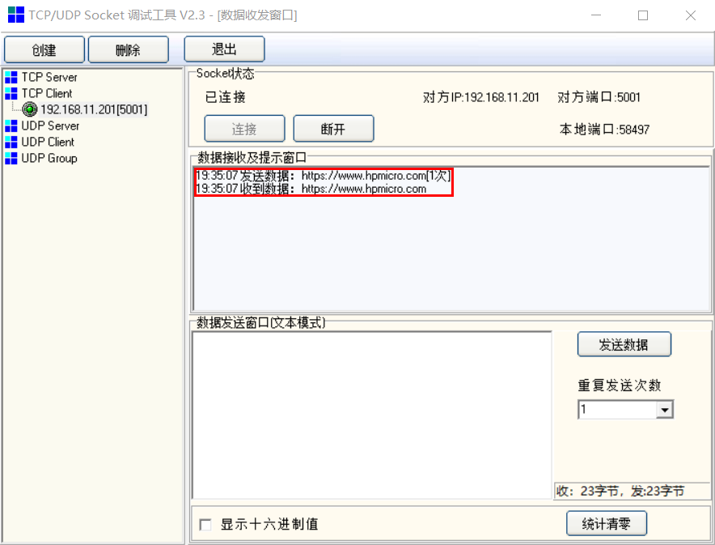

# TCP回送

## 概述

本示例展示TCP回送通讯

- PC 通过以太网发送TCP数据帧至MCU，MCU将接收的数据帧回发至PC

## 硬件设置

* 使用USB Type-C线缆连接PC USB端口和PWR DEBUG端口
* 使用以太网线缆连接PC以太网端口和开发板RGMII或RMII端口

## 工程配置

- 在文件[CMakeLists.txt](./CmakeLists.txt)中,  根据开发板原理图，设置匹配的以太网PHY类型，例如："set(COFNIG_ENET_PHY_DP83848 1)"

## 运行示例

* 编译下载程序

* 串口终端显示如下信息：

  ```
  This is an ethernet demo: TCP Echo
  LwIP Version: 2.1.2
  Local IP: 192.168.11.201
  Speed Rate:100Mbps
  Reference Clock: Internal Clock
  Enet phy init passes !
  Static IP: 192.168.11.201
  NETMASK  : 255.255.255.0
  Gateway  : 192.168.11.1
  ```

* 打开以太网调试工具

  - 创建并设置TCP客户端：TCP服务端IP: 192.168.11.201/端口: 5001

    **注：实际需要根据PC所在局域网段调整服务端IP**

  - 连接

  - 在数据发送窗口编辑发送字符

    

  - 观察回送数据

  ​         

  
