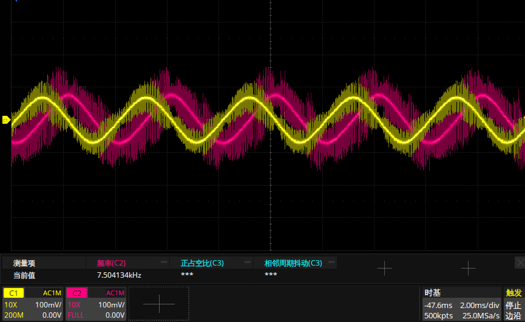

.. _step_motor_foc:

STEP MOTOR FOC
============================

Overview
--------

The **step motor foc**  project description Stepper motor control using vector modulation.
- Use the **FOC**  control algorithm

- Trapezoidal acceleration and deceleration curves

- The current waveform is as follows, a sine wave with a phase difference of 90 degrees

Configurations
--------------

- 42 Stepper Motor, 24v, 50 Pair of Poles.

- Stepper motor driver board **24V_STEP_NONE_2A** .

    - plug J2 and J4

    - connect M1 to motor

- Plugged into the driver board via the motor interface

Running the demo
----------------

The stepper motor switches forward and reverse speed without stopping, and the serial port prints speed information.

The serial console message is as follows:

.. code-block:: console

   step motor demo.
   speed: 1 r/s.
   speed: -2 r/s.
   speed: 3 r/s.
   speed: -4 r/s.
   speed: 5 r/s.
   speed: -6 r/s.
   speed: 1 r/s.
   speed: -2 r/s.
   speed: 3 r/s.
   speed: -4 r/s.
   speed: 5 r/s.
   speed: -6 r/s.
   speed: 1 r/s.
   speed: -2 r/s.
   speed: 3 r/s.

.. warning::

   - Pay attention to the current size, when abnormalities occur, please cut off the power at any time

   - Pay attention to the temperature of the stepper motor in long-term operation.

