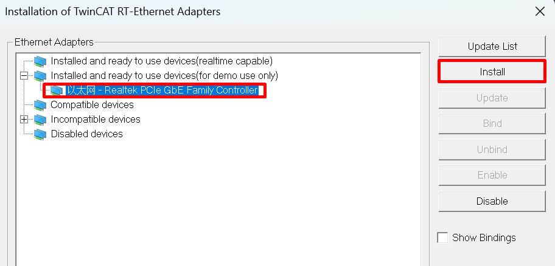
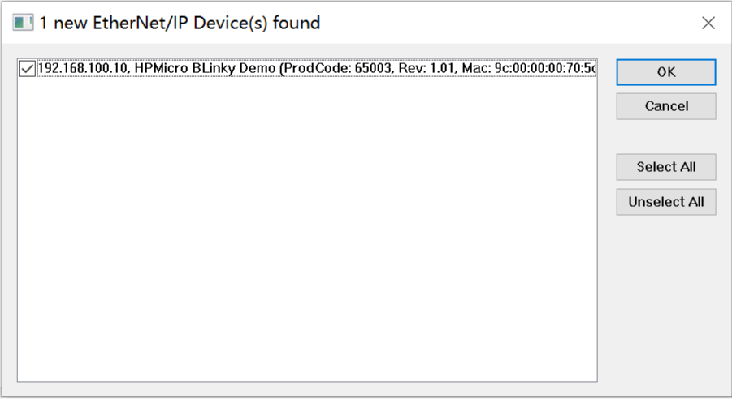
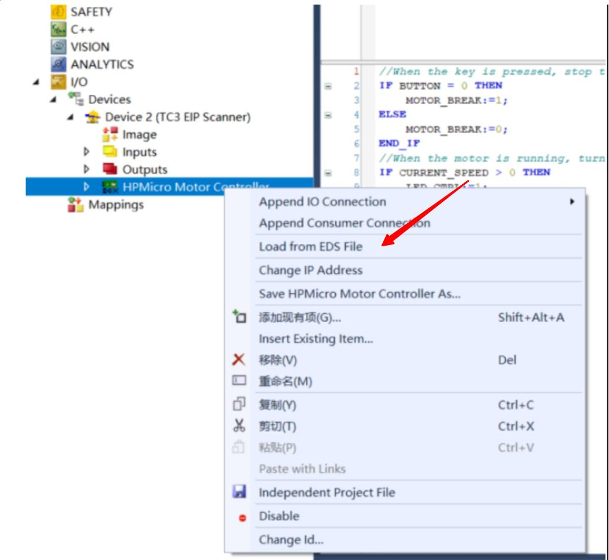
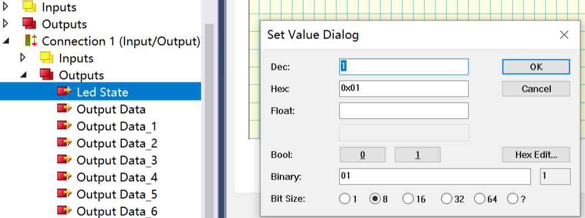
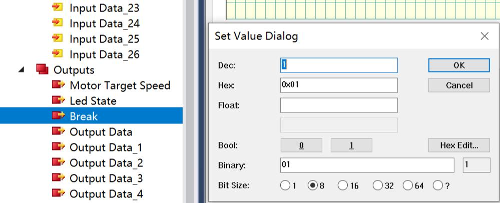

# OpENer Erpc Motor

## 1.Overview

The OpENer Erpc Motor dual core example is used to demonstrate the function of realizing remote motor speed control through the Ethernet/IP (EIP) protocol using OpENer. Core0 runs FreeRTOS, Lwip and OpENer, core1 runs motor controlling mothod, while erpc is used between two cores.

For how to use erpc, see `middleware/samples/multicore/erpc/erpc_matrix_multiply_rpmsg_bm/README_en.md`

## 2.Preparation
### 2.1 Hardware

  - A development board with Ethernet. Refer to the {ref}pin description <lab_board_resource> of the specific development board to view the Ethernet hardware.
    - ==According to your development board, select RMII/RGMII and ethernet phy in the CMakeLists.txt==

  - A PC with a network port.
    - The TwinCAT3 software has adaptation issues with PC network cards. Some supported Intel network cards.

  - This program uses the **BLM57050-1000** brushless motor of "Leisai Intelligence", please refer to the [Leisai Intelligence](https://leisai.com/) website for the specific parameters of the motor.

  - Board settings refer to the development board documentation [Motor Pin](lab_board_motor_ctrl_pin) related content

### 2.2 Software
  - TwinCAT3.1(Build 4024.56)

## 3. TwinCAT project settings

### 3.1 Create a project
  1. Open the TwinCAT software and select File -> New -> Project.
    
  2. Select TwinCAT Project, name it and click OK.
    

### 3.2 Software configuration
  1. Update the network card driver (required when using for the first time).
    
    
  2. Clock setting
    When the software is running, the following error may be encountered: It is necessary to run C:\TwinCAT\3.1\System\win8settick.bat with administrator privileges.
      - - -
      *Init4\RTime：Start Interrupt：Ticker started >> AdsWarning4115 （0x1013,RTIME：system clock setup failed）*
      - - -
      

### 3.3 Add EIP Scanner
  1. Click on Device, right-click to add a new item.
    
  2. Select EIP Scanner.
    
  3. Select the network card after the driver is updated.
    
  4. Configure the IP address.
    
  5. Re-enter the configuration mode to make the IP configuration in the previous step take effect.
    

### 3.4. Add EDS file
  Right-click on EIP Scanner and select import EDS file. Select opener/opener_blinky_app.eds.
    

### 3.5. Scan devices
  1. Right-click on EIP Scanner and then scan.
    
  2. Add a device.
    

### 3.6 Add IO connection
  
  If there is no `Exclusive Owner` is the combox, specify the eds file manually.
  

### 3.7 IO operation
  1. For input IO, press the button KEYA on the evaluation board, and the value of Input/Key State changes.
    
  2. For output IO, right-click on Led State, select Online, and click Write to write a value. When writing 1, the LED on the development board lights up. When writing 0, the LED on the development board turns off.
    
  3. For output IO. Right-click "Motor Target Speed", select "Online", and click "Write" to enter a value. The motor rotates according to the input value. Note that the upper limit of the motor speed is 35.
    
  4. For input IO. Observe "Inputs/Motor Current Speed", which shows the real-time motor speed.
    
  5. For input IO, right-click Break, select Online, and write values by motor Write. When inputting 1, the motor stops rotating. When inputting 0, the motor resumes the rotating state before stopping.
    

## 6. Operation phenomenon

After the project runs correctly, the serial terminal will output the following information. The input and output IO states correspond to the TwinCAT project configuration:
```console
This is an Ethernet/IP demo.
LwIP Version: 2.1.2
Enet phy init passed !

Primary core started

Copying secondary core image to destination memory: 0x80003178
Starting secondary core...

Link Status: Down

Secondary core started...
Link Status: Down
Link Status: Down
Link Status: Down
Link Status: Down
Link Status: Up
Link Speed:  100Mbps
Link Duplex: Full duplex
IPv4 Address: 192.168.100.10
IPv4 Netmask: 255.255.255.0
IPv4 Gateway: 192.168.100.1

eRPC request is sent to the server
```
