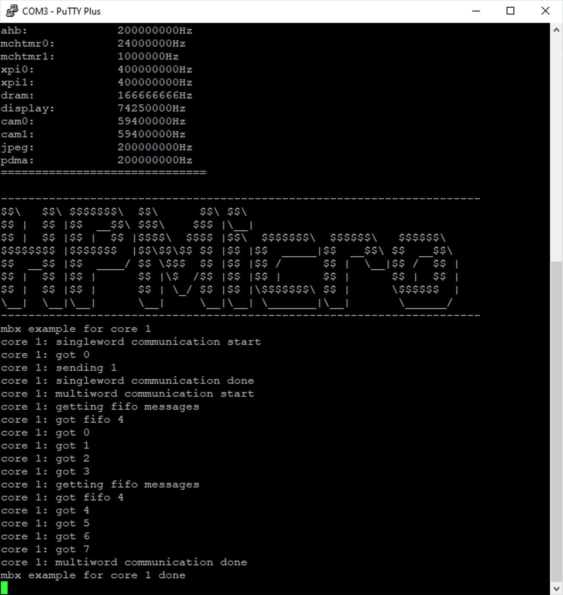

# MBX dualcore

## Overview

This example demonstrate how MBX works. Core 0 will send message to core 1 which will echo back what's been received.

## Board Setting

debug console for core1 can be found in [Pin Description](lab_board_resource) for specific board

## Generate, Build and Debug Multi-core projects

Please reference[Multicore General Description.md](../README_en.md)

## Running the Example

- start to run application for each core, following content should be shown on debug console
  - for core0:
  
  - for core1:
  
  - once core1 application starts, core1 will receive messages from core0 then send them back, then in the console of core0:
  
