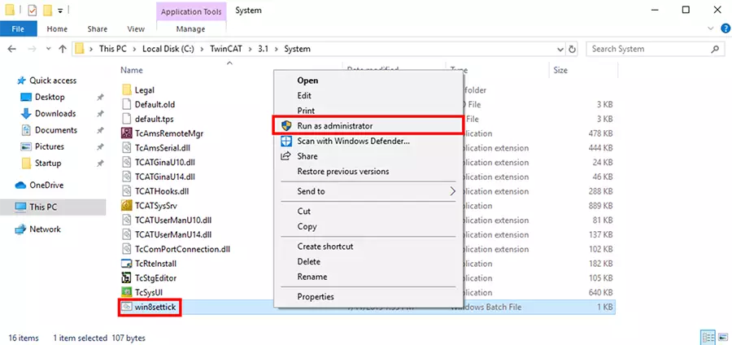
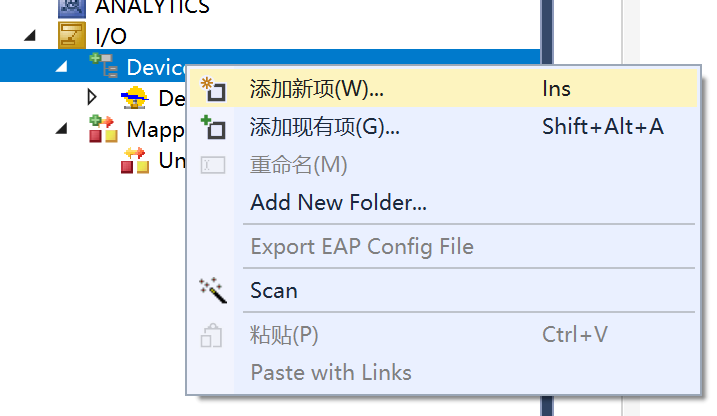
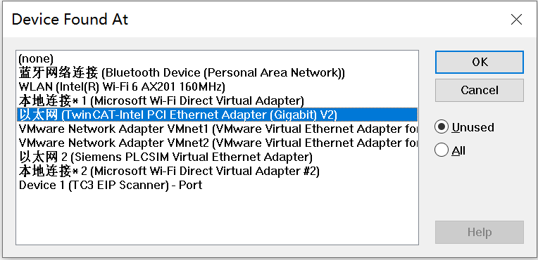
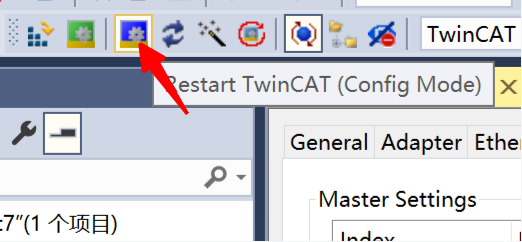
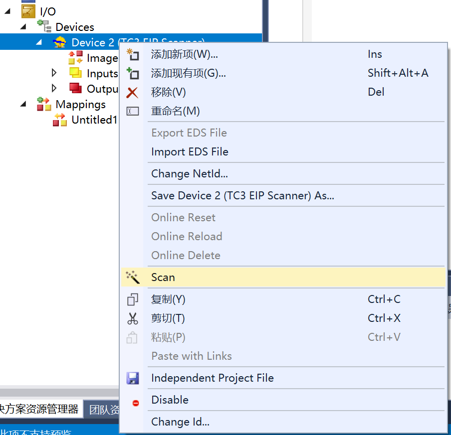
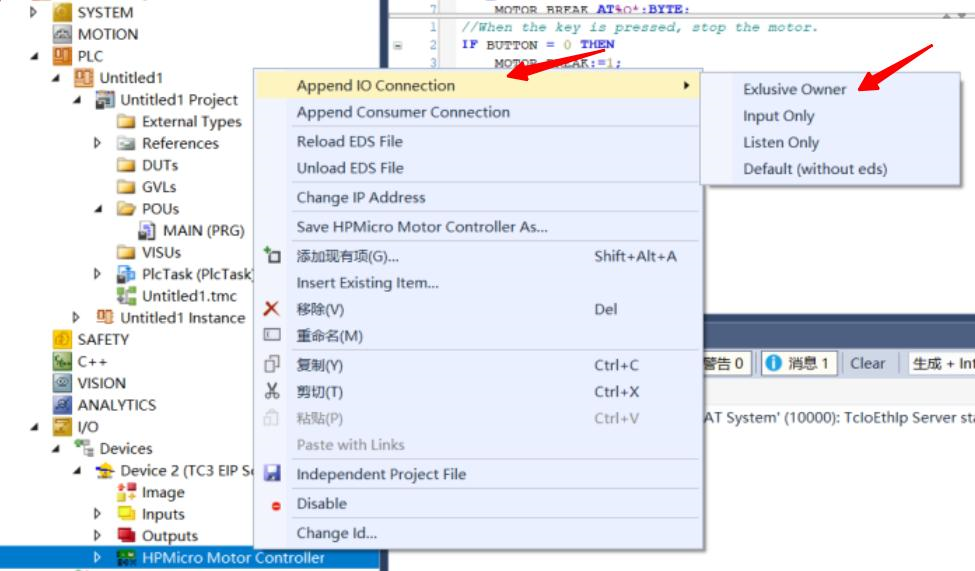
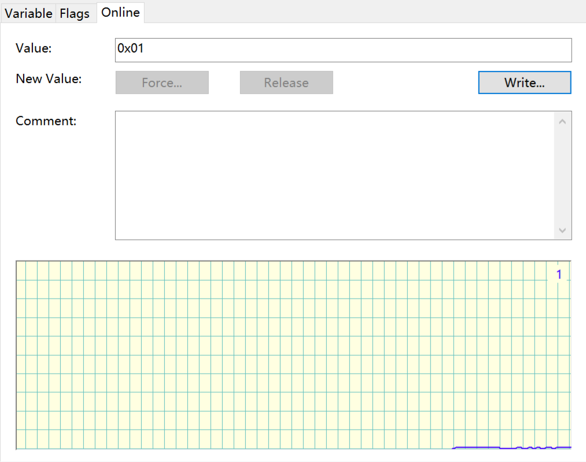
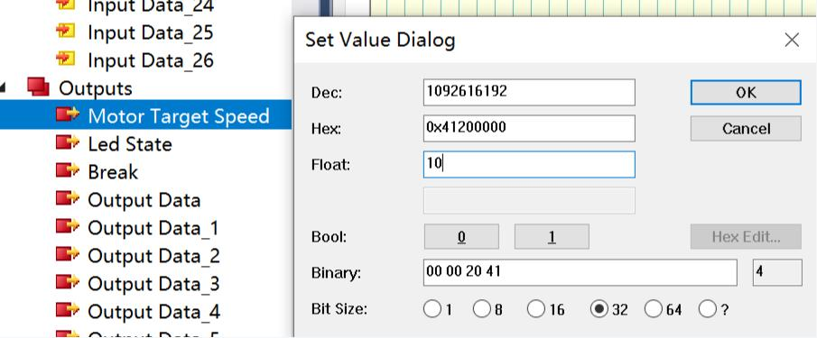
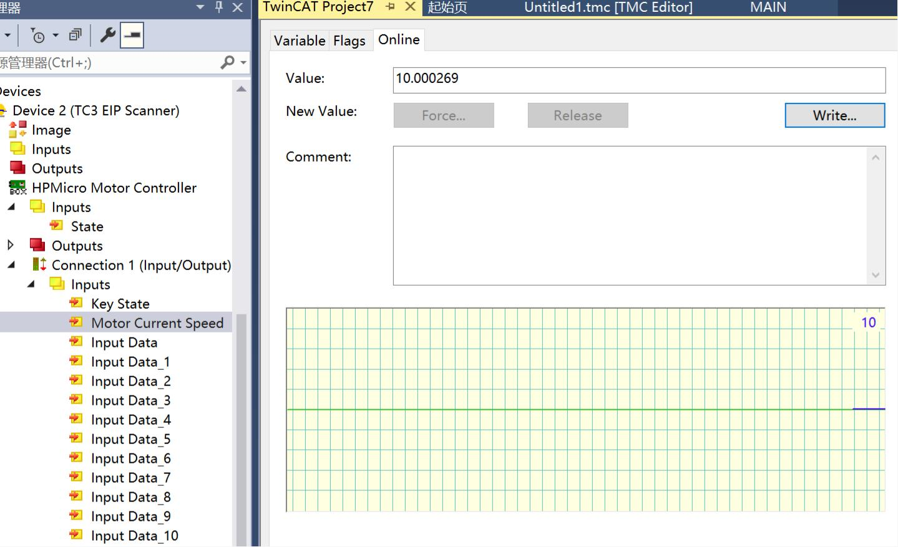

# OpENer Motor

## 1. 概述

OpENer Motor示例用于演示使用OpENer通过Ethernet/IP(EIP)协议实现远程控制电机转速的功能。

## 2. 准备

### 2.1 硬件
  - 带Ethernet的开发板，请参考具体开发板{ref}`引脚描述 <lab_board_resource>`查看Ethernet硬件
    - ==根据开发板的硬件配置，在CMakeLists.txt中选择相应的RMII/RGMII，和phy芯片。==
  - 带网口的PC
      - TwinCAT3软件对PC网卡有适配问题, [部分支持的Intel网卡](https://infosys.beckhoff.com/english.php?content=../content/1033/tc3_overview/9309844363.html&id=1489698440745036069)
  - 本例程电机使用的是雷赛智能的 **BLM57050-1000** 无刷电机，电机具体参数请参考[雷赛智能官网](https://leisai.com/)。

  - 板子设置参考开发板文档[Motor Pin](lab_board_motor_ctrl_pin)相关内容

  - 完成上述过程后，给驱动板上电观察电流无异常后，给核心板上电，再次确认电流无异常后，就可以烧录程序，观察运行现象。
### 2.2 软件
  - TwinCAT3.1(Build 4024.56)

## 3. TwinCAT工程设置

### 3.1 创建工程
  1. 打开TwinCAT软件，选择**File->New->Project**
    
  2. 选择**TwinCAT Project**, 命名后点击**OK**
    

### 3.2 软件配置
  1. 更新网卡驱动(第一次使用时需要)
    
    
  2. 时钟设置
    软件运行时可能遇到如下报错： 需要以管理员权限运行C：\TwinCAT\3.1\System\win8settick.bat
      - - -
      *Init4\RTime：Start Interrupt：Ticker started >> AdsWarning4115 （0x1013,RTIME：system clock setup failed）*
      - - -
      

### 3.3 添加EIP Scaner
  1. 点击Device, 右键添加新项
    
  2. 选择EIP Scaner
    
  3. 选择前边更新驱动后的网卡
    
  4. 配置ip地址
    
  5. 重新进入配置模式，使上一步的ip配置生效
    

### 3.4. 添加EDS文件
  右键EIP Scaner，选择import EDS file，选择opener/opener_blinky_app.eds
    

### 3.5. 扫描设备
  1. 右键EIP Scaner, 然后扫描
    
  2. 添加设备
    

### 3.6 添加IO链接
  
  如果此时列表中没有找到Exclusive Owner，那么可以手动指定一下eds文件。
  

### 3.7 IO操作
  1. 输入IO, 按动评估板上的按键KEYA, Input/Key State数值发生变化
    
  2. 输出IO,右键Led State, 选择Online, 点击Write写入数值。 写入1开发板LED亮起，写入0开发板LED熄灭。
    
  3. 输出IO,右键Motor Target Speed, 选择Online, 点击Write写入数值。电机按照输入的数值进行转动。注意电机转速的上限为35。
    
  4. 输入IO,观察Inputs/Motor Current Speed, 显示为实时的电机转速。
    
  5. 输入IO,右键Break，选择Online, 电机Write写入数值。输入1电机停止转动，输入0电机恢复停止之前的转动状态。
    

## 6. 运行现象

当工程正确运行后, 串口终端会输出如下信息：
```console
This is an Ethernet/IP demo.
LwIP Version: 2.1.2

Speed mode, motor run, speed is: 0.000000.
Enet phy init passed !
Link Status: Down
Link Status: Down
Link Status: Up
Link Speed:  100Mbps
Link Duplex: Full duplex
IPv4 Address: 192.168.100.10
IPv4 Netmask: 255.255.255.0
IPv4 Gateway: 192.168.100.1
Mesaage receieved from host!
```
