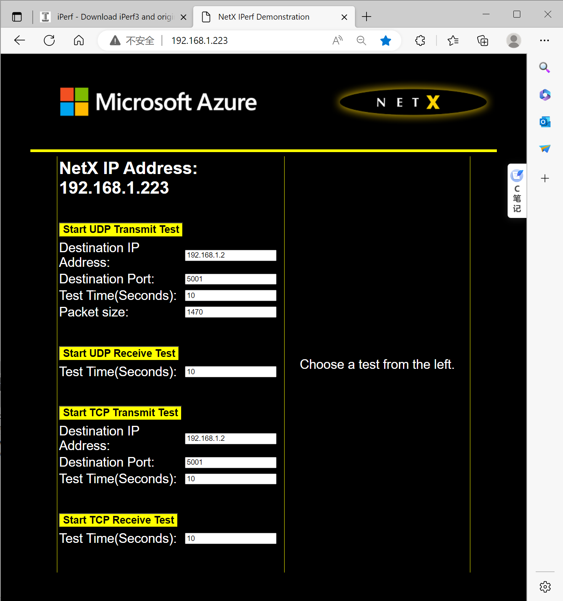

# TCP/UDP Throughput Test

## Overview

This  example shows TCP/UDP throughput performance test through iperf (https://iperf.fr/iperf-download.php) with a total of four mode as follows:

- MCU acts as TCP Server / PC acts as TCP Client
- MCU acts as TCP Client / PC acts as TCP Server
- MCU acts as UDP Server / PC acts as UDP Client
- MCU acts as UDP Client / PC acts as UDP Server

## Board Setting

- Connect a USB port on PC to the PWR DEBUG port on the development board with a USB Type-C cable
- Connect an Ethernet port on PC to a RGMII port or a RMII port on the development board with an Ethernet cable

## Project Configuration
- Ethernet Port Settings: Refer to [Ethernet common project settings](../../../../lwip/doc/Ethernet_Common_Project_Settings_en.md)
- By Setting `CONFIG_NETX_ENABLE_DHCP` to zero or comment the definition code in CMakeLists.txt, the DHCP will be disabled
- When DHCP is disabled, comment or delete `set(CONFIG_AZURE_RTOS_NETXDUO_ADDONS_DHCP 1)` can decrease project source files number

## Run Example

- Compiling and Downloading
- Wait until the link status becomes 'Up'. Accessing web addresses using a browser http://192.168.1.223 (Related to the configuration in the demo. If dhcp is enabled, replace the ip address with the alloted one), the following IPerf test page will open.

- Use IPerf tools on the PC side and web pages for testing. (You can use gui tools such as jperf or iperf cmd line). Iperf3 is not supported.
