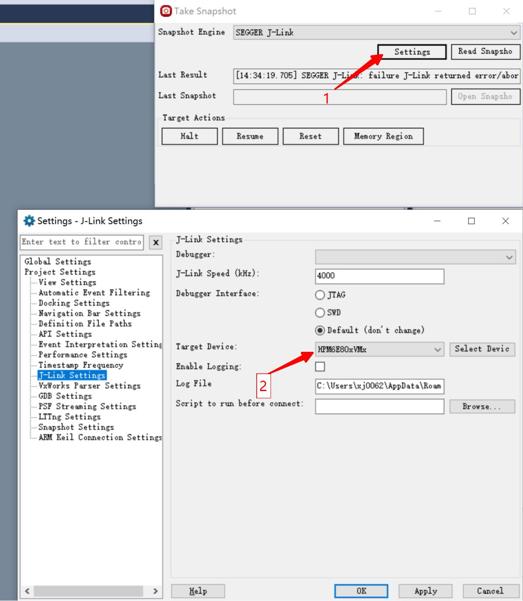
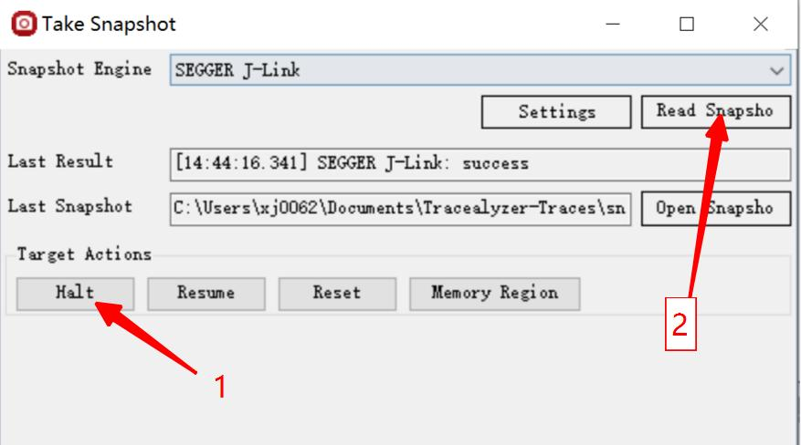
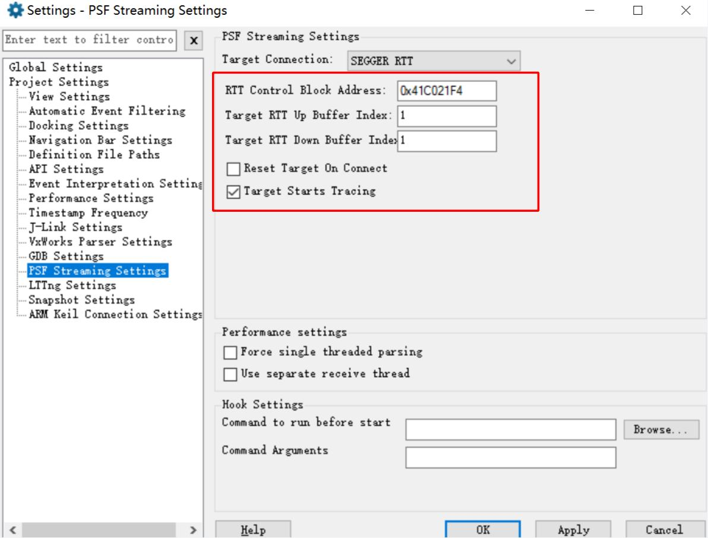
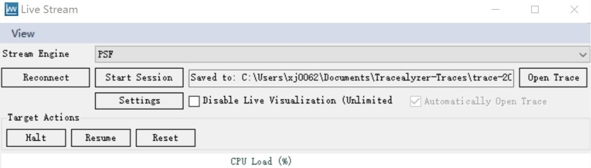
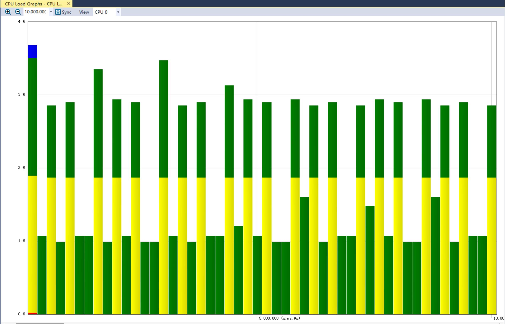

.. _trace_recorder_freertos:

Trace Recorder FreeRTOS
==============================================

Overview
--------

This project demonstrates the task scheduling function of Trace Recorder for tracking FreeRTOS.

Hardware Setup
--------------

- It is recommended to use JLink for tracking.

- GDB only supports snapshot mode.

Operation Steps
---------------

Snapshot mode
~~~~~~~~~~~~~

Add "set(CONFIG_TRACE_RECORDER_SNAPSHOT_MODE 1)" and remove "set(CONFIG_TRACE_RECORDER_STREAM_MODE "JLink RTT")" in CMakeLists.txt to enable snapshot mode. Some hpm_build_type is not supported because there maybe not enough memory to save trace data, such as flash_xip and ram.
In snapshot mode, TraceRecorder stores data in memory. The data needs to be exported and then analyzed using a host computer tool.

Obtain the address where data is stored
^^^^^^^^^^^^^^^^^^^^^^^^^^^^^^^^^^^^^^^

- Open the generated.map file after compilation, search for RecorderData, and you can see its address and size.

Export snapshot data
^^^^^^^^^^^^^^^^^^^^

Using GDB
"""""""""

To obtain snapshot data using GDB Server, you need to connect to GDB Server first, and then run the program to prevent GDB Server from resetting MCU and losing snapshot data when connecting. Open GDB Server (openocd/JLink GDB Sever), use GDB to connect to the target, run the program, and pause the program execution when you need to export data.

.. code-block:: text

   tar remo :2331
   mo reset halt
   //Download program to target if needed
   continue
   //Press CTRL - C to halt mcu
   dump binary memory target_data.bin {start address of RecorderData} {end address of RecorderData}

Then open the Tracealyzer4 software and open the target_data.bin file.

Using JLink
"""""""""""

Open the Tracealyzer4 software, open snapshot mode, switch to the JLink interface, and select the target chip in the JLink configuration. In the JLink configuration, select the target chip.

In the memory configuration, configure the starting address and size of RecorderData.

.. image:: ../doc/memory_setting.jpg
   :alt:

Pause the execution of the target program and then read the data.

Stream mode
~~~~~~~~~~~

Add "set(CONFIG_TRACE_RECORDER_STREAM_MODE "JLink RTT")" and remove "set(CONFIG_TRACE_RECORDER_SNAPSHOT_MODE 1)" to CMakeLists.txt to enable stream mode.

Obtain the address of the JLink RTT control block
^^^^^^^^^^^^^^^^^^^^^^^^^^^^^^^^^^^^^^^^^^^^^^^^^

Open the generated.map file after compilation, search for the _SEGGER_RTT variable, and you can obtain its address.

Host computer software configuration
^^^^^^^^^^^^^^^^^^^^^^^^^^^^^^^^^^^^

First, open the Tracealyzer4 software, open stream mode, switch to the JLink interface, and select the target chip in the JLink configuration. Configure the RTT control block address and the RTT channel sequence number (default is 1).

In the control interface, start data capture. Click buttons "Reset, Reconnect, Start Session" in order.

Running the example
-------------------

Snapshot mode
~~~~~~~~~~~~~

Stream mode
~~~~~~~~~~~

Data can be viewed dynamically without halting the cpu.