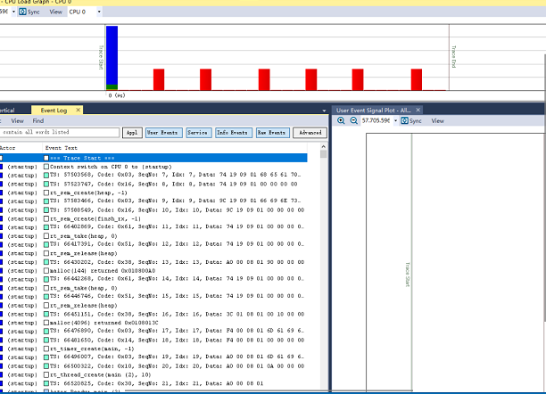

.. _trace_recorder_rt_thread:

Trace Recorder RT-Thread
================================================

概述
------

该工程演示了Trace Recorder跟踪freertos的任务调度功能。

硬件设置
------------

- 仅支持使用JLink进行流模式的跟踪。

操作步骤
------------

流模式
~~~~~~~~~

在CMakeLists.txt中加入set(CONFIG_TRACE_RECORDER_STREAM_MODE "JLink RTT")使能流模式。RT-Thread目前仅支持流模式。

复制描述文件
^^^^^^^^^^^^^^^^^^

将middleware/trace_recorder/kernelports/rtthread-nano/config/RTThread-psf.xml和middleware/trace_recorder/kernelports/rtthread-nano/config/RTThread-v1.0.0.xml复制到Tracealyzer安装目录的cfg文件夹内。

获取JLink RTT控制块地址
^^^^^^^^^^^^^^^^^^^^^^^^^^^^^^

打开编译生成的.map文件，搜索_SEGGER_RTT变量，即可获取其地址

上位机软件配置
^^^^^^^^^^^^^^^^^^^^^

首先打开tracealyzer4软件，打开stream mode，切换到JLink接口，并在JLink配置中选择目标芯片,配置好RTT控制块地址，以及RTT的通道序列号（默认为1）

.. image:: ../doc/jlink_setting_stream.jpg
   :alt:

在控制界面中，开启数据抓取: 依次点击Reset, Reconnect, Start Session。

.. image:: ../doc/stream.jpg
   :alt:

运行现象
------------

不用暂停cpu就可以动态的查看数据。

